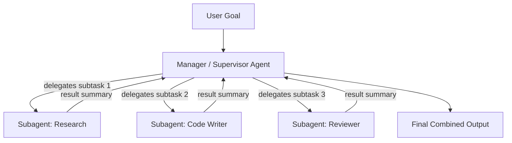
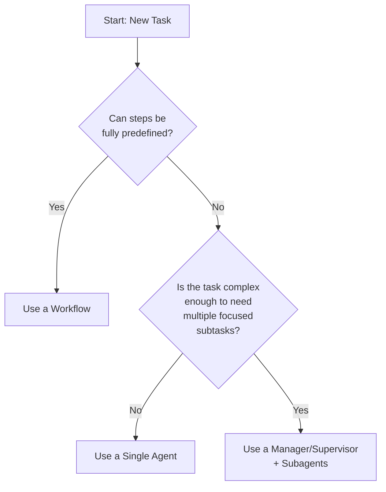

# CCDF Domain 1: Agents and Workflows (14.7%)
## Task 1.1 — Agent Architecture (4.5%)

> Principles, patterns, and tradeoffs of agent and workflow architecture, including the decision criteria for using a workflow versus an agent, the structure of manager/supervisor hierarchies, and the role of subagents in improving task execution.

---

## 1. Why This Topic Matters

Before you build anything with Claude, you must decide **how much control to give the model**. This single decision — workflow vs. agent — shapes cost, reliability, latency, and how easy the system is to debug. The exam tests whether you can pick the *right* architecture for a *given* problem, not just whether you know the definitions.

---

## 2. Workflow vs. Agent — The Core Distinction

### 2.1 What is a Workflow?

A **workflow** is a system where **the developer decides the steps in advance**, and code orchestrates calls to Claude at fixed points. Claude does the "thinking" inside each step, but it does **not** decide what step comes next — your code does.

Think of it like a recipe. The steps are fixed. Claude is the chef who cooks each individual step well, but does not decide to skip a step or add a new one.

**Simple example (pseudocode):**

```python
# Workflow: developer controls the sequence
def process_support_ticket(ticket):
    category = call_claude(f"Classify this ticket: {ticket}")   # Step 1
    if category == "billing":
        draft = call_claude(f"Draft a billing reply for: {ticket}")  # Step 2
    else:
        draft = call_claude(f"Draft a general reply for: {ticket}")  # Step 2 (alt)
    final = call_claude(f"Polish this reply for tone: {draft}")  # Step 3
    return final
```

Notice: the `if/else` branching and step order are **hardcoded by the developer**. Claude only fills in the "thinking" at each fixed point.

### 2.2 What is an Agent?

An **agent** is a system where **Claude itself decides** what to do next, which tools to call, and when the task is finished. The developer gives Claude a goal, a set of tools, and lets it run a loop: think → act → observe result → think again → ... → stop.

**Simple example (pseudocode):**

```python
# Agent: Claude controls the sequence
def resolve_ticket_agentically(ticket, tools):
    messages = [{"role": "user", "content": f"Resolve this ticket: {ticket}"}]
    while True:
        response = call_claude(messages, tools=tools)
        if response.stop_reason == "tool_use":
            result = run_tool(response.tool_call)       # Claude chose this tool
            messages.append(tool_result(result))
            continue
        else:
            return response.text   # Claude decided it's done
```

Notice: there is no `if/else` logic for what Claude should do — Claude decides which tool to call, in what order, and when to stop.

### 2.3 Side-by-Side Comparison

| Aspect | Workflow | Agent |
|---|---|---|
| Who decides the next step | Developer (code) | Claude (model) |
| Predictability | High — same path every time | Lower — path can vary |
| Cost & latency | Lower, fixed number of calls | Higher, variable number of calls |
| Debuggability | Easy — steps are explicit | Harder — must trace reasoning/tool calls |
| Best for | Well-understood, repeatable tasks | Open-ended, unpredictable tasks |
| Failure mode | Breaks if input doesn't fit the fixed path | Can loop, waste tool calls, or go off-track |
| Example use case | Ticket triage with 3 fixed categories | Open-ended research or multi-step coding task |

### 2.4 Decision Criteria — How to Choose

Ask these questions, in order:

1. **Can I describe the steps in advance?**
   If yes → lean **workflow**. If the task genuinely varies too much to script → **agent**.
2. **Do I need predictable cost and latency?**
   Workflows give you a fixed number of Claude calls. Agents can loop many times, so cost is variable.
3. **Is the task open-ended or exploratory?**
   Research, debugging, or "figure out what's wrong" tasks suit agents because the next step depends on what was just discovered.
4. **How much risk can I tolerate?**
   Agents making autonomous tool calls (e.g., deleting files, sending emails) need more guardrails. If the risk is high and the task is scriptable, prefer a workflow.

> **Rule of thumb (exam-tested):** *Use the simplest architecture that reliably solves the problem.* Don't reach for an agent just because it's more capable — added autonomy means added unpredictability. Start with a workflow; escalate to an agent only when the task truly requires dynamic decision-making.

### 2.5 Anti-Pattern Callout

> ⚠️ **Anti-Pattern: "Agent by default"**
> Building an open-ended agent loop for a task that has a small, fixed number of well-known steps. This adds cost, latency, and unpredictability with no real benefit. If you can draw the flowchart of steps before writing any code, it's a workflow, not an agent.

---

## 3. Manager/Supervisor Hierarchies

As tasks grow more complex, a single agent trying to do everything becomes hard to manage — its context window fills up, and it starts mixing unrelated concerns. The solution is a **manager/supervisor hierarchy**.

### 3.1 The Structure

- A **manager (or supervisor/orchestrator) agent** sits at the top. It does **not** do the detailed work itself.
- It **breaks the overall goal into smaller subtasks** and **delegates** each subtask to a **subagent**.
- Each subagent works in its **own context**, focused only on its piece of the problem.
- Subagents return their **results** (not their full working process) back to the manager.
- The manager **combines the results** and decides the next step, or produces the final answer.



### 3.2 Why This Helps

- **Context isolation**: Each subagent only sees what it needs. It doesn't get overwhelmed by irrelevant details from other subtasks.
- **Separation of concerns**: A "code writer" subagent doesn't need to know how the "research" subagent searched the web — it just needs the research summary.
- **Parallelism**: Independent subtasks (like research and drafting) can sometimes run at the same time, saving overall time.
- **Cleaner reasoning**: The manager's context stays focused on *coordination*, not on every low-level detail, so it makes better high-level decisions.

### 3.3 Simple Example

```python
def manager_agent(goal):
    plan = call_claude(f"Break this goal into subtasks: {goal}")
    results = []
    for subtask in plan.subtasks:
        # Each subagent call is a FRESH context — it doesn't see the other subtasks
        subagent_result = call_claude(
            messages=[{"role": "user", "content": subtask}],
            tools=tools_for(subtask)
        )
        results.append(subagent_result)
    final = call_claude(f"Combine these results into a final answer: {results}")
    return final
```

### 3.4 Anti-Pattern Callout

> ⚠️ **Anti-Pattern: "God context" manager**
> Letting the manager agent see the *entire* raw output of every subagent (full transcripts, tool logs, etc.) instead of clean summaries. This defeats the purpose of the hierarchy — the manager's context fills up just as fast as a single monolithic agent's would.

---

## 4. The Role of Subagents in Improving Task Execution

Subagents are not just "workers that do a piece of the task." They improve execution quality in specific ways:

| Benefit | Explanation |
|---|---|
| **Focused context** | A subagent's prompt and tools are scoped tightly to one job, so it makes fewer mistakes caused by distraction or irrelevant information. |
| **Specialization** | Different subagents can have different system prompts, tools, or even different Claude models suited to their subtask (e.g., a fast/cheap model for simple lookups, a stronger model for complex reasoning). |
| **Error containment** | If one subagent fails or produces a bad result, it's easier to detect and retry just that piece — instead of restarting the whole task. |
| **Reusability** | A well-defined subagent (e.g., "summarize a document") can be reused across many different manager workflows. |
| **Reduced context pollution** | The manager's context stays clean because it only receives final results, not every intermediate reasoning step from the subagent. |

### 4.1 When *Not* to Use Subagents

Subagents add coordination overhead (extra calls, extra latency, and the complexity of combining results). Avoid them when:
- The task is small enough for a single agent or workflow to handle directly.
- Subtasks are tightly interdependent and need to share a lot of running context — splitting them may cause the manager to just re-explain everything anyway.

> **Exam tip:** If a question describes a task that could be solved with a single agent but the "solution" splits it into many subagents for no clear reason, that is usually the wrong answer. Subagents earn their overhead through genuine separation of concerns, not by default.

---

## 5. Putting It All Together — Decision Flow



---

## 6. Quick Reference Summary

| Concept | One-Line Definition |
|---|---|
| Workflow | Developer-controlled sequence of fixed steps, Claude does the thinking per step |
| Agent | Claude-controlled loop that decides its own steps, tool calls, and stopping point |
| Manager/Supervisor Agent | Top-level agent that delegates subtasks and combines results, doesn't do detailed work itself |
| Subagent | A focused agent handling one subtask in its own isolated context |
| Context isolation | Giving each subagent only the information it needs, to avoid distraction/overload |
| Rule of thumb | Use the simplest architecture (workflow > single agent > manager+subagents) that reliably solves the task |

---

## 7. Practice Q&A

**Q1. A company wants to build a system that reads an invoice, checks 3 fixed conditions (amount, vendor, date), and routes it to one of exactly 3 approval queues. Which architecture fits best?**
<details><summary>Answer</summary>
A **workflow**. The steps and branching logic are fully known in advance — no dynamic decision-making by Claude is required beyond reading/classifying values inside each fixed step.
</details>

**Q2. A team wants Claude to investigate why a production service is slow — it needs to look at logs, query metrics, maybe check recent deploys, and decide what to check next based on what it finds. Which architecture fits best?**
<details><summary>Answer</summary>
An **agent**. The next investigative step depends on what was just discovered, which cannot be fully predefined — this is a classic open-ended, exploratory task.
</details>

**Q3. What is the main risk of letting a manager agent receive full raw transcripts from every subagent instead of summaries?**
<details><summary>Answer</summary>
The manager's own context window fills up with irrelevant detail ("god context"), which reduces the benefit of using a hierarchy in the first place and can degrade the manager's decision quality.
</details>

**Q4. True or False: Adding subagents always improves task execution quality.**
<details><summary>Answer</summary>
False. Subagents add coordination overhead. They help when there's genuine separation of concerns; for small or tightly-coupled tasks, a single agent is simpler and more efficient.
</details>

**Q5. What is the exam-tested "rule of thumb" for choosing between workflow and agent?**
<details><summary>Answer</summary>
Use the simplest architecture that reliably solves the problem — start with a workflow, and escalate to an agent only when the task truly requires dynamic, unpredictable decision-making.
</details>