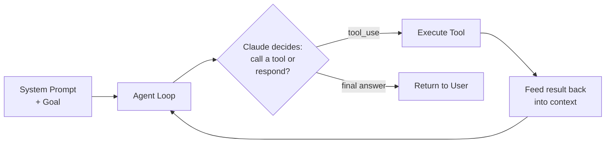
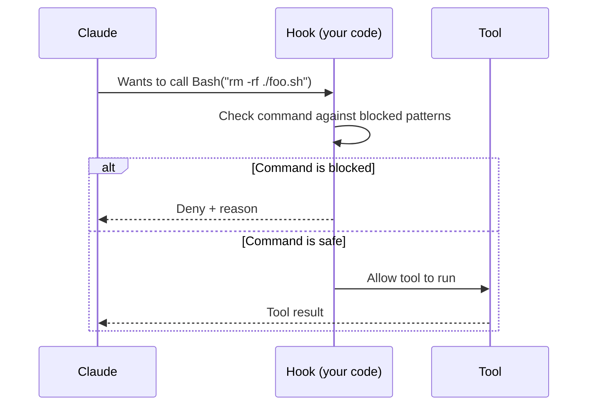
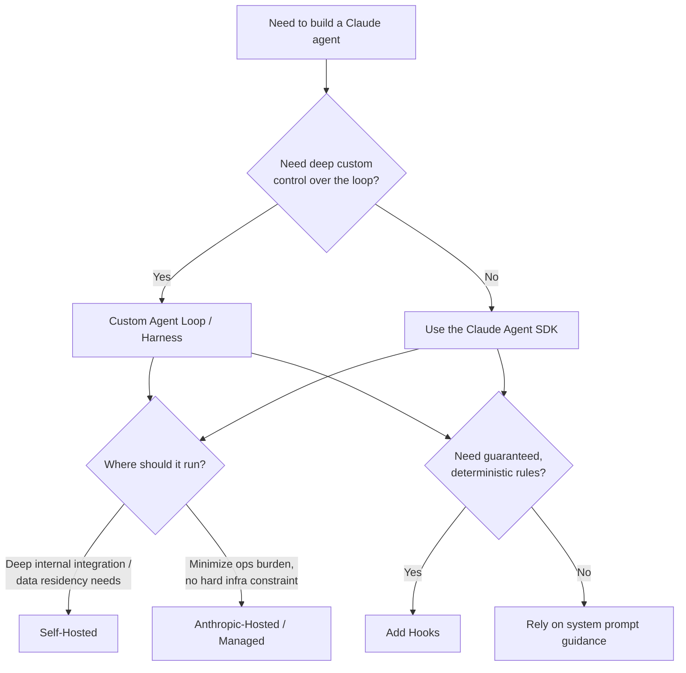

# CCDF Domain 1: Agents and Workflows (14.7%)
## Task 1.2 — Agent Construction with Claude (5.3%)

> Methods, tools, and platforms for constructing Claude agents, including the Claude Agent SDK, custom agent loops and harnesses, managed agent deployment models (self-hosted vs. Anthropic hosted), and hooks for deterministic actions.

---

## 1. Why This Topic Matters

Once you've decided you need an **agent** (see Task 1.1), the next question is: **how do you actually build it?** You have a spectrum of choices — from writing every line of the agent loop yourself, to using Anthropic's official SDK, to letting Anthropic run the whole thing for you. This task tests whether you know these options and can pick the right one for a given situation.

---

## 2. The Building Blocks of Any Claude Agent

No matter how you build it, every Claude agent needs the same core pieces:



- **System prompt** — tells Claude its role, goal, and constraints.
- **Tools** — functions Claude can call (file access, web search, custom APIs, etc.).
- **The loop** — code that keeps sending messages to Claude, running whatever tool it picks, feeding the result back, and repeating until Claude produces a final answer.
- **Guardrails** — deterministic checks (hooks, permission rules) that sit outside Claude's control.

The question in this task is: **who writes and runs that loop, and where does it run?**

---

## 3. Option 1 — Custom Agent Loops and Harnesses

You can build the agent loop **entirely yourself**, using the plain Claude API (`messages` endpoint) plus your own code for looping, tool execution, and state management. This is sometimes called a **custom harness**.

**Simple example (pseudocode):**

```python
def custom_agent_loop(user_goal, tools, max_turns=10):
    messages = [{"role": "user", "content": user_goal}]
    for turn in range(max_turns):
        response = anthropic_client.messages.create(
            model="claude-sonnet-4-6",
            messages=messages,
            tools=tools
        )
        if response.stop_reason == "tool_use":
            tool_call = extract_tool_call(response)
            result = run_my_own_tool(tool_call)         # you wrote this
            messages.append(assistant_turn(response))
            messages.append(tool_result_turn(tool_call.id, result))
        else:
            return response.content   # Claude is done
    return "Stopped: reached max turns"
```

**When to use a custom loop:**
- You need very specific control over looping behavior, stopping conditions, retries, or state storage.
- You're integrating the agent deeply into an existing custom system (e.g., a proprietary backend) where a ready-made SDK doesn't fit.
- You want to fully understand and control every part of the loop for compliance or debugging reasons.

**Trade-off:** You own *everything* — tool execution safety, context management, error handling, retries. More flexibility, but more code to build and maintain.

---

## 4. Option 2 — The Claude Agent SDK

The **Claude Agent SDK** (available for Python and TypeScript) is Anthropic's official library that gives you a **ready-made agent loop** — so you don't have to write it from scratch. It bundles together:

- The agent loop itself (think → tool call → observe → repeat)
- Built-in tools (e.g., file editing, bash/command execution, web tools)
- **MCP (Model Context Protocol)** support for connecting custom tools/servers
- **Permission modes** — control how much the agent can do without asking (e.g., auto-accept file edits vs. ask first)
- **Hooks** — deterministic callback functions (see Section 6)
- **Subagent** support — spinning up focused sub-loops for subtasks (ties back to Task 1.1's manager/subagent pattern)

**Simple example (pseudocode, Python):**

```python
from claude_agent_sdk import query, ClaudeAgentOptions

async def run_agent():
    options = ClaudeAgentOptions(
        allowed_tools=["Bash", "Edit", "Read"],
        permission_mode="acceptEdits"   # auto-approve safe edits
    )
    async for message in query(
        prompt="Refactor the utils.py file to improve readability.",
        options=options
    ):
        print(message)
```

**When to use the Agent SDK:**
- You want to build a production agent without re-implementing the loop, tool plumbing, and permission handling yourself.
- You need things like subagents, hooks, or MCP integration and don't want to build them from scratch.
- You're staying inside the Anthropic ecosystem and want first-party support.

**Trade-off:** Faster to build and battle-tested, but you're using Anthropic's opinions about how the loop should work (less low-level control than a fully custom harness).

---

## 5. Managed Agent Deployment Models — Self-Hosted vs. Anthropic-Hosted

Once your agent (via SDK or custom loop) is built, you must decide **where it runs**. There are two broad models:

| Aspect | Self-Hosted | Anthropic-Hosted (Managed) |
|---|---|---|
| Who runs the agent loop | Your own servers/process | Anthropic's infrastructure |
| Sandbox / execution environment | You provision and manage it | Provided and managed for you |
| Session state (conversation history, progress) | You store and persist it | Managed for you |
| Scaling | You handle autoscaling | Handled by Anthropic |
| Data residency / VPC / on-prem | Possible (runs in your network) | Not possible — runs on Anthropic's side |
| Operational effort | Higher — you own uptime, monitoring, storage | Lower — Anthropic operates it |
| Best for | Deep integration into existing internal systems, strict data residency needs, embedding the loop inside a larger pipeline | Teams that want to move fast without building/operating infrastructure |

### 5.1 Decision Criteria

Ask:
1. **Does the agent need to live inside an existing internal system** (share a transaction, call private internal services, be one step of a bigger pipeline)? → **Self-hosted** is usually the only real fit.
2. **Do you have the platform engineering capacity to run sandboxes, workers, and session storage reliably?** If not, and your use case fits a hosted offering → **Anthropic-hosted** gets you to production faster.
3. **Do you have strict data residency or "must run inside our VPC" requirements?** → **Self-hosted**.
4. **Is minimizing operational burden the priority, with no hard infra constraints?** → **Anthropic-hosted**.

> **Exam tip:** The exam is testing the *trade-off pattern*, not exact product names or pricing. Remember the core trade: self-hosted = more control, more operational burden; Anthropic-hosted = less control, less burden.

### 5.2 Anti-Pattern Callout

> ⚠️ **Anti-Pattern: Self-hosting "just in case"**
> Choosing to self-host and operate your own agent infrastructure when there's no actual requirement for it (no VPC constraint, no deep internal integration). This adds unnecessary operational cost and complexity when a managed/hosted option would have met the requirements just as well.

---

## 6. Hooks — Deterministic Actions Around the Agent Loop

Claude, as a language model, is inherently **non-deterministic** — it decides what to do based on reasoning, and that reasoning can vary. But some actions must **always** happen a certain way (e.g., "never let the agent touch the `.env` file," or "always run a linter after any file edit"). This is what **hooks** are for.

### 6.1 What is a Hook?

A **hook** is a piece of **your own code** (not Claude) that the agent harness calls automatically at specific points in the agent loop — for example, right before a tool runs, or right after. Because it's plain code, its behavior is **deterministic**: given the same input, it always does the same thing. This is different from asking Claude nicely in a system prompt, which it may or may not follow exactly.



### 6.2 Common Hook Events

| Hook Event | Fires When | Typical Use |
|---|---|---|
| `PreToolUse` | Right before a tool call executes | Block dangerous commands, require approval, validate inputs |
| `PostToolUse` | Right after a tool call finishes | Run a linter/test suite, log the result, inject feedback |
| `SessionStart` / `SessionEnd` | At the start/end of an agent session | Setup/teardown, logging session boundaries |
| `SubagentStop` | When a subagent finishes its task | Coordinate manager/subagent hierarchies (Task 1.1) |

### 6.3 Simple Example

```python
async def check_bash_command(input_data, tool_use_id, context):
    tool_name = input_data["tool_name"]
    if tool_name != "Bash":
        return {}   # not our concern, allow

    command = input_data["tool_input"].get("command", "")
    blocked = [".env", ".git/", "rm -rf"]

    for pattern in blocked:
        if pattern in command:
            return {
                "hookSpecificOutput": {
                    "hookEventName": "PreToolUse",
                    "permissionDecision": "deny",
                    "permissionDecisionReason": f"Blocked pattern: {pattern}"
                }
            }
    return {}   # allow
```

This hook runs **every single time** Claude tries to use the `Bash` tool. No matter how Claude "feels" about the request, this check always applies — that's the deterministic guarantee hooks give you.

### 6.4 Hooks vs. System Prompt Instructions

| | System Prompt Instruction | Hook |
|---|---|---|
| Who enforces it | Claude (the model) | Your code |
| Guarantee | Best-effort — model *usually* follows it | Deterministic — always applies |
| Good for | General guidance, tone, reasoning style | Hard rules: security, compliance, "never do X" |

> **Exam tip:** If a scenario says something must be **guaranteed** to happen (or never happen) regardless of what the model decides, the answer is a **hook**, not a stronger prompt instruction.

---

## 7. Putting It All Together — Decision Flow



---

## 8. Quick Reference Summary

| Concept | One-Line Definition |
|---|---|
| Custom Agent Loop / Harness | Agent loop written entirely by the developer using the raw API — maximum control, maximum effort |
| Claude Agent SDK | Anthropic's official library with a built-in loop, tools, permissions, hooks, and subagent support |
| Self-Hosted Deployment | You run the agent's infrastructure (sandbox, state, scaling) on your own systems |
| Anthropic-Hosted Deployment | Anthropic runs the agent's infrastructure for you |
| Hook | Deterministic code that runs at fixed points in the agent loop (e.g., before/after a tool call) to guarantee certain behavior |
| Rule of thumb | Use the SDK unless you have a real reason to go custom; use self-hosting only when deep integration or data residency truly requires it; use hooks whenever a rule must be guaranteed, not just suggested |

---

## 9. Practice Q&A

**Q1. A team wants their agent's loop to run inside their existing internal microservice, sharing a database transaction with other internal code. Which construction approach fits best?**
<details><summary>Answer</summary>
A **custom agent loop/harness**, likely combined with **self-hosted deployment** — deep integration into an existing internal system is the classic case where a fully custom, self-hosted approach is needed.
</details>

**Q2. A startup wants to launch an agent-powered feature quickly, has no dedicated infrastructure team, and has no data residency requirements. What's the best deployment model?**
<details><summary>Answer</summary>
**Anthropic-hosted (managed)** deployment — it minimizes operational burden and gets them to production faster, since they don't need to own sandboxes, scaling, or session storage.
</details>

**Q3. A company needs to guarantee that the agent can never modify files inside the `.git/` directory, no matter what the model decides. What should they use?**
<details><summary>Answer</summary>
A **hook** (specifically a `PreToolUse` hook) — it enforces the rule deterministically in code, unlike a system prompt instruction which is only best-effort.
</details>

**Q4. True or False: The Claude Agent SDK removes the need to think about tool permissions and hooks.**
<details><summary>Answer</summary>
False. The SDK provides built-in support for permissions and hooks, but you still need to configure them correctly for your use case — it doesn't remove the responsibility, it just removes the need to build the plumbing from scratch.
</details>

**Q5. What is the key difference between a hook and a system prompt instruction?**
<details><summary>Answer</summary>
A hook is deterministic code that always enforces its rule; a system prompt instruction is guidance to the model that it usually — but not guaranteed to — follow.
</details>