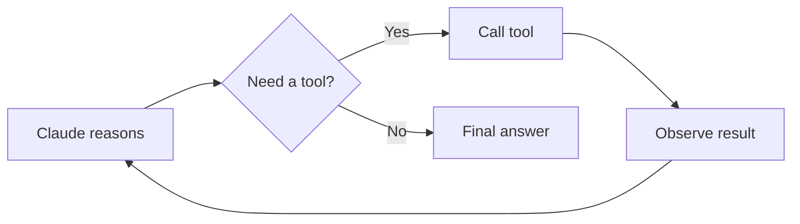
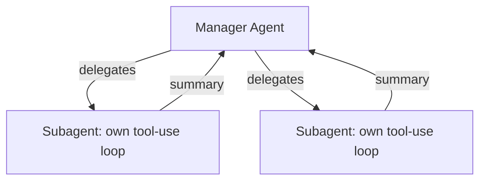
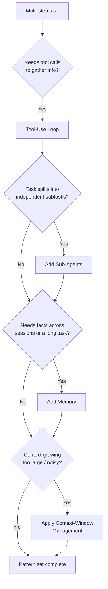

# CCDF Domain 1: Agents and Workflows (14.7%)
## Task 1.3 — Agent Patterns and Frameworks (4.9%)

> Common agent design patterns (tool-use loops, sub-agents, memory, context-window management) and agentic abstraction frameworks (e.g., Strands, LangGraph, PydanticAI) for building agents and workflows for multi-step tasks.

---

## 1. Why This Topic Matters

Once you know *whether* to build an agent (Task 1.1) and *how* to construct one with Claude (Task 1.2), you need a vocabulary for the **recurring design patterns** that show up inside almost every agent — and you need to know the **frameworks** that package these patterns for you. This task tests both: can you recognize a pattern by its description, and can you match a framework to its design philosophy?

---

## 2. Common Agent Design Patterns

These four patterns appear, in some form, in nearly every non-trivial agent.

### 2.1 Tool-Use Loop

This is the **core mechanic** of any agent (also covered in Task 1.2): Claude receives a goal, decides to call a tool, receives the tool's result, and decides again — repeating until it has enough information to answer.



**Simple example (pseudocode):**

```python
messages = [{"role": "user", "content": "What's the weather in Pune, then suggest an outfit"}]
while True:
    response = call_claude(messages, tools=[weather_tool])
    if response.stop_reason == "tool_use":
        result = run_tool(response.tool_call)      # e.g., weather_tool("Pune")
        messages.append(tool_result(result))
        continue   # loop back — Claude reasons again with new info
    else:
        break  # Claude has enough info to give the final answer
```

Every other pattern below is really a variation or extension built **on top of** this basic loop.

### 2.2 Sub-Agents

Covered in depth in Task 1.1: a **manager/supervisor** agent breaks a big goal into smaller pieces and delegates each piece to a **focused subagent**, which runs its own tool-use loop in an isolated context, then returns a summarized result.

**Why it's a "pattern":** it's a reusable way to keep any single agent's context small and focused, no matter how complex the overall task is.



### 2.3 Memory

An agent's **context window** only holds what's in the current conversation. But many tasks need information from **past sessions** or need to **persist facts across a long-running task**. This is what the **memory** pattern solves.

There are two common kinds:

| Type | What it stores | Example |
|---|---|---|
| **Short-term (working) memory** | The current task's state — kept inside the context window for this session | "So far I've checked files A and B, still need C" |
| **Long-term (persistent) memory** | Facts that should survive across sessions — stored *outside* the context window (a file, database, or vector store) and retrieved when relevant | "This user prefers metric units" saved from a past conversation |

**Simple example (pseudocode) — persistent memory:**

```python
def agent_turn(user_message, memory_store):
    # Retrieve only relevant memory, not everything
    relevant_facts = memory_store.search(user_message)
    messages = [
        {"role": "system", "content": f"Known facts: {relevant_facts}"},
        {"role": "user", "content": user_message}
    ]
    response = call_claude(messages)
    # Optionally save new durable facts back to the store
    if response.new_fact:
        memory_store.save(response.new_fact)
    return response
```

> ⚠️ **Anti-Pattern: Dumping all memory into every prompt**
> Loading the *entire* memory store into context on every turn wastes tokens and can distract the model with irrelevant facts. The correct pattern is to **retrieve only what's relevant** to the current task (see Context-Window Management below).

### 2.4 Context-Window Management

Every agent loop grows its context with each new tool result and reasoning step. Left unmanaged, this leads to:
- **Running out of context space** on long tasks
- **Context distraction** — too much irrelevant information making the model reason worse, even if it technically still fits

Common management strategies:

| Strategy | What it does |
|---|---|
| **Summarization** | Periodically compress old conversation turns into a short summary, replacing the verbose original |
| **Trimming tool-result verbosity** | Only keep the *useful* parts of a tool's raw output, not the entire raw response |
| **Retrieval over stuffing** | Fetch only the specific relevant documents/facts needed right now, instead of stuffing all possible documents into context upfront |
| **Sub-agent isolation** | Offload a subtask to a subagent with its own separate context, so the manager's context doesn't grow with every detail |

**Simple example (pseudocode) — trimming tool results:**

```python
def run_tool_and_trim(tool_call):
    raw_result = run_tool(tool_call)          # e.g., a huge JSON API response
    trimmed = extract_relevant_fields(raw_result, keep=["status", "summary"])
    return trimmed   # only this goes back into context, not the raw blob
```

> **Exam tip:** The tested principle is *"right context, well organized"* beats *"more context."* Bigger context windows do not remove the need to manage what you put into them.

---

## 3. Agentic Abstraction Frameworks

Instead of hand-building the patterns above every time, several frameworks package them into reusable abstractions. You are not expected to master any one framework in depth for the exam — you need to recognize **what each one is generally for** and its core design philosophy.

### 3.1 LangGraph

- Models an agent's workflow as a **directed graph**: nodes are functions or LLM calls, edges are the (possibly conditional) transitions between them.
- Supports cycles, branching, parallel execution, and durable state across long-running tasks.
- Good fit when you want **explicit, inspectable control** over exactly how steps connect — closer to a structured workflow that can still behave like an agent when edges are conditional on the model's output.

**Conceptual shape (pseudocode-style graph definition):**

```python
graph.add_node("classify", classify_step)
graph.add_node("handle_billing", billing_step)
graph.add_node("handle_general", general_step)
graph.add_conditional_edge("classify",
    condition=lambda state: state["category"],
    routes={"billing": "handle_billing", "general": "handle_general"}
)
```

### 3.2 Strands Agents SDK

- A **model-driven**, lightweight agent framework: define an agent in a few lines, and it runs a tool-use loop under the hood.
- **Model-agnostic** — works with multiple model providers (including Claude), so it's not tied to one vendor.
- Emphasizes production readiness: built-in observability (tracing), and it can run anywhere — cloud, on-prem, or locally.
- Good fit when you want a **simple, declarative** way to define agent behavior without hand-writing the loop, while keeping flexibility over which model/provider runs underneath.

**Conceptual shape (pseudocode-style):**

```python
agent = Agent(
    model="claude-sonnet-4-6",
    tools=[weather_tool, search_tool],
    system_prompt="You are a helpful trip-planning assistant."
)
result = agent("Plan a 3-day trip to Goa")
```

### 3.3 PydanticAI

- Built around **Pydantic**, the popular Python data-validation library — its core strength is **structured, type-safe outputs**.
- Lets you define the exact shape (schema) of what the agent should return, and validates the model's output against that schema automatically.
- Good fit when your agent's output needs to reliably plug into other code (e.g., a downstream function expecting a specific object shape) rather than free-form text.

**Conceptual shape (pseudocode-style):**

```python
from pydantic import BaseModel

class TripPlan(BaseModel):
    destination: str
    days: int
    budget_usd: float

agent = Agent(model="claude-sonnet-4-6", output_type=TripPlan)
result = agent.run("Plan a 3-day trip to Goa under $500")
# result is guaranteed to be a valid TripPlan object, not raw text
```

### 3.4 Framework Comparison Table

| Framework | Core Philosophy | Best Fit When... |
|---|---|---|
| **LangGraph** | Explicit graph of nodes & edges; strong state/branching control | You need fine-grained, inspectable control over complex multi-step flows with branching/cycles |
| **Strands Agents SDK** | Lightweight, model-driven, declarative agent definition | You want to get an agent running quickly with minimal boilerplate, across multiple model providers |
| **PydanticAI** | Type-safe, schema-validated structured outputs | Your agent's output must reliably match a strict data shape for downstream code |

> **Exam tip:** These questions usually test *recognition*, not deep API knowledge. If a scenario emphasizes "graph of steps with branching," think LangGraph. If it emphasizes "quick to define, runs anywhere," think Strands. If it emphasizes "must return valid structured data," think PydanticAI.

### 3.5 Anti-Pattern Callout

> ⚠️ **Anti-Pattern: Framework-first thinking**
> Picking a framework before understanding which *pattern* the task actually needs (tool-use loop, sub-agents, memory, context management). Frameworks are just packaging for these patterns — the underlying design decision (Task 1.1's workflow-vs-agent, and which patterns apply) should come first.

---

## 4. Putting It All Together — Pattern Recognition Flow



---

## 5. Quick Reference Summary

| Concept | One-Line Definition |
|---|---|
| Tool-Use Loop | The core agent mechanic: reason → call tool → observe → repeat until done |
| Sub-Agents | Delegating focused subtasks to isolated agents to keep context clean |
| Memory (short-term) | Task state kept inside the current context window |
| Memory (long-term) | Durable facts stored outside the context window, retrieved when relevant |
| Context-Window Management | Techniques (summarization, trimming, retrieval, sub-agent isolation) to keep context relevant and small |
| LangGraph | Graph-based framework for explicit, branching multi-step workflows |
| Strands Agents SDK | Lightweight, model-agnostic, declarative agent framework |
| PydanticAI | Framework focused on type-safe, schema-validated structured agent outputs |
| Rule of thumb | Identify the pattern the task needs first, then pick the framework/tool that best packages that pattern |

---

## 6. Practice Q&A

**Q1. An agent's context is filling up with huge raw API responses, most of which are irrelevant to the task. Which pattern addresses this directly?**
<details><summary>Answer</summary>
**Context-window management** — specifically trimming tool-result verbosity (keeping only the relevant fields from each tool result).
</details>

**Q2. A user returns after a week and expects the assistant to remember their stated preferences from before. Which pattern is this, and where should that information live?**
<details><summary>Answer</summary>
This is the **long-term (persistent) memory** pattern — the facts should be stored outside the context window (e.g., a database or file) and retrieved when relevant, not kept only in the current session's context.
</details>

**Q3. A team wants an agent whose output must always match a strict schema (specific fields, specific types) so it can be passed directly into another function. Which framework's core philosophy best fits this need?**
<details><summary>Answer</summary>
**PydanticAI** — its core strength is type-safe, schema-validated structured outputs.
</details>

**Q4. A team wants explicit control over a complex workflow with branching paths and cycles between steps, and wants to inspect/debug the exact flow. Which framework best fits?**
<details><summary>Answer</summary>
**LangGraph** — it models the workflow as a directed graph of nodes and edges, supporting branching and cycles with inspectable state.
</details>

**Q5. True or False: You should choose an agent framework first, then figure out which design patterns you need.**
<details><summary>Answer</summary>
False. This is the "framework-first thinking" anti-pattern. Identify the design patterns the task actually needs first (tool-use loop, sub-agents, memory, context management), then choose the framework that best supports those patterns.
</details>