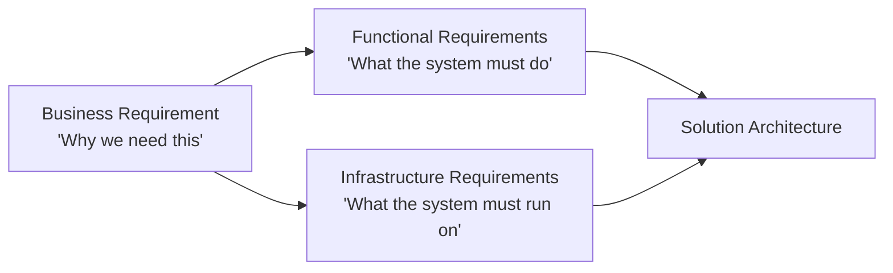
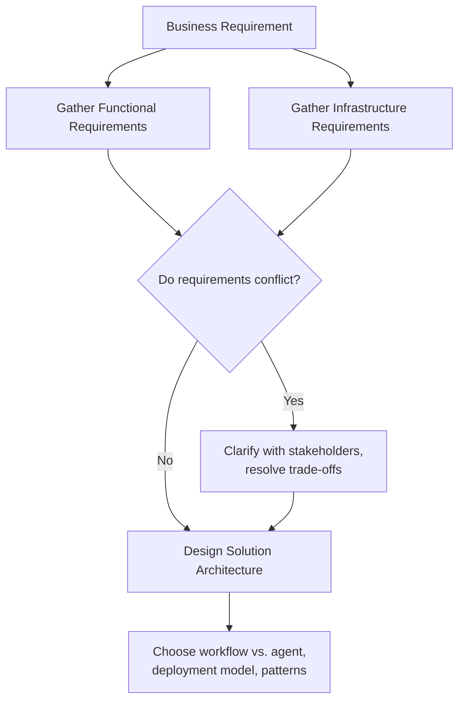

# CCDF Domain 2: Applications and Integration (33.1%)
## Task 2.1 — Understanding Requirements (3.4%)

> Functional and infrastructure requirements based on business requirements and solution architecture.

---

## 1. Why This Topic Matters

Before you write a single line of code or pick a single tool, you must translate **what the business wants** into **what the system must do and run on**. Get this step wrong, and every later decision (which model, which architecture, which tools) is built on a shaky foundation. This task tests whether you can correctly separate and derive **functional** and **infrastructure** requirements from a business problem.

---

## 2. Business Requirements — The Starting Point

A **business requirement** describes the *outcome* the business wants, in business language — not technical language.

**Example:**
> "We want to reduce the time our support team spends answering repetitive billing questions."

Notice: this says nothing about Claude, APIs, or servers. It's the "why." Everything else in this task is about turning statements like this into something engineers can actually build.



---

## 3. Functional Requirements — "What Must the System Do?"

**Functional requirements** describe the specific **behaviors and capabilities** the system must have. They answer: *given an input, what should happen?*

### 3.1 How to Derive Them

Take the business requirement and ask: *"To achieve this outcome, what specific things must the system be able to do?"*

**From our example above:**

| Business Requirement | Derived Functional Requirements |
|---|---|
| Reduce time spent on repetitive billing questions | 1. System must read and understand an incoming billing question<br>2. System must look up the customer's account/billing data<br>3. System must generate an accurate, policy-compliant answer<br>4. System must escalate to a human when confidence is low<br>5. System must log every interaction for audit |

### 3.2 Simple Example — Documenting a Functional Requirement

```markdown
## FR-01: Answer Billing Questions
**Description:** The system shall accept a natural-language billing question 
and return an accurate answer using the customer's account data.
**Input:** Customer question (text), customer ID
**Output:** Answer (text), confidence indicator
**Acceptance Criteria:**
- Answer must be grounded in real account data (no fabricated numbers)
- If confidence is below threshold, system escalates instead of guessing
```

Writing requirements this way — with a clear input, output, and acceptance criteria — makes them testable, which matters later during evaluation (see later domains on testing/evaluation).

### 3.3 Anti-Pattern Callout

> ⚠️ **Anti-Pattern: Vague functional requirements**
> "The system should be smart about billing questions" is not a functional requirement — it can't be tested or verified. A good functional requirement is specific enough that two different engineers would build the same thing from it.

---

## 4. Infrastructure Requirements — "What Must the System Run On?"

**Infrastructure requirements** describe the **non-functional, operational conditions** the system must satisfy — performance, scale, security, compliance, and where/how it runs.

### 4.1 Common Categories

| Category | Typical Questions to Ask |
|---|---|
| **Performance / Latency** | How fast must a response come back? (e.g., under 3 seconds) |
| **Scale / Throughput** | How many requests per second/day must it handle? |
| **Availability** | What uptime is required? (e.g., 99.9%) |
| **Security** | What data is sensitive? What access controls are needed? |
| **Data residency / Compliance** | Must data stay in a specific region? Are there regulations (e.g., financial, healthcare) to follow? |
| **Cost constraints** | Is there a budget ceiling per request, per month? |
| **Integration points** | What existing systems (CRM, database, ticketing tool) must this connect to? |

### 4.2 Simple Example — Documenting an Infrastructure Requirement

```markdown
## IR-01: Response Latency
**Description:** 95% of billing-question responses must be returned within 3 seconds.

## IR-02: Data Residency
**Description:** All customer billing data must remain within the company's 
existing VPC and must not be sent to third-party services outside the approved list.

## IR-03: Availability
**Description:** The system must maintain 99.9% uptime during business hours.
```

### 4.3 How Infrastructure Requirements Shape Architecture Decisions

Infrastructure requirements directly affect earlier decisions you learned in Domain 1:

| Infrastructure Requirement | Likely Architectural Impact |
|---|---|
| Strict data residency / must run in our VPC | Favors **self-hosted** agent deployment (Task 1.2) over Anthropic-hosted |
| Very low latency needed, simple fixed steps | Favors a **workflow** over an open-ended agent (Task 1.1) |
| High, unpredictable request volume | Needs scaling plan — managed hosting may reduce operational burden |
| Strict cost ceiling per request | May favor smaller/faster models for simple sub-tasks, reserving larger models for complex reasoning |

> **Exam tip:** Expect scenario questions that give you a business situation and ask you to identify *which* requirement (functional vs. infrastructure) is missing or violated. Functional = behavior. Infrastructure = the operating conditions around that behavior.

### 4.4 Anti-Pattern Callout

> ⚠️ **Anti-Pattern: Skipping infrastructure requirements until "later"**
> Designing the whole functional solution first, then discovering a hard infrastructure constraint (like data residency) afterward — forcing a costly redesign. Infrastructure requirements should be gathered **alongside** functional requirements, not as an afterthought.

---

## 5. Functional vs. Infrastructure — Side-by-Side

| Aspect | Functional Requirement | Infrastructure Requirement |
|---|---|---|
| Answers | "What must it do?" | "What must it run on / how well must it perform?" |
| Example | "System must classify a support ticket into a category" | "Classification must complete in under 1 second" |
| Focus | Behavior and capability | Performance, scale, security, compliance, cost |
| Who usually states it first | Business stakeholders | Often surfaces from IT/security/compliance teams |
| Testable via | Does the output match expected behavior? | Does the system meet the measured operational target? |

---

## 6. From Requirements to Solution Architecture

Once you have both sets of requirements, they **jointly** shape the solution architecture — this is where Domain 1's concepts (workflow vs. agent, self-hosted vs. managed, patterns) get applied concretely.



**Example of a conflict to resolve:** A functional requirement says "the agent should research thoroughly across many sources," but an infrastructure requirement says "response must return in under 2 seconds." These pull in opposite directions — thorough research takes time. This kind of conflict must be surfaced and resolved (e.g., by relaxing the latency requirement, or narrowing the research scope) *before* architecture is finalized.

---

## 7. Quick Reference Summary

| Concept | One-Line Definition |
|---|---|
| Business Requirement | The business outcome desired, stated in business language |
| Functional Requirement | A specific behavior/capability the system must have (input → output) |
| Infrastructure Requirement | An operational condition the system must satisfy (latency, scale, security, cost, compliance) |
| Acceptance Criteria | The testable conditions that confirm a requirement is met |
| Rule of thumb | Gather functional and infrastructure requirements together, resolve conflicts before finalizing architecture |

---

## 8. Practice Q&A

**Q1. A stakeholder says: "The assistant should feel fast and responsive." Which type of requirement is this, once made specific, and how would you make it testable?**
<details><summary>Answer</summary>
It's an **infrastructure requirement** (performance/latency). To make it testable, convert it into a measurable target, e.g., "95% of responses must return within 2 seconds."
</details>

**Q2. A requirement states: "The system must extract the invoice number, amount, and due date from an uploaded PDF." Functional or infrastructure?**
<details><summary>Answer</summary>
**Functional** — it describes a specific input (PDF) and expected output (three extracted fields), i.e., a behavior/capability.
</details>

**Q3. Why should infrastructure requirements be gathered at the same time as functional requirements, rather than afterward?**
<details><summary>Answer</summary>
Because infrastructure constraints (like data residency or latency limits) can directly conflict with or limit how functional requirements are implemented. Discovering them late can force a costly redesign of the whole solution.
</details>

**Q4. A functional requirement wants deep, multi-source research; an infrastructure requirement demands a 2-second response. What should happen?**
<details><summary>Answer</summary>
The conflict must be surfaced and resolved with stakeholders before finalizing the architecture — e.g., by relaxing the latency target, narrowing the research scope, or restructuring the task (such as returning a fast partial answer now and a deeper follow-up later).
</details>

**Q5. True or False: A well-written functional requirement should be specific enough that two different engineers would build the same behavior from it.**
<details><summary>Answer</summary>
True. Vague requirements ("be smart about X") cannot be verified or consistently implemented — good functional requirements include clear inputs, outputs, and acceptance criteria.
</details>