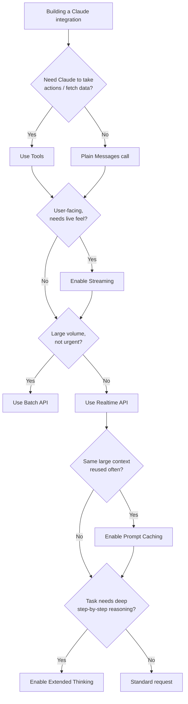

# CCDF Domain 2: Applications and Integration (33.1%)
## Task 2.3 — Claude API Mechanics (6.8%)

> Claude API behavior and mechanics, including messages, tools, streaming, vision, thinking, caching, invoking Claude through third-party vendors, Messages API data access patterns, batch API use, and tradeoffs between realtime and batch API selection.

---

## 1. Why This Topic Matters

Everything you build with Claude — a simple chatbot, a workflow, or a full agent — ultimately sits on top of **one API: the Messages API**. This task tests whether you understand the mechanics of that API deeply enough to make correct implementation choices: how messages are structured, how to stream responses, how to send images, how extended thinking works, how caching saves cost, how to call Claude through cloud vendors, and when to use batch processing instead of realtime calls.

---

## 2. The Messages API — Core Structure

Every call to Claude is built around the **Messages API**. You send a list of messages (a conversation so far), and Claude returns the next message.

**Simple example:**

```python
import anthropic

client = anthropic.Anthropic()

response = client.messages.create(
    model="claude-sonnet-4-6",
    max_tokens=1024,
    system="You are a helpful billing assistant.",
    messages=[
        {"role": "user", "content": "What's my current plan?"}
    ]
)
print(response.content)
```

**Key parts of a request:**

| Field | Purpose |
|---|---|
| `model` | Which Claude model to use |
| `max_tokens` | Maximum length of the response |
| `system` | Instructions that shape Claude's role/behavior (not part of the conversation turns) |
| `messages` | The conversation history — a list of `{"role": ..., "content": ...}` objects |

**Key parts of a response:**

- `content` — a list of **content blocks** (text, tool use, thinking, etc. — not just a single string)
- `stop_reason` — why Claude stopped (`end_turn`, `tool_use`, `max_tokens`, etc.)
- `usage` — token counts (input/output), important for cost tracking

> **Exam tip:** Remember that `content` is a **list of blocks**, not a plain string. A response can mix text, tool-use requests, and thinking blocks together in one turn.

---

## 3. Tools — Letting Claude Take Action

**Tools** let Claude request that your code perform an action (call an API, run a calculation, query a database) and give the result back. This is the foundation of the tool-use loop from Domain 1.

```python
tools = [
    {
        "name": "get_account_balance",
        "description": "Look up a customer's current account balance",
        "input_schema": {
            "type": "object",
            "properties": {
                "customer_id": {"type": "string"}
            },
            "required": ["customer_id"]
        }
    }
]

response = client.messages.create(
    model="claude-sonnet-4-6",
    max_tokens=1024,
    tools=tools,
    messages=[{"role": "user", "content": "What's my balance? My ID is C-102"}]
)

if response.stop_reason == "tool_use":
    tool_block = next(b for b in response.content if b.type == "tool_use")
    print(tool_block.name, tool_block.input)  # Claude's requested tool call
```

Your code then executes the real function and sends the result back as a `tool_result` content block in the next message, continuing the loop.

---

## 4. Streaming — Getting Tokens as They're Generated

By default, an API call waits for the **entire** response to be generated before returning anything. **Streaming** instead sends back small chunks (tokens) as soon as they're generated, so the user sees the response appear progressively — like a typewriter effect.

```python
with client.messages.stream(
    model="claude-sonnet-4-6",
    max_tokens=1024,
    messages=[{"role": "user", "content": "Explain prompt caching in 3 sentences."}]
) as stream:
    for text in stream.text_stream:
        print(text, end="", flush=True)   # prints as chunks arrive
```

**When to use streaming:**
- Interactive, user-facing chat experiences (users don't want to stare at a blank screen)
- Long responses, where perceived latency matters more than total time

**When realtime non-streaming is fine:**
- Backend/automated pipelines where only the final result matters, not the user experience

---

## 5. Vision — Sending Images to Claude

Claude can accept **images** as part of a message's content, alongside text — useful for reading screenshots, diagrams, scanned documents, or photos.

```python
import base64

with open("invoice.png", "rb") as f:
    image_data = base64.standard_b64encode(f.read()).decode("utf-8")

response = client.messages.create(
    model="claude-sonnet-4-6",
    max_tokens=1024,
    messages=[
        {
            "role": "user",
            "content": [
                {
                    "type": "image",
                    "source": {
                        "type": "base64",
                        "media_type": "image/png",
                        "data": image_data
                    }
                },
                {"type": "text", "text": "Extract the invoice number and total amount."}
            ]
        }
    ]
)
```

> **Exam tip:** An image is just another **content block** inside a message, mixed with text blocks in the same `content` list — there's no separate "vision endpoint."

---

## 6. Extended Thinking — Letting Claude Reason Before Answering

**Extended thinking** lets Claude produce an internal reasoning process (a `thinking` content block) before its final answer, for tasks that benefit from step-by-step reasoning (complex math, multi-step logic, tricky trade-off analysis).

```python
response = client.messages.create(
    model="claude-sonnet-4-6",
    max_tokens=2048,
    thinking={"type": "enabled", "budget_tokens": 1024},
    messages=[{"role": "user", "content": "A train leaves at 3pm going 60mph..."}]
)

for block in response.content:
    if block.type == "thinking":
        print("Reasoning:", block.thinking)
    elif block.type == "text":
        print("Answer:", block.text)
```

**When to use it:** complex reasoning tasks where quality improves from deliberate step-by-step thought.
**Trade-off:** thinking tokens add latency and cost — not needed for simple, direct questions.

---

## 7. Prompt Caching — Reusing Context to Save Cost and Latency

If you send the **same large block of context** repeatedly (a long system prompt, a big document, a big tool definitions list), **prompt caching** lets Claude reuse the already-processed version instead of reprocessing it from scratch every time — cutting cost and latency on the repeated portion.

```python
response = client.messages.create(
    model="claude-sonnet-4-6",
    max_tokens=1024,
    system=[
        {
            "type": "text",
            "text": very_long_policy_document,   # e.g., 10,000 words of company policy
            "cache_control": {"type": "ephemeral"}   # mark this block as cacheable
        }
    ],
    messages=[{"role": "user", "content": "Does policy X apply to refunds?"}]
)
```

**When it helps most:**
- A long, unchanging system prompt or reference document reused across many requests
- Multi-turn conversations where earlier turns don't change

> **Exam tip:** Caching only helps when the **same content is reused** across calls. Content that changes every request cannot benefit from caching.

---

## 8. Invoking Claude Through Third-Party Vendors

Besides calling the Anthropic API directly, Claude is also available through major cloud platforms:

| Vendor | What it means |
|---|---|
| **Amazon Bedrock** | Access Claude through AWS's managed model marketplace — useful if your infrastructure/billing/IAM is already on AWS |
| **Google Cloud (Vertex AI)** | Access Claude through Google Cloud's managed platform — useful for GCP-based infrastructure |
| **Microsoft Foundry** | Access Claude through Microsoft's cloud AI platform — useful for Azure/Microsoft-based infrastructure |

**Why this matters architecturally:** the **Messages API shape stays conceptually the same**, but authentication, billing, and regional/data-residency behavior follow that **cloud vendor's** model instead of Anthropic's direct API. This ties back to Task 2.1's infrastructure requirements (e.g., "must stay inside our existing AWS account/VPC" → use Bedrock instead of the direct Anthropic API).

> **Exam tip:** If a scenario says a company must keep everything inside their existing AWS/GCP/Azure environment for compliance or procurement reasons, the answer is usually to call Claude through that **cloud vendor**, not the direct Anthropic API.

---

## 9. Messages API Data Access Patterns

"Data access patterns" refers to **how you get the information Claude needs into a request**. There are a few common patterns:

| Pattern | How it works | Best for |
|---|---|---|
| **Inline in the prompt** | Paste the needed data directly into the `messages` content | Small, one-off pieces of data |
| **Tool-based retrieval** | Claude requests a tool call to fetch exactly the data it needs, when it needs it | Large datasets where only a subset is relevant per request |
| **Prompt caching + system prompt** | Load a large reference document once, mark it cacheable, reuse across many calls | Same big reference document/policy needed repeatedly |
| **Files API** | Upload a file once, reference it by ID in later requests, instead of re-sending raw bytes each time | Large or reused files (PDFs, datasets) across multiple calls |

> **Exam tip:** The right pattern depends on **how much data**, **how often it repeats**, and **how much of it is actually relevant** to a given request. Don't inline huge documents you could instead retrieve selectively via a tool, or cache if reused often.

---

## 10. Batch API — Processing Many Requests Asynchronously

The **Batch API** lets you submit a **large set of requests at once** and get results back later (asynchronously), rather than waiting on each request in realtime. It's designed for high-volume, non-urgent workloads and typically comes at a **lower cost** than realtime calls.

```python
batch = client.messages.batches.create(
    requests=[
        {
            "custom_id": "ticket-001",
            "params": {
                "model": "claude-sonnet-4-6",
                "max_tokens": 512,
                "messages": [{"role": "user", "content": "Summarize this ticket: ..."}]
            }
        },
        {
            "custom_id": "ticket-002",
            "params": {
                "model": "claude-sonnet-4-6",
                "max_tokens": 512,
                "messages": [{"role": "user", "content": "Summarize this ticket: ..."}]
            }
        }
        # ... potentially thousands more
    ]
)
# Poll batch.id later to retrieve results once processing completes
```

---

## 11. Realtime vs. Batch — Choosing the Right Mode

| Aspect | Realtime (Messages API) | Batch API |
|---|---|---|
| Response time | Immediate (seconds) | Delayed — processed asynchronously (can take longer) |
| Cost | Standard pricing | Typically discounted |
| Best for | User-facing, interactive experiences | Large-volume, non-urgent background processing |
| Example use case | A live chat assistant | Nightly summarization of 50,000 support tickets |

### 11.1 Decision Criteria

Ask:
1. **Does a human need the answer right now?** → Realtime.
2. **Is this a large volume of independent requests with no urgent deadline?** → Batch (cheaper, and doesn't need to hold a live connection per request).
3. **Is cost the primary constraint, and latency is flexible?** → Batch.

> ⚠️ **Anti-Pattern: Using realtime calls for bulk, non-urgent processing**
> Sending 100,000 individual realtime requests to summarize a backlog of documents overnight wastes money and adds unnecessary operational complexity (rate limits, retries) compared to submitting them as one batch job.

---

## 12. Putting It All Together — Mechanics Decision Flow



---

## 13. Quick Reference Summary

| Concept | One-Line Definition |
|---|---|
| Messages API | Core API: send a list of messages, get Claude's next message (a list of content blocks) back |
| Tools | Let Claude request that your code execute a function and return the result |
| Streaming | Returns response tokens progressively instead of waiting for the full response |
| Vision | Images are sent as content blocks alongside text in the same message |
| Extended Thinking | Optional reasoning step (`thinking` block) before the final answer, for complex tasks |
| Prompt Caching | Reuses already-processed context across calls to cut cost/latency on repeated content |
| Third-Party Vendors | Claude is also accessible via Amazon Bedrock, Google Cloud (Vertex AI), and Microsoft Foundry |
| Data Access Patterns | Inline prompt, tool-based retrieval, caching, or Files API — chosen by data size/reuse/relevance |
| Batch API | Submit many requests asynchronously at lower cost, results retrieved later |
| Rule of thumb | Realtime for interactive/urgent needs; batch for high-volume, non-urgent processing; cache what repeats; stream what users watch live |

---

## 14. Practice Q&A

**Q1. A company needs to summarize 200,000 archived documents overnight with no live user waiting. Which API mode fits best, and why?**
<details><summary>Answer</summary>
The **Batch API** — it's designed for high-volume, non-urgent workloads, is typically cheaper, and avoids the operational overhead of running that many realtime calls.
</details>

**Q2. A chatbot needs to show the response appearing progressively as it's generated, rather than a long pause followed by the full answer. What feature enables this?**
<details><summary>Answer</summary>
**Streaming** — it returns tokens as they're generated instead of waiting for the complete response.
</details>

**Q3. A company reuses the same 15,000-word policy document as context in thousands of requests per day. What feature should they use to reduce cost and latency?**
<details><summary>Answer</summary>
**Prompt caching** — marking the reused document as cacheable avoids reprocessing it from scratch on every request.
</details>

**Q4. A company's compliance team requires that all model calls happen inside their existing AWS account. What should they do?**
<details><summary>Answer</summary>
Call Claude through **Amazon Bedrock** instead of the direct Anthropic API, since Bedrock keeps the invocation, billing, and IAM inside their existing AWS environment.
</details>

**Q5. True or False: A Claude API response's `content` field is always a single plain text string.**
<details><summary>Answer</summary>
False. `content` is a **list of content blocks**, which can include text, tool-use requests, thinking blocks, and more — not just a single string.
</details>