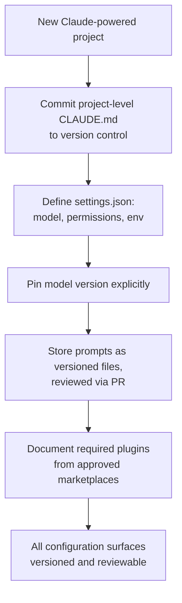

# CCDF Domain 2: Applications and Integration (33.1%)
## Task 2.6 — Configuration Management (4.1%)

> Configuration management for Claude system components, including CLAUDE.md files, settings.json, model version pinning, prompt versioning, and plugin dependencies.

---

## 1. Why This Topic Matters

A Claude-powered application isn't just prompts and code — it's also **configuration**: which model runs, what a session is allowed to do, what instructions load automatically, and which plugins/dependencies are active. Managed poorly, configuration drift causes inconsistent behavior across environments and teammates. This task tests whether you know the main configuration surfaces and how to manage them properly.

---

## 2. CLAUDE.md — Persistent Project Instructions

Covered in Task 2.5 as an *instruction layer*; here the focus is on **managing it as configuration**.

`CLAUDE.md` is a Markdown file, automatically loaded by Claude Code, that persists project context and standards across every session — so instructions don't need to be repeated in each conversation.

### 2.1 Where CLAUDE.md Files Live (Hierarchy)

| Location | Scope | Typically version-controlled? |
|---|---|---|
| `~/.claude/CLAUDE.md` | Personal, applies across all your projects | No — personal machine only |
| `./CLAUDE.md` (project root) | Whole project/team | **Yes** — committed and shared with the team |
| `./subdir/CLAUDE.md` | Just that subdirectory/module | Yes, alongside that module's code |
| `./CLAUDE.local.md` | Personal overrides for this one project | No — typically git-ignored |

More specific files can **add to or override** broader ones — the same idea as configuration precedence in general software systems.

### 2.2 Simple Example

```markdown
# CLAUDE.md (project root — committed to git)
## Project Overview
Java/Spring Boot backend, PostgreSQL database.

## Coding Standards
- Use constructor injection, not field injection
- All new endpoints require unit tests

## Commands
- ./mvnw test — run tests
- ./mvnw spring-boot:run — start locally
```

### 2.3 Configuration Management Best Practice

> **Treat `CLAUDE.md` like code.** Commit the project-level file to version control (Task 2.4), review changes to it in pull requests, and keep personal preferences out of it — those belong in your personal `~/.claude/CLAUDE.md` instead.

---

## 3. settings.json — Behavioral and Permission Configuration

`settings.json` is Claude Code's configuration file for **how sessions behave** — covering things like the default model, permissions (what tools can run automatically vs. need approval), environment variables, and MCP server approvals.

### 3.1 Common Settings

| Key | Purpose | Example |
|---|---|---|
| `model` | Overrides the default model used | `"model": "claude-sonnet-4-6"` |
| `permissions.allow` | Tool actions allowed without asking | `["Bash(git diff:*)"]` |
| `permissions.ask` | Tool actions that require confirmation | `["Bash(git push:*)"]` |
| `permissions.deny` | Tool actions always blocked | `["Read(./.env)", "WebFetch"]` |
| `env` | Environment variables applied to every session | `{"FOO": "bar"}` |
| `hooks` | Commands run automatically around tool use (Task 1.2) | `{"PreToolUse": {...}}` |
| `enableAllProjectMcpServers` | Auto-approve MCP servers defined in the project | `true` / `false` |

### 3.2 Simple Example

```json
{
  "model": "claude-sonnet-4-6",
  "permissions": {
    "allow": ["Bash(git diff:*)", "Bash(npm test:*)"],
    "ask": ["Bash(git push:*)"],
    "deny": ["Read(./.env)", "Bash(curl:*)"]
  },
  "env": {
    "NODE_ENV": "development"
  }
}
```

### 3.3 settings.json Hierarchy (Precedence)

Just like `CLAUDE.md`, `settings.json` files exist at multiple levels, and **more specific/session-level settings generally win**, except for one crucial exception:

```mermaid
flowchart TD
    A["Managed settings\n(organization-enforced, cannot be overridden)"] --> B[Command-line arguments\n(this session only)]
    B --> C[".claude/settings.local.json\n(personal, project-specific, git-ignored)"]
    C --> D[".claude/settings.json\n(team-shared, committed to git)"]
    D --> E["~/.claude/settings.json\n(personal, global defaults)"]
```

> **Exam tip:** The key exception to "more specific wins" is `deny` rules and organization-managed settings — a `deny` rule and a managed policy **cannot** be overridden by a lower-priority `allow`/`ask` rule. Security restrictions always win, regardless of hierarchy level.

### 3.4 Anti-Pattern Callout

> ⚠️ **Anti-Pattern: Committing personal settings to the shared project file**
> Putting a developer's personal preferences (e.g., their own permission shortcuts) into the team-shared `.claude/settings.json` instead of their personal `settings.local.json`. This causes every teammate to inherit one person's individual configuration.

---

## 4. Model Version Pinning

**Model version pinning** means explicitly specifying which model version an application uses, rather than always using "whatever is latest."

### 4.1 Why It Matters

| Without Pinning | With Pinning |
|---|---|
| Model updates automatically, behavior can shift unexpectedly | Behavior stays consistent until you deliberately upgrade |
| Hard to reproduce a bug from last week | Easy to reproduce — you know exactly which model ran |
| Risky for production systems with strict evaluation requirements | Safer — you control exactly when and how to re-evaluate after an upgrade |

### 4.2 Simple Example

```python
# Unpinned — resolves to "whatever sonnet currently is" (risk: behavior can shift under you)
model = "claude-sonnet-latest"

# Pinned — a specific, dated model version
model = "claude-sonnet-4-6"
```

```json
// settings.json — pinning Claude Code's default model
{
  "model": "claude-sonnet-4-6"
}
```

> **Exam tip:** The tested principle: **pin the model version in production**, and treat a model upgrade as a **deliberate, tested change** — re-run your evaluations (covered in later domains) before switching, rather than letting it happen silently.

---

## 5. Prompt Versioning

Just like application code, **prompts** (system prompts, tool descriptions, few-shot examples) change over time and need to be **versioned** — tracked, reviewed, and revertible.

### 5.1 Why Prompt Versioning Matters

- A prompt change can alter behavior as much as a code change (Task 2.4's code-review point).
- Without versioning, you can't answer "what prompt was live when this bug happened?"
- Enables **A/B testing** or gradual rollout of a new prompt version.

### 5.2 Simple Example — Storing Prompts as Versioned Files

```
/prompts
  ├── billing_assistant_v1.md
  ├── billing_assistant_v2.md   # improved escalation logic
  └── billing_assistant_CURRENT.md -> billing_assistant_v2.md  (symlink or config pointer)
```

```python
PROMPT_VERSION = "v2"  # tracked in application config, changed deliberately

def load_system_prompt():
    with open(f"prompts/billing_assistant_{PROMPT_VERSION}.md") as f:
        return f.read()
```

Storing prompts as separate, version-controlled files (rather than buried as inline strings scattered through code) makes changes to them **reviewable in pull requests**, just like any other code change.

### 5.3 Anti-Pattern Callout

> ⚠️ **Anti-Pattern: Editing the "live" prompt directly with no history**
> Changing a production system prompt in place with no commit history, no review, and no way to see what changed or roll back. This makes debugging behavior regressions extremely difficult — was it the model, the data, or an unreviewed prompt edit?

---

## 6. Plugin Dependencies

Covered functionally in Task 2.5 (plugin management); here the focus is **managing plugins as part of your configuration** — what a project depends on to work correctly.

### 6.1 What "Plugin Dependencies" Means

A project's Claude Code setup may depend on specific **plugins** being installed (e.g., an internal linting plugin, a company MCP-server plugin) for its intended workflows to function. This is conceptually similar to a `package.json` or `requirements.txt` for regular software dependencies — except for plugins/marketplaces.

### 6.2 Simple Example — Documenting Plugin Dependencies

```markdown
# CLAUDE.md (project root)
## Required Plugins
This project expects the following Claude Code plugins to be installed:
- `internal-lint-helper@company-marketplace` — enforces our style guide
- `ticket-context@company-marketplace` — pulls ticket context from our internal tracker

Run:
/plugin marketplace add company-org/company-marketplace
/plugin install internal-lint-helper@company-marketplace
/plugin install ticket-context@company-marketplace
```

### 6.3 Why This Matters for Configuration Management

| Risk if unmanaged | Mitigation |
|---|---|
| Teammates have inconsistent capabilities (one has the linting plugin, another doesn't) | Document required plugins clearly, ideally checked/onboarded automatically |
| An untrusted or outdated plugin version introduces unexpected behavior | Pin/review plugin versions the same way you'd pin a model version |
| Plugin from an unreviewed marketplace introduces a security risk (Task 2.5) | Only depend on plugins from reviewed, approved marketplaces |

> **Exam tip:** The consistent theme across this whole task: **treat every configuration surface — CLAUDE.md, settings.json, model version, prompts, plugins — with the same discipline as code**: version it, review changes, and avoid silent drift between environments or teammates.

---

## 7. Putting It All Together — Configuration Management Checklist



---

## 8. Quick Reference Summary

| Concept | One-Line Definition |
|---|---|
| CLAUDE.md | Persistent, hierarchical project instructions auto-loaded by Claude Code |
| settings.json | Configures model, permissions, environment variables, and MCP approvals for a session |
| Settings Hierarchy | Managed (org) > command-line > local project > shared project > personal global — deny rules always win |
| Model Version Pinning | Explicitly specifying a fixed model version instead of "latest," for reproducibility |
| Prompt Versioning | Tracking prompt changes like code — reviewable, revertible, testable |
| Plugin Dependencies | Documenting/managing which plugins a project requires, from approved marketplaces |
| Rule of thumb | Treat every configuration surface with the same discipline as source code: version it, review it, avoid silent drift |

---

## 9. Practice Q&A

**Q1. A team notices inconsistent Claude Code behavior across teammates' machines. What configuration practice most likely fixes this?**
<details><summary>Answer</summary>
Ensuring the **project-level `CLAUDE.md` and shared `.claude/settings.json`** are committed to version control (not left as personal/local files), and that **model version pinning** is used so everyone runs the same model version.
</details>

**Q2. A production application always uses `claude-sonnet-latest` instead of a specific dated model string. What risk does this create?**
<details><summary>Answer</summary>
Behavior can shift unexpectedly whenever the underlying model updates, making bugs hard to reproduce. **Model version pinning** to a specific dated model avoids this.
</details>

**Q3. A `deny` rule exists in an organization's managed settings, but a developer's personal `settings.local.json` has an `allow` rule for the same action. Which one wins?**
<details><summary>Answer</summary>
The **`deny` rule** — deny rules and organization-managed policies always take precedence and cannot be overridden by a lower-priority `allow`/`ask` rule, regardless of hierarchy level.
</details>

**Q4. Why should system prompts be stored as separate, version-controlled files rather than inline strings scattered through the codebase?**
<details><summary>Answer</summary>
So prompt changes are **tracked, reviewable in pull requests, and revertible** — just like code — making it possible to know exactly what prompt was live at any point and to roll back a problematic change.
</details>

**Q5. True or False: Plugin dependencies for a project should be installed from any marketplace a teammate finds convenient.**
<details><summary>Answer</summary>
False. Plugins should come from **reviewed, approved marketplaces**, since an unreviewed plugin can introduce untrusted hooks or MCP servers — a real security risk, not just a convenience choice.
</details>