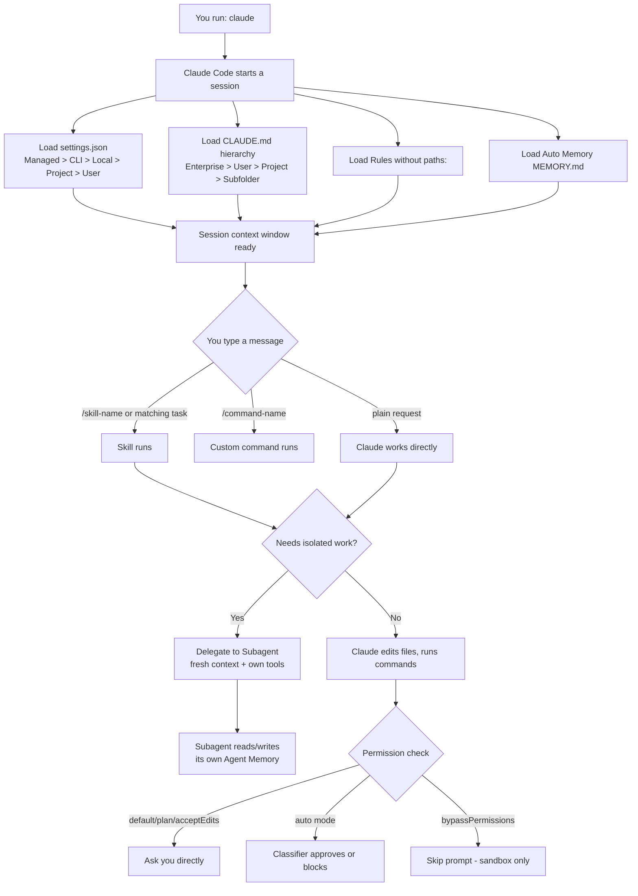

# Claude Certified Developer Foundations (CCDF)
## Domain 3: Claude Code — Claude Code Operation (3.1%)

This tutorial explains everything in the syllabus line:

> Claude Code core components (Rules, Skills, Commands, Agents, Agent Memory), features (session
> management, built-in and custom slash commands, headless mode, streaming mode, auto-mode), the
> CLAUDE.md hierarchy, repository initialization, and settings.json configuration.

The language is kept simple. Every idea has a small example. Read it top to bottom, or use the
table of contents to jump to a topic you need to review.

---

## Table of Contents

1. [What is Claude Code?](#1-what-is-claude-code)
2. [The `.claude` Directory — The Big Picture](#2-the-claude-directory--the-big-picture)
3. [CLAUDE.md and the Memory Hierarchy](#3-claudemd-and-the-memory-hierarchy)
4. [Rules](#4-rules)
5. [Skills](#5-skills)
6. [Commands (Slash Commands)](#6-commands-slash-commands)
7. [Agents (Subagents)](#7-agents-subagents)
8. [Agent Memory](#8-agent-memory)
9. [Session Management](#9-session-management)
10. [Headless Mode](#10-headless-mode)
11. [Streaming Mode](#11-streaming-mode)
12. [Auto Mode](#12-auto-mode)
13. [Repository Initialization](#13-repository-initialization)
14. [settings.json Configuration](#14-settingsjson-configuration)
15. [How Everything Fits Together (Flow Diagram)](#15-how-everything-fits-together-flow-diagram)
16. [Quick Revision Cheat Sheet](#16-quick-revision-cheat-sheet)
17. [Practice Questions](#17-practice-questions)

---

## 1. What is Claude Code?

Claude Code is a command-line tool (a "CLI") made by Anthropic. It lets Claude read your project
files, write code, run tests, and do real development work — not just chat about code.

You start it by typing:

```bash
claude
```

This opens an interactive chat inside your terminal. Claude can see your files, edit them, and
run shell commands (with your permission, depending on the mode you are in).

Claude Code is also available inside VS Code, JetBrains IDEs, and a desktop app, but they all read
the **same configuration files** described in this tutorial.

---

## 2. The `.claude` Directory — The Big Picture

Almost everything Claude Code does with a project is controlled by files inside a folder called
`.claude/`. This folder can live in two places:

| Location | Applies to |
|---|---|
| `~/.claude/` (in your home folder) | **You**, in every project on your machine (global/personal) |
| `.claude/` (inside your project folder) | **Everyone** who works on this project, if you commit it to git |

Think of it like this: the **global** folder is your personal toolbox that follows you everywhere.
The **project** folder is the shared toolbox that ships with the repository.

Here is what normally lives inside `.claude/`:

```
your-project/
├── CLAUDE.md                 # Project instructions (memory)
├── .mcp.json                 # Shared MCP server config
└── .claude/
    ├── settings.json         # Permissions, hooks, env vars (committed)
    ├── settings.local.json   # Your personal overrides (gitignored)
    ├── rules/                # Topic-scoped instructions
    │   └── testing.md
    ├── skills/                # Reusable prompts + supporting files
    │   └── security-review/
    │       └── SKILL.md
    ├── commands/              # Legacy single-file prompts
    │   └── fix-issue.md
    ├── agents/                # Subagent definitions
    │   └── code-reviewer.md
    └── agent-memory/          # Persistent memory for subagents
        └── code-reviewer/
            └── MEMORY.md
```

Most beginners only ever touch `CLAUDE.md` and `settings.json`. Everything else is optional and
added as your project grows.

---

## 3. CLAUDE.md and the Memory Hierarchy

### What is CLAUDE.md?

`CLAUDE.md` is a plain markdown file where **you write instructions for Claude**. It is loaded
into context automatically at the start of every session — you never have to repeat yourself.

Example `CLAUDE.md`:

```markdown
# Project conventions

## Commands
- Build: `npm run build`
- Test: `npm test`
- Lint: `npm run lint`

## Rules
- Use named exports, never default exports
- Tests live next to source: `foo.ts` -> `foo.test.ts`
```

### The Hierarchy (Where CLAUDE.md Files Can Live)

Claude Code looks for `CLAUDE.md` files at **several levels**, from organization-wide down to a
single folder. All the files found are **concatenated together** into context — one does not
replace another (except at the same path).

| Level | Location | Who it affects |
|---|---|---|
| Enterprise / Managed policy | e.g. `/etc/claude-code/CLAUDE.md` (Linux) | Everyone in the organization |
| User (global) | `~/.claude/CLAUDE.md` | Just you, in every project |
| Project | `./CLAUDE.md` or `./.claude/CLAUDE.md` | Everyone on the project (via git) |
| Subdirectory | `./src/CLAUDE.md`, `./tests/CLAUDE.md` | Only loaded when Claude reads files in that folder |
| Local (personal, per project) | `./CLAUDE.local.md` | Just you, only in this project (gitignore it yourself) |

**How lookup works:** Starting from your current working directory, Claude Code walks **up** the
folder tree (but never above your home directory or the filesystem root) and loads every
`CLAUDE.md` and `CLAUDE.local.md` it finds along the way. It also discovers `CLAUDE.md` files
**nested inside subfolders below** where you started — those load only when Claude actually reads
a file in that subfolder, not at startup.

> **Exam tip:** CLAUDE.md files are **concatenated**, not overridden. If your team's
> `.claude/CLAUDE.md` says one thing and your personal `~/.claude/CLAUDE.md` says another, Claude
> sees both — it is guidance, not a strict override system like `settings.json`.

### Quick ways to manage memory

- Type `#` at the start of a message to quickly add a memory line.
- Run `/memory` inside a session to open your memory files directly in your editor.
- Run `/init` to have Claude scan your codebase and generate a starter `CLAUDE.md` for you.

### Auto Memory (Claude's own notes)

Separate from CLAUDE.md (which **you** write), Claude Code also keeps **auto memory** — notes
**Claude writes about itself** as it learns your preferences and codebase quirks.

- Stored at `~/.claude/projects/<project>/memory/MEMORY.md`
- The first 200 lines (or 25 KB, whichever is smaller) load automatically every session
- Extra "topic files" (like `debugging.md`) are read only when relevant

| | CLAUDE.md | Auto memory |
|---|---|---|
| Who writes it | You | Claude |
| Purpose | Standing instructions | Learned facts/preferences |
| Shared with team? | Yes, if committed | No, it's local to your machine |

---

## 4. Rules

**Rules** solve one problem: a big `CLAUDE.md` file loads into **every single session**, even when
most of it is irrelevant to the current task. Rules let you split instructions into topic files
that load **only when needed**.

Rules live in:
- `.claude/rules/*.md` (project, shared with team)
- `~/.claude/rules/*.md` (personal, every project)

A rule **without** `paths:` in its frontmatter behaves like CLAUDE.md — it loads at session start.

A rule **with** `paths:` only loads when Claude reads a matching file — this keeps your context
window clean.

Example: `.claude/rules/testing.md`

```markdown
---
paths:
  - "**/*.test.ts"
  - "**/*.test.tsx"
---

# Testing Rules

- Use descriptive test names: "should [expected] when [condition]"
- Mock external dependencies, not internal modules
- Clean up side effects in afterEach
```

This rule is invisible to Claude until it opens a `.test.ts` file — then it appears automatically.

> **Exam tip:** Rules are still **guidance**, not enforcement. Claude reads and tries to follow
> them, but it can make mistakes. For something that must **always** be true (e.g. "never allow
> `rm -rf`"), use **permissions** or **hooks** in `settings.json` instead — those are enforced by
> Claude Code itself, not just suggested to the model.

---

## 5. Skills

A **Skill** is a reusable capability packaged as a folder containing a `SKILL.md` file (plus any
supporting files it needs, like scripts or reference docs).

```
.claude/skills/
└── security-review/
    ├── SKILL.md
    └── checklist.md
```

`SKILL.md` example:

```markdown
---
description: Reviews code changes for security vulnerabilities and injection risks
disable-model-invocation: true
argument-hint: <branch-or-path>
---

## Diff to review

!`git diff $ARGUMENTS`

Audit the changes above for:
1. Injection vulnerabilities (SQL, XSS, command)
2. Hardcoded secrets or credentials

Use checklist.md in this skill directory for the full checklist.
```

Key points:

- A skill is invoked either by typing `/security-review <branch>` **or** automatically by
  Claude, if the task matches the skill's `description`.
- `disable-model-invocation: true` means **only you** (the user) can trigger it — Claude will
  never invoke it on its own.
- `user-invocable: false` does the opposite — hides it from the `/` menu, but Claude can still
  use it automatically.
- `$ARGUMENTS` captures everything typed after the skill name. You can also use `$0`, `$1`, etc.
  for individual arguments.
- A line starting with `` !`command` `` runs a shell command and inserts its output into the
  prompt before Claude even sees it.
- Skills can bundle extra files (like `checklist.md` above) that Claude reads on demand.

Skills can live at:
- `.claude/skills/` — project-level, shared with the team
- `~/.claude/skills/` — personal, available in every project

> **Exam tip:** Skills are the **modern, recommended way** to build reusable capabilities. They
> replaced the older "Commands" mechanism for most new use cases (see next section).

---

## 6. Commands (Slash Commands)

"Commands" in Claude Code has **two meanings** — be careful not to confuse them in the exam:

### A) Custom Commands (the legacy file-based mechanism)

A single markdown file that creates a `/name` command, without the extra folder structure of a
skill.

```
.claude/commands/fix-issue.md
```

```markdown
---
argument-hint: <issue-number>
---

!`gh issue view $ARGUMENTS`

Investigate and fix the issue above.
1. Trace the bug to its root cause
2. Implement the fix
3. Write or update tests
```

Typing `/fix-issue 123` runs this file, substituting `123` for `$ARGUMENTS`.

- Project commands: `.claude/commands/` (legacy; prefer skills for new work)
- Personal commands: `~/.claude/commands/`

> **Exam tip:** Commands and Skills use the **same invocation mechanism** (`/name`). A skill is
> essentially a command **plus** a folder for bundled files and richer frontmatter. If a command
> and a skill share the same name, the **skill wins**.

### B) Built-in Slash Commands (part of the CLI itself)

These are commands that ship with Claude Code and control the **session itself**, not your
project. A few of the most important ones:

| Command | What it does |
|---|---|
| `/clear` | Wipes conversation history, but keeps CLAUDE.md and project memory |
| `/compact` | Summarizes older parts of the conversation to free up context space |
| `/context` | Shows what is currently filling up your context window |
| `/memory` | Opens CLAUDE.md and other memory files for editing |
| `/resume` | Resume a previous session, by name or picker |
| `/model` | Switch the active model |
| `/config` | Open the settings menu |
| `/status` | Shows which settings files are currently loaded |
| `/permissions` | View and edit permission (and auto mode) rules |
| `/init` | Scan the repo and generate a starter CLAUDE.md |

Rule of thumb for the exam: **use `/compact` to keep working on the same task** while freeing
space, and **use `/clear` when switching to a completely new, unrelated task** (CLAUDE.md still
reloads, so you don't lose your project setup).

---

## 7. Agents (Subagents)

A **subagent** is a specialized "helper Claude" with its **own separate context window**, its own
system prompt, and (optionally) restricted tool access. Using subagents keeps your main
conversation clean because the sub-task's back-and-forth doesn't clutter it.

Defined as a markdown file:

```
.claude/agents/code-reviewer.md
```

```markdown
---
name: code-reviewer
description: Reviews code for correctness, security, and maintainability
tools: Read, Grep, Glob
---

You are a senior code reviewer. Review for:
1. Correctness: logic errors, edge cases, null handling
2. Security: injection, auth bypass, data exposure
3. Maintainability: naming, complexity, duplication

Every finding must include a concrete fix.
```

Key points:

- `tools:` restricts what the subagent can do. Here it can only **read** code (`Read`, `Grep`,
  `Glob`) — it cannot edit files.
- The main Claude can **delegate automatically** to a subagent whose `description` matches the
  task, or you can call it directly by typing `@` and picking it from the autocomplete list.
- Each subagent run gets a **fresh context window** — separate from your main session.
- Subagents can be defined at project scope (`.claude/agents/`, shared with the team) or personal
  scope (`~/.claude/agents/`, available everywhere).

> **Exam tip:** Subagents are great for **parallel or isolated work** — for example, running one
> subagent to write code while another reviews it, without either one polluting the other's
> context.

---

## 8. Agent Memory

**Agent Memory** is persistent memory that belongs to a **subagent**, not to your main session.

- It is a different feature from your main session's "auto memory."
- Enabled by adding a `memory:` field to a subagent's frontmatter.

```markdown
---
name: code-reviewer
description: Reviews code for correctness and security
tools: Read, Grep, Glob
memory: project
---
```

| `memory:` value | Where it is stored | Shared with team? |
|---|---|---|
| `project` | `.claude/agent-memory/<agent-name>/MEMORY.md` | Yes, if committed to git |
| `local` | `.claude/agent-memory-local/<agent-name>/` | No, kept out of git |
| `user` | `~/.claude/agent-memory/<agent-name>/` | No, personal, but works across all your projects |

The subagent writes and updates its own `MEMORY.md` automatically. You do not write it by hand —
you can read it, though, to see what the subagent has learned.

Example content the subagent might save:

```markdown
# code-reviewer memory

## Patterns seen
- Project uses custom Result<T, E> type, not exceptions
- Auth middleware expects Bearer token in Authorization header

## Recurring issues
- Missing null checks on API responses (src/api/*)
```

The first 200 lines (capped at 25 KB) of this file load into the subagent's system prompt every
time it runs.

---

## 9. Session Management

A "session" is one continuous conversation with Claude Code, tied to a project folder.

### Starting and continuing sessions

```bash
# Start a brand-new interactive session
claude

# Resume the most recently used session
claude --continue
# or the short form
claude -c

# Resume a specific session by its ID or name
claude --resume "payment-refactor"
claude -r "payment-refactor"
```

### Inside a session

| Action | Command |
|---|---|
| Reset conversation, keep CLAUDE.md | `/clear` |
| Free up space, keep context | `/compact` |
| See what's using your context | `/context` |
| List/switch to another session | `/resume` |
| Branch the current session in a new direction | `/branch` |
| Roll code and conversation back | `/rewind` |

### What Claude can "see" in a session

The context window for a session holds: your conversation history, file contents, command
outputs, CLAUDE.md, auto memory, loaded skills, and the system instructions. When this fills up,
Claude Code automatically **compacts** older parts (summarizes them) so the session can continue.

> **Exam tip:** Project-root `CLAUDE.md` and auto memory **survive compaction** — they are
> reloaded fresh from disk afterward. Instructions given only in the chat itself can be lost
> during compaction, which is why persistent instructions belong in CLAUDE.md.

---

## 10. Headless Mode

**Headless mode** runs Claude Code **without** the interactive chat UI — perfect for scripts, CI/CD
pipelines, and automation. You turn it on with `-p` (or `--print`).

```bash
# Run one prompt and exit, printing plain text
claude -p "Summarize this project"
```

### Getting structured (parseable) output

Use `--output-format` to control the shape of the response:

| Value | Meaning |
|---|---|
| `text` (default) | Plain text, for humans |
| `json` | One structured JSON object with `result`, `session_id`, cost info, etc. |
| `stream-json` | Newline-delimited JSON, one event per line, sent in real time |

```bash
claude -p "Summarize this project" --output-format json
```

Example: extracting just the answer text with `jq`:

```bash
claude -p "Summarize this project" --output-format json | jq -r '.result'
```

### Chaining headless calls together (keeping the same session)

```bash
session_id=$(claude -p "Start a review" --output-format json | jq -r '.session_id')
claude -p "Continue that review" --resume "$session_id"
```

### Auto-approving tools for CI pipelines

Because there is no human to click "yes" in a pipeline, you usually pass an explicit permission
mode or an allow-list:

```bash
claude -p "Run tests and fix failures" --allowedTools "Bash,Read,Edit"
```

> **Exam tip:** Headless mode is the foundation for **automation** — CI/CD jobs, git hooks, and
> scripts all use `claude -p` under the hood.

---

## 11. Streaming Mode

Streaming mode is the **`stream-json`** output format used together with headless mode. Instead of
waiting for the whole answer, you get a live feed of events as Claude works — useful for
dashboards, progress bars, or piping into another program.

To get **token-by-token** streaming (not just message-by-message), combine three flags:

```bash
claude -p "Explain recursion" \
  --output-format stream-json \
  --verbose \
  --include-partial-messages
```

- `--output-format stream-json` — turns on newline-delimited JSON events
- `--verbose` — needed for full detail
- `--include-partial-messages` — required to see individual tokens as they are generated, not
  just complete messages

Each line printed to stdout is a separate, complete JSON object you can parse one at a time.

There is also **streaming input**, using `--input-format stream-json`, which lets a program send
Claude a continuous stream of messages instead of one single prompt — this is the mechanism used
for building interactive, bidirectional integrations on top of the CLI.

```bash
echo '{"type":"user","message":{"role":"user","content":[{"type":"text","text":"Explain this code"}]}}' \
  | claude -p --output-format=stream-json --input-format=stream-json --verbose
```

> **Exam tip:** `json` gives you **one** final answer object. `stream-json` gives you **many**
> small event objects, in real time, as Claude generates the response.

---

## 12. Auto Mode

**Auto mode** is a permission mode that lets Claude work **without stopping to ask for
permission** on every action. Instead of asking you, a background **classifier** (a model that
inspects each action) decides whether an action is safe.

- The classifier blocks anything **irreversible, destructive, or aimed outside your project
  environment** (like deleting files, or sending data to an unrelated external host).
- If the classifier **fails or blocks an action too many times in a row**, auto mode pauses and
  Claude Code falls back to asking you directly — it doesn't stay silently stuck.
- You can review and edit the classifier's rules by running `/permissions` and opening the
  **Auto mode** tab.

### The permission modes, side by side

| Mode | What happens |
|---|---|
| `default` (a.k.a. Manual) | You approve every sensitive action yourself |
| `plan` | Claude can only read files and run read-only commands, then proposes a plan |
| `acceptEdits` | File edits are auto-approved; other sensitive actions still ask |
| `auto` | A classifier auto-approves safe actions; asks you only when unsure or blocked repeatedly |
| `bypassPermissions` | Skips almost all prompts — only for isolated sandboxes/containers |

Setting `auto` as your default starting mode:

```json
{
  "permissions": {
    "defaultMode": "auto"
  }
}
```

For a single session, you can pass a flag instead:

```bash
claude --permission-mode auto
```

> **Exam tip:** Auto mode **reduces prompts**, but the syllabus/docs are clear that it does
> **not guarantee safety** — it is still recommended to run it inside a sandbox or container for
> extra protection, especially for CI/automation.

---

## 13. Repository Initialization

"Initializing" a repository means setting Claude Code up for a project for the first time. The
easiest way is the built-in slash command:

```bash
claude
> /init
```

What `/init` does:

1. Scans your codebase (folder structure, package files, existing docs).
2. Detects your build, test, and lint commands.
3. Generates a starter `CLAUDE.md` file with that information already filled in.

You can also just create the file yourself:

```bash
touch CLAUDE.md
```

A good starter `CLAUDE.md` after initialization usually includes:

```markdown
# Project conventions

## Commands
- Build: `npm run build`
- Test: `npm test`
- Lint: `npm run lint`

## Stack
- TypeScript with strict mode
- React 19, functional components only

## Rules
- Named exports, never default exports
```

### Sharing initialization with your team

Once you have a `CLAUDE.md` and a `.claude/settings.json` you are happy with, **commit them to
git**. Everyone who clones the repository will then automatically get the same:

- Project conventions and context (via `CLAUDE.md`)
- Permission rules, hooks, and environment variables (via `.claude/settings.json`)

Personal tweaks that should **not** be shared go in `.claude/settings.local.json` and
`CLAUDE.local.md` — Claude Code keeps these files out of git automatically the first time it
writes to them.

> **Exam tip:** `/init` does not require any prior configuration — running it in a brand-new,
> unconfigured project is the standard first step of onboarding Claude Code to a codebase.

---

## 14. settings.json Configuration

`settings.json` is **JSON configuration that Claude Code enforces directly** — unlike CLAUDE.md,
which is guidance the model reads, settings are rules the tool itself applies whether Claude
"wants to" follow them or not.

### Where settings files live

| Scope | File | Who it affects |
|---|---|---|
| User | `~/.claude/settings.json` | You, every project on this machine |
| Shared project | `.claude/settings.json` | Everyone working in this project (commit it) |
| Project local | `.claude/settings.local.json` | You, this project only (gitignored) |
| Managed | `managed-settings.json` / MDM / admin console | Everyone in the organization |

### Example settings.json

```json
{
  "$schema": "https://json.schemastore.org/claude-code-settings.json",
  "permissions": {
    "allow": [
      "Bash(npm run lint)",
      "Bash(npm run test *)"
    ],
    "deny": [
      "Read(./.env)",
      "Read(./.env.*)"
    ]
  },
  "hooks": {
    "PostToolUse": [
      {
        "matcher": "Edit|Write",
        "hooks": [
          {
            "type": "command",
            "command": "jq -r '.tool_input.file_path' | xargs npx prettier --write"
          }
        ]
      }
    ]
  },
  "model": "claude-sonnet-5"
}
```

What each key does:

- **`permissions.allow`** — tool calls that run **without asking**
- **`permissions.deny`** — tool calls that are **always blocked**
- **`hooks`** — your own scripts that run automatically at certain points (here, formatting a
  file right after Claude edits or writes it)
- **`model`** — sets the default model for this scope
- **`env`** — environment variables applied to every session in this scope

### Precedence: which file "wins"?

When the **same key** is set in more than one file, Claude Code uses the value from the
**highest-precedence** source. From highest to lowest:

1. **Managed settings** (organization-deployed — nothing below can override it, with a few
   security exceptions)
2. **Command line** (`--settings`, flags, for one session only)
3. **Project local** (`.claude/settings.local.json`)
4. **Shared project** (`.claude/settings.json`)
5. **User** (`~/.claude/settings.json`)

```
Highest precedence
1. Managed settings
2. Command line (--settings, flags)
3. Project local settings.local.json
4. Shared project settings.json
5. User settings.json
Lowest precedence
```

**Important exception:** list-type settings, like `permissions.allow`, **merge together** across
every file instead of one replacing another. So your organization's allow rules and your personal
allow rules can both apply at the same time. Scalar settings (like `model`) simply use the value
from the highest-precedence file.

### Checking what actually loaded

```bash
claude
> /status
```

`/status` shows a "Setting sources" line naming every settings file that was actually loaded for
the current session — very useful for debugging why a setting doesn't seem to apply.

### Changing a setting without editing a file

```bash
# One-off change for a single session only
claude --settings '{"model": "claude-opus-5-5"}'

# Or set one value inline in the /config menu
/config verbose=true
```

> **Exam tip:** Remember the difference in *philosophy*: **CLAUDE.md/Rules = guidance Claude
> reads**, and **settings.json (permissions/hooks) = rules Claude Code enforces**. If the exam
> asks "how do I guarantee Claude never runs `rm -rf`", the answer is a `deny` rule in
> `settings.json`, not a line in CLAUDE.md.

---

## 15. How Everything Fits Together (Flow Diagram)



---

## 16. Quick Revision Cheat Sheet

| Term | One-line definition |
|---|---|
| **CLAUDE.md** | Instructions **you** write; loads every session; concatenated across levels |
| **Rules** | Topic-scoped instructions, optionally loaded only for matching file paths |
| **Skills** | Reusable folder-based capability with `SKILL.md`; invoked by `/name` or automatically |
| **Commands** | Legacy single-file version of a skill; also invoked by `/name` |
| **Agents (Subagents)** | Helper Claude with its own context window and restricted tools |
| **Agent Memory** | Persistent memory written by a subagent about itself (project/local/user scope) |
| **Auto Memory** | Notes Claude writes about itself for the main session, separate from CLAUDE.md |
| **Session** | One conversation; managed with `/clear`, `/compact`, `/resume`, `--continue` |
| **Headless mode** | `claude -p`, non-interactive, for scripts/CI |
| **Streaming mode** | `--output-format stream-json` (+ `--verbose --include-partial-messages`) for real-time events |
| **Auto mode** | Permission mode where a classifier approves safe actions instead of asking you |
| **settings.json** | Enforced configuration: permissions, hooks, env vars, model — not just guidance |
| **`/init`** | Scans the repo and generates a starter CLAUDE.md |

---

## 17. Practice Questions

**Q1.** You want a rule that only applies when Claude is working on files inside `src/api/`.
Where do you put it, and what frontmatter field controls the scope?
<details><summary>Answer</summary>
In <code>.claude/rules/api-design.md</code>, using the <code>paths:</code> frontmatter field with
a glob like <code>src/api/**/*.ts</code>.
</details>

**Q2.** What is the key difference between `/clear` and `/compact`?
<details><summary>Answer</summary>
<code>/clear</code> wipes the conversation history completely (but keeps CLAUDE.md loaded).
<code>/compact</code> summarizes older parts of the same conversation to save space, while
keeping continuity.
</details>

**Q3.** Which file type is enforced by Claude Code itself, regardless of what the model
"wants" — CLAUDE.md or settings.json?
<details><summary>Answer</summary>
<code>settings.json</code> (specifically its <code>permissions</code> and <code>hooks</code>).
CLAUDE.md and Rules are guidance the model reads, not guaranteed enforcement.
</details>

**Q4.** You need Claude to run in a CI pipeline and return a machine-readable result. Which two
flags do you combine?
<details><summary>Answer</summary>
<code>-p</code> (headless/print mode) together with <code>--output-format json</code> (or
<code>stream-json</code> for real-time events).
</details>

**Q5.** What does auto mode do when its classifier fails or blocks an action too many times in a
row?
<details><summary>Answer</summary>
Auto mode pauses and Claude Code falls back to asking the user directly for permission, instead of
staying stuck.
</details>

**Q6.** True or False: A `CLAUDE.md` file at the project root overrides a `CLAUDE.md` file at the
user (`~/.claude/`) level.
<details><summary>Answer</summary>
False. CLAUDE.md files at different levels are <strong>concatenated</strong> into context
together, not overridden. (Settings.json values, by contrast, do follow an override/precedence
order.)
</details>

**Q7.** Where does a subagent's persistent memory get stored if its frontmatter sets
`memory: user`?
<details><summary>Answer</summary>
<code>~/.claude/agent-memory/&lt;agent-name&gt;/MEMORY.md</code> — personal to you, available
across all your projects.
</details>

---

### Final Tips for the Exam

- Know **which file is guidance vs. enforcement** (CLAUDE.md/Rules vs. settings.json/hooks).
- Know **the precedence order** for settings.json (Managed > CLI > Local > Project > User) and
  that CLAUDE.md files are concatenated, not overridden.
- Know **the difference between Skills and Commands** (skills are the modern, folder-based,
  richer version; commands are legacy single files — both use `/name`).
- Know **headless vs. streaming** (`-p` for non-interactive; `stream-json` for real-time events).
- Know **what auto mode changes** (a classifier replaces manual approval, with automatic
  fallback to prompting if it repeatedly fails).

Good luck with your CCDF exam!