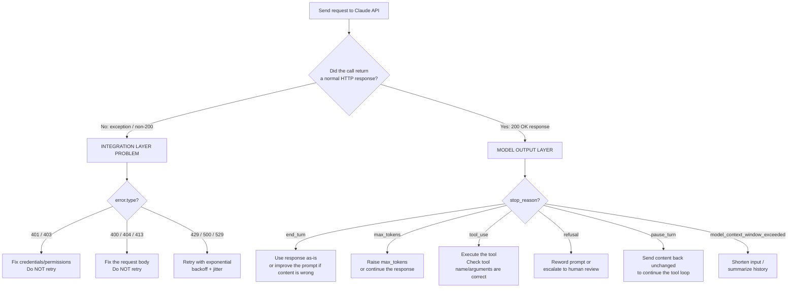

# Claude Certified Developer Foundations (CCDF)
## Domain 4: Eval, Testing, and Debugging — Debugging and Error Handling (2.6%)

This tutorial explains everything in the syllabus line:

> Debugging and error handling techniques for Claude applications, including error type
> identification, recovery strategy selection, trace analysis to identify failure modes, and
> problem origin isolation between the integration layer and model output.

The language is kept simple. Every idea has a small example. Read it top to bottom, or use the
table of contents to jump to a topic you need to review.

---

## Table of Contents

1. [Why Debugging Claude Apps Is Different](#1-why-debugging-claude-apps-is-different)
2. [The Two Layers: Integration vs. Model Output](#2-the-two-layers-integration-vs-model-output)
3. [Error Type Identification](#3-error-type-identification)
4. [Model Output "Failure Modes" (stop_reason)](#4-model-output-failure-modes-stop_reason)
5. [Recovery Strategy Selection](#5-recovery-strategy-selection)
6. [Trace Analysis](#6-trace-analysis)
7. [Problem Origin Isolation — A Step-by-Step Method](#7-problem-origin-isolation--a-step-by-step-method)
8. [Putting It All Together: A Robust Call Wrapper](#8-putting-it-all-together-a-robust-call-wrapper)
9. [Flow Diagram](#9-flow-diagram)
10. [Quick Revision Cheat Sheet](#10-quick-revision-cheat-sheet)
11. [Practice Questions](#11-practice-questions)

---

## 1. Why Debugging Claude Apps Is Different

When a normal program crashes, you usually get a stack trace pointing at one broken line. A Claude
application is different because a request can "fail" in **two very different ways**:

1. The **request itself never succeeded** — something went wrong before, during, or after the
   network call (a bad API key, a timeout, a malformed request, a server outage).
2. The **request succeeded perfectly**, but the **content Claude produced** wasn't what you wanted
   (it got cut off, it refused, it hallucinated, it called the wrong tool).

Both feel like "something went wrong" to your user, but they need **completely different fixes**.
Confusing the two is the single most common debugging mistake in Claude applications — for
example, retrying a request that "failed" because Claude's answer was simply too long will not
help, since the API call itself was a success.

---

## 2. The Two Layers: Integration vs. Model Output

Think of every Claude API call as passing through two layers:

```
Your Code  --->  [ INTEGRATION LAYER ]  --->  Anthropic API  --->  [ MODEL OUTPUT ]  --->  Your Code
                 (network, auth, request
                  format, SDK, retries)                         (what Claude decided
                                                                   to say or do)
```

| Layer | What lives here | How it fails | Signal you check |
|---|---|---|---|
| **Integration layer** | Your API key, request JSON, network, SDK client, timeouts, retries | HTTP error (4xx/5xx) — the request never got a normal completed response | Exception / `error.type` / HTTP status code |
| **Model output** | What Claude actually generated | A completed response, but the content or `stop_reason` isn't what you wanted | `stop_reason`, `content`, `usage` fields on a **successful** response |

> **Exam tip:** The single fastest question to ask when something looks wrong is: **"Did I get a
> normal (HTTP 200) response back, or did the call raise/return an error?"** If it's an error →
> integration layer. If it's a normal response you're unhappy with → model output layer.

---

## 3. Error Type Identification

The Anthropic API returns errors as JSON, always with a top-level `error` object containing a
`type` and a `message`. Every error also includes a `request_id` — save this, because it is the
single most useful piece of information when reporting a bug or investigating a trace.

```json
{
  "type": "error",
  "error": {
    "type": "not_found_error",
    "message": "The requested resource could not be found."
  },
  "request_id": "req_018EeWyXxfu5pfWkrYcMdjWG"
}
```

### The standard HTTP error codes

| HTTP status | `error.type` | Meaning | Layer |
|---|---|---|---|
| 400 | `invalid_request_error` | Your request format/content was wrong | Integration |
| 401 | `authentication_error` | Problem with your API key | Integration |
| 403 | `permission_error` | Your key can't use this resource | Integration |
| 404 | `not_found_error` | Resource (e.g. model name) not found | Integration |
| 413 | `request_too_large` | Request exceeds the max byte size | Integration |
| 429 | `rate_limit_error` | You've hit a rate limit | Integration |
| 500 | `api_error` | Unexpected error inside Anthropic's systems | Integration (server-side) |
| 529 | `overloaded_error` | Anthropic's API is temporarily overloaded | Integration (server-side) |

Notice that these are all **integration-layer** problems: none of them tell you anything about
what Claude "wanted" to say — they mean the request-response cycle itself broke down.

### A special case: streaming errors

When you use Server-Sent Events (streaming), it's possible for an error to occur **after** the
server already returned a 200 OK status. In that case the error arrives as an event inside the
stream instead of as an HTTP status code — your error handling must check **both** places.

### Client-side vs. server-side errors

- **4xx codes** (400, 401, 403, 404, 413, 429) are almost always something **you** can fix:
  wrong key, malformed JSON, request too big, too many requests.
- **5xx-style codes** (500, 529) are on **Anthropic's** side. Retrying later is usually the right
  move; changing your request will not help.

---

## 4. Model Output "Failure Modes" (`stop_reason`)

Every **successful** Messages API response includes a `stop_reason` field. This is not an error —
it is Claude telling you *why it stopped generating*. This is where you look for **model-output**
problems.

```json
{
  "id": "msg_01234",
  "type": "message",
  "role": "assistant",
  "content": [{ "type": "text", "text": "Here's the answer..." }],
  "stop_reason": "end_turn",
  "stop_sequence": null,
  "usage": { "input_tokens": 100, "output_tokens": 50 }
}
```

| `stop_reason` | When it happens | What to do |
|---|---|---|
| `end_turn` | Claude finished naturally | Use the response as-is |
| `max_tokens` | Response hit your `max_tokens` limit | Raise `max_tokens`, or continue the response |
| `stop_sequence` | Claude emitted one of your custom stop sequences | Check `stop_sequence` to see which one fired |
| `tool_use` | Claude is calling a tool and expects you to run it | Execute the tool, return the result, continue the conversation |
| `pause_turn` | A server-side tool loop (e.g. web search) hit its iteration limit | Send the assistant content back unchanged to let Claude continue |
| `refusal` | Claude declined to respond, for safety reasons | Read details, consider rewording the request or a fallback model |
| `model_context_window_exceeded` | The response filled the model's whole context window | Treat the response as truncated; shorten input or start a new turn |

Example — handling truncation:

```python
response = client.messages.create(
    model="claude-sonnet-5",
    max_tokens=10,
    messages=[{"role": "user", "content": "Explain quantum physics"}],
)

if response.stop_reason == "max_tokens":
    # The response was cut off — not an error!
    print("Response was cut off at the token limit")
    # Fix: raise max_tokens, or send a follow-up asking Claude to continue
```

Example — handling a refusal:

```python
if response.stop_reason == "refusal":
    # Claude refused for safety reasons. This is a normal HTTP 200 response,
    # not an exception — safety refusals are not returned as errors.
    print("Claude declined to answer this request")
    # Fix: rephrase, remove the unsafe element, or route to human review
```

> **Exam tip:** A **refusal** is a `stop_reason`, delivered as an ordinary 200 OK response — **not**
> an HTTP error. This is a favorite exam trap: don't write error-handling code that only checks
> HTTP status codes and ignores `stop_reason`, or you will silently ship refusals and truncated
> answers straight to users.

---

## 5. Recovery Strategy Selection

Once you know **what kind of problem** you have, you pick a matching recovery strategy. Different
problems need different fixes — using the wrong one wastes time or money.

| Problem type | Example | Recommended recovery strategy |
|---|---|---|
| Transient server error | `500 api_error`, `529 overloaded_error` | **Retry with exponential backoff** (and jitter) |
| Rate limit | `429 rate_limit_error` | Retry, honoring any `retry-after` guidance; slow down request rate |
| Bad request | `400 invalid_request_error` | **Do not retry** — fix the request first (this is a bug in your code) |
| Auth problem | `401 authentication_error` | **Do not retry** — fix the API key/credentials |
| Response too long | `stop_reason: "max_tokens"` | Increase `max_tokens`, or send a "continue" follow-up |
| Claude refused | `stop_reason: "refusal"` | Reword the prompt, remove unsafe content, or escalate to a human |
| Context window full | `stop_reason: "model_context_window_exceeded"` | Shorten input, summarize history, or start a fresh conversation |
| Wrong tool call / bad tool output | `stop_reason: "tool_use"` but wrong tool/arguments | Improve tool descriptions/schema, or validate + re-prompt |

### Retries: what "smart" retrying looks like

The official Anthropic SDKs (Python and TypeScript) already build in **automatic retries with
exponential backoff** for exactly the errors that are worth retrying:

- Connection errors / timeouts
- `408` Request Timeout
- `409` Conflict
- `429` Rate Limit
- `5xx` server errors

They do **not** automatically retry `400`, `401`, `403`, or `404` — retrying those again would
just fail again in exactly the same way, since the problem is in your request, not the network.

```python
import anthropic

# Configure retry behavior explicitly
client = anthropic.Anthropic(
    max_retries=3,     # default is 2
    timeout=60.0,       # seconds
)
```

```typescript
import Anthropic from '@anthropic-ai/sdk';

const client = new Anthropic({
  maxRetries: 3,   // default is 2
  timeout: 60_000, // milliseconds
});
```

A manual exponential-backoff loop looks like this:

```python
import time
import random

def call_with_backoff(fn, max_attempts=5):
    for attempt in range(max_attempts):
        try:
            return fn()
        except anthropic.RateLimitError:
            if attempt == max_attempts - 1:
                raise
            delay = (2 ** attempt) + random.uniform(0, 1)  # exponential + jitter
            time.sleep(delay)
```

Key ideas:

- **Exponential backoff**: each retry waits longer than the last (1s, 2s, 4s, 8s...), so you don't
  hammer an already-struggling server.
- **Jitter**: adding a small random delay prevents many clients from retrying at the exact same
  moment ("thundering herd").
- **A retry ceiling**: always cap the number of attempts, and give up cleanly (e.g. show the user
  a friendly message, or fall back to a different model) instead of retrying forever.

### When NOT to retry

- `400 invalid_request_error` — the request is malformed; retrying sends the same broken request
- `401 authentication_error` — the key is wrong; retrying won't fix it
- `stop_reason: "refusal"` — retrying the exact same prompt usually gets the exact same refusal;
  you need to change the input instead

> **Exam tip:** Recovery strategy always follows from **error type identification**. The exam may
> describe a scenario and ask "what should you do next?" — match the symptom to the table above
> before picking an answer.

---

## 6. Trace Analysis

A "trace" is the full record of one request: what was sent, what came back, and any errors along
the way. Trace analysis means reading that record carefully to find **where** things went wrong.

### What a good trace should contain

| Field | Why it matters |
|---|---|
| `request_id` | Unique ID for this exact API call — needed to look up or report the issue |
| Full request body | The exact `messages`, `system`, `tools`, and parameters sent |
| Full response body (or error body) | The exact content, `stop_reason`, and `usage` returned |
| HTTP status code | Tells you immediately if this was an integration-layer failure |
| Timestamps | Helps you tell a timeout apart from a slow-but-successful call |
| Token usage (`usage.input_tokens` / `usage.output_tokens`) | Helps spot context-window and cost issues |

### Reading a trace: an example

```
2026-04-28T16:24:21Z  POST /v1/messages -> 401
request_id=req_011CaWUkyMHCnP23HHubcq8W
error.type=authentication_error
```

From this trace alone you can already conclude:

1. The HTTP status is `401` → this is an **integration-layer** problem (not model output).
2. `error.type` confirms it's specifically an **authentication** problem.
3. The fix is to check the API key/credentials — **not** to change the prompt, and **not** to
   simply retry.

### Reading a multi-step agent trace

For tool-using agents, a trace usually shows a **sequence** of Claude calls. To find where a
failure started, read the sequence **in order** and note the `stop_reason` at each step:

```
Step 1: user asks "What's the weather in Paris and email me the result"
Step 2: response.stop_reason = "tool_use" (calls get_weather)
Step 3: your code executes get_weather, returns result
Step 4: response.stop_reason = "tool_use" (calls send_email)
Step 5: your code executes send_email --> raises an exception (SMTP timeout)
Step 6: (agent loop crashes here)
```

Here, trace analysis shows the failure is **not** in Claude's decision-making (it correctly chose
the two tools in the right order) — the failure is in **your integration code** that executes the
`send_email` tool. This distinction changes where you spend your debugging time.

> **Exam tip:** Trace analysis is about **reconstructing the timeline** of a request (or a whole
> agent loop) and matching each step to a layer (integration vs. model output) so you know exactly
> where the chain broke.

---

## 7. Problem Origin Isolation — A Step-by-Step Method

When something goes wrong and you don't yet know which layer is responsible, follow this
checklist in order:

**Step 1 — Did the API call return an error, or a normal response?**
- Exception raised / non-200 HTTP status → go to **Step 2** (integration layer)
- Normal response object came back → go to **Step 4** (model output layer)

**Step 2 — Look at the error type.**
- `401`/`403` → credentials/permissions problem
- `400`/`404`/`413` → something wrong with how you built the request
- `429`/`5xx`/`529` → transient/server-side; retry-worthy

**Step 3 — Check the request that was actually sent** (not what you *think* you sent). Log the
raw JSON body before it goes over the network. A huge number of "integration bugs" turn out to be
things like an extra field, a wrong model name, or a missing required parameter.

**Step 4 — Look at `stop_reason` on the successful response.**
- `end_turn` and the content still looks wrong → this is a **prompt/model-behavior** problem, not
  a code bug. Consider prompt engineering, better examples, or a different model.
- `max_tokens` → output was cut off; not a "wrong answer," just a length limit
- `tool_use` → check whether Claude picked the **right tool with the right arguments**; if not,
  the tool's `description` or JSON schema probably needs to be clearer
- `refusal` → treat it as intentional model behavior around safety, not a bug to "fix" with retries

**Step 5 — If Claude called a tool correctly but the result was still wrong, check your own tool
execution code.** This is a very common mix-up: developers blame "the model" when the model
actually made a perfectly reasonable tool call, and the bug is in the function that *executes*
that tool.

### A simple decision test

> "If I removed my own code and replaced it with a human reading the API response by hand, would
> the same problem still happen?"
>
> - **Yes** (the response itself is wrong/incomplete/refused) → **model output** layer
> - **No** (a human would never have seen this — it never got a normal response, or my code mishandled a correct response) → **integration** layer

---

## 8. Putting It All Together: A Robust Call Wrapper

Here is a small, complete example that identifies error types, applies a matching recovery
strategy, and separately handles model-output failure modes:

```python
import anthropic
import time
import random

client = anthropic.Anthropic(max_retries=0)  # we'll control retries ourselves for this example

def safe_call(messages, max_attempts=4):
    for attempt in range(max_attempts):
        try:
            response = client.messages.create(
                model="claude-sonnet-5",
                max_tokens=1024,
                messages=messages,
            )
        # --- INTEGRATION LAYER ERRORS ---
        except anthropic.RateLimitError:
            wait = (2 ** attempt) + random.uniform(0, 1)
            print(f"Rate limited. Retrying in {wait:.1f}s...")
            time.sleep(wait)
            continue
        except anthropic.InternalServerError:  # 500 / 529
            wait = (2 ** attempt) + random.uniform(0, 1)
            print(f"Server error. Retrying in {wait:.1f}s...")
            time.sleep(wait)
            continue
        except anthropic.AuthenticationError as e:
            # Never retry — this needs a human to fix the key
            raise RuntimeError("Fix your API key/credentials") from e
        except anthropic.BadRequestError as e:
            # Never retry — the request itself is malformed
            raise RuntimeError(f"Malformed request: {e}") from e

        # --- MODEL OUTPUT LAYER ---
        if response.stop_reason == "max_tokens":
            print("Warning: response was truncated (raise max_tokens if needed)")
        elif response.stop_reason == "refusal":
            print("Claude declined this request for safety reasons")
        elif response.stop_reason == "tool_use":
            print("Claude wants to call a tool — hand off to tool executor")

        return response

    raise RuntimeError("Exceeded max retry attempts")
```

Notice the shape of this function: the `except` blocks handle **integration-layer** errors (and
each one gets its **own** recovery strategy — retry vs. fail fast), while the `if response.stop_reason`
checks handle **model-output** cases on an already-successful call.

---

## 9. Flow Diagram



---

## 10. Quick Revision Cheat Sheet

| Concept | One-line definition |
|---|---|
| **Integration layer** | Network, auth, SDK, request formatting — fails as an exception/HTTP error |
| **Model output layer** | What Claude generated on a successful call — inspected via `stop_reason` |
| **`error.type`** | Identifies *which* integration-layer error occurred (e.g. `rate_limit_error`) |
| **`stop_reason`** | Identifies *why* Claude stopped generating on a successful response |
| **`request_id`** | Unique per-call ID, always present, essential for trace analysis and bug reports |
| **Retry-worthy errors** | `429`, `500`, `529`, connection/timeout errors |
| **Never-retry errors** | `400`, `401`, `403`, `404` — these need a code/config fix, not a retry |
| **Exponential backoff + jitter** | Wait longer each retry, with a random offset, up to a max attempt count |
| **`refusal`** | A safety-based stop, delivered as a normal 200 response — **not** an HTTP error |
| **Origin isolation test** | "Would a human reading the raw response see the same problem?" |

---

## 11. Practice Questions

**Q1.** A request returns HTTP 429. Which layer is responsible, and what's the correct recovery
strategy?
<details><summary>Answer</summary>
Integration layer (rate limiting). Recovery: retry with exponential backoff (and jitter), and/or
slow down the request rate. Do not change the prompt.
</details>

**Q2.** Claude returns a normal 200 response, but `stop_reason` is `"refusal"`. Should your code
treat this the same way as a `500` server error?
<details><summary>Answer</summary>
No. A refusal is a successful HTTP response — it is a model-output outcome, not an integration
error. Retrying the identical request will usually produce the same refusal; the fix is to reword
or change the request, or escalate to a human.
</details>

**Q3.** You get `stop_reason: "max_tokens"`. Is this a bug in your integration code?
<details><summary>Answer</summary>
No. The API call succeeded; the response was simply truncated because it hit your `max_tokens`
limit. Fix by raising `max_tokens` or sending a follow-up request asking Claude to continue.
</details>

**Q4.** True or False: The official Anthropic SDKs automatically retry `400 invalid_request_error`
responses.
<details><summary>Answer</summary>
False. The SDKs only auto-retry transient errors (connection issues, 408, 409, 429, and 5xx).
400-class client errors are not retried automatically because retrying the same malformed request
will fail the same way again.
</details>

**Q5.** An agent calls the correct tool with the correct arguments (`stop_reason: "tool_use"`), but
your tool-execution function throws an exception. Which layer is the bug in?
<details><summary>Answer</summary>
The integration layer — specifically your own tool-execution code, not Claude's decision-making.
Claude's tool call was correct; your code failed to run it successfully.
</details>

**Q6.** What piece of information should you always capture from every API response (success or
error) to support later trace analysis?
<details><summary>Answer</summary>
The <code>request_id</code>. It uniquely identifies the call and is essential for investigating
issues or reporting them.
</details>

**Q7.** Why is jitter added to an exponential backoff retry strategy?
<details><summary>Answer</summary>
To prevent many clients from retrying at exactly the same moment after a shared outage (the
"thundering herd" problem), which could overwhelm the server again right as it recovers.
</details>

---

### Final Tips for the Exam

- Always ask **"error, or successful-but-unwanted response?"** first — this single question
  routes you to the right half of the syllabus (integration vs. model output).
- Memorize which HTTP codes are **retry-worthy** (`429`, `5xx`) versus **fix-your-code**
  (`400`, `401`, `403`, `404`).
- Memorize the `stop_reason` table — especially that **`refusal` is a 200 OK, not an error**.
- For agent/tool scenarios, practice tracing step-by-step to isolate whether a failure is in
  Claude's tool choice or in your own tool-execution code.
- Always keep `request_id` in your logs — it's the anchor point for every trace analysis question.

Good luck with your CCDF exam!