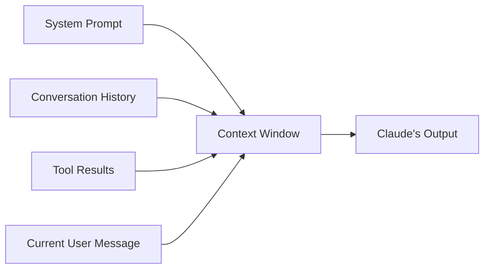
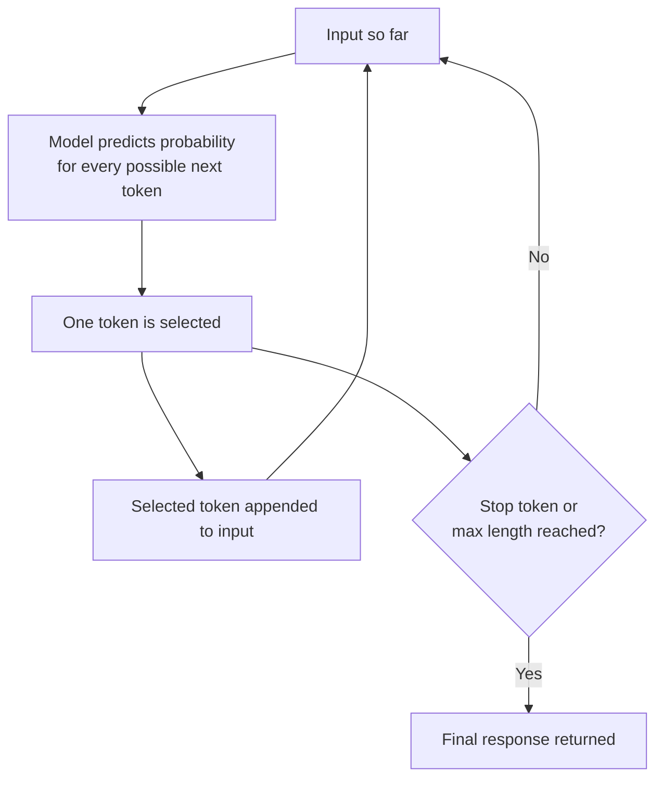
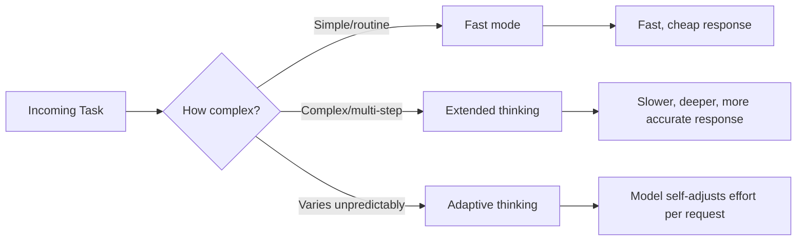

# CCDF Domain 5: Model Selection and Optimization (16.8%)
## Task 5.1 — LLM Fundamentals (5.2%)

This tutorial explains the basic building blocks of how Large Language Models (LLMs) like Claude work, the different "modes" Claude can run in, and the core prompting techniques you must know for the exam.

---

## 1. What is an LLM, in simple words?

An LLM is a large neural network trained on huge amounts of text. It has one core job:

> **Given some text, predict what text comes next.**

That's it. Everything else (chatting, coding, writing) is built on top of this one simple ability, repeated over and over.

---

## 2. Tokens

Claude does not read text letter-by-letter or word-by-word. It reads **tokens**.

A token is a small chunk of text — sometimes a whole word, sometimes part of a word, sometimes just punctuation.

**Example:**

```
Text:    "unbelievable results!"
Tokens:  ["un", "believ", "able", " results", "!"]
```

### Why tokens matter

| Reason | Explanation |
|---|---|
| Cost | Claude API pricing is based on number of input + output tokens |
| Context window | The context window is measured in tokens, not words or characters |
| Latency | More tokens to generate = more time taken |

**Simple rule of thumb:** 1 token ≈ 4 characters ≈ ¾ of an English word.

```python
# Rough token estimate (not exact, just for intuition)
text = "Claude is a helpful AI assistant"
approx_tokens = len(text) / 4
print(approx_tokens)  # ~8-9 tokens
```

---

## 3. Context Window

The **context window** is the total amount of text (in tokens) that Claude can "see" at one time — this includes:

- The system prompt
- Conversation history (previous turns)
- Tool definitions and tool results
- The current user message
- The space reserved for Claude's response



If the total tokens go beyond the context window limit, older content must be dropped, summarized, or trimmed — this connects directly to **context management strategies** (a topic tested elsewhere in the exam too).

**Anti-pattern:** Stuffing the entire conversation history and full documents into every request "just to be safe." This wastes tokens, raises cost, and can cause **context distraction** (too much irrelevant text making Claude lose focus on what matters).

---

## 4. Next-Token Generation

Claude generates its response **one token at a time**, in a loop:



Each step, the model does not "know" the whole answer in advance — it builds it token-by-token, using everything generated so far as new input.

---

## 5. Sampling and Non-Determinism

When picking the next token, the model doesn't always pick the single "best" (highest probability) token. It **samples** from a probability distribution.

**Example (simplified):**

| Candidate next token | Probability |
|---|---|
| "great" | 45% |
| "good" | 30% |
| "excellent" | 15% |
| "fine" | 10% |

Because of sampling, the model might pick "good" one time and "great" another time — even with the **exact same input**.

### Why this matters: Non-determinism

> **Non-determinism** means: the same prompt can produce different outputs on different runs.

**Exam-relevant implications:**

- You cannot assume Claude will give byte-identical output every time.
- For tasks needing strict reproducibility (e.g., automated tests, structured data extraction), design your system to validate output format rather than expect exact text matches.
- Lower "temperature-like" randomness settings (where available) reduce variation but don't remove it completely.

**Anti-pattern:** Writing an automated test that does `assert response == "expected exact string"` for a Claude-generated response. Prefer schema/structure validation instead.

---

## 6. Model Options / Modes

Claude offers different operating modes that trade off **speed vs. depth of reasoning**. Choosing the right one is a model-selection skill tested in this domain.

| Mode | What it does | Best for |
|---|---|---|
| **Fast mode / standard mode** | Responds quickly with minimal internal deliberation | Simple queries, low-latency needs, high-volume tasks |
| **Extended thinking** | Claude reasons step-by-step internally before answering, using extra "thinking" tokens | Complex reasoning, multi-step math, tricky logic, planning |
| **Adaptive thinking** | Claude decides on its own how much reasoning effort a task needs, rather than using a fixed extended-thinking budget every time | Mixed workloads where task difficulty varies request to request |
| **Effort levels** | A configurable setting controlling how much computation/reasoning Claude applies (e.g., low/medium/high effort) | Tuning cost/latency vs. quality trade-off per use case |



**Key exam heuristic:** Match the mode/effort to **task difficulty, not task importance**. An "important" but simple task (e.g., a routine approval check) doesn't need extended thinking — a genuinely hard reasoning task does, even if it seems low-stakes.

**Anti-pattern:** Always turning on extended thinking "to be safe," even for simple lookups — this wastes latency and cost with no accuracy gain.

---

## 7. Fundamental Prompting Techniques

These are the basic ways to structure a prompt based on how many examples you give the model.

### 7.1 Zero-shot prompting

You give an instruction with **no examples**. The model relies purely on its training.

```text
Classify the sentiment of this review as Positive, Negative, or Neutral:

"The delivery was late but the product quality was great."
```

**Use when:** the task is simple/common enough that the model already understands the format and intent clearly.

### 7.2 Single-shot (one-shot) prompting

You give **exactly one example** to show the desired format or style before asking the real question.

```text
Example:
Review: "Terrible service, I'm never coming back."
Sentiment: Negative

Now classify:
Review: "The delivery was late but the product quality was great."
Sentiment:
```

**Use when:** the output format is a little unusual and one example is enough to clarify it.

### 7.3 Multi-shot (few-shot) prompting

You give **multiple examples** (usually 2–5+) covering different cases, so the model learns the pattern more reliably.

```text
Review: "Terrible service, I'm never coming back."
Sentiment: Negative

Review: "It's okay, nothing special."
Sentiment: Neutral

Review: "Absolutely loved it, will buy again!"
Sentiment: Positive

Review: "The delivery was late but the product quality was great."
Sentiment:
```

**Use when:** the task is nuanced, has edge cases, or needs a consistent structured output format (e.g., JSON with specific fields).

### Comparison Table

| Technique | Examples given | Token cost | Best for |
|---|---|---|---|
| Zero-shot | 0 | Lowest | Simple, well-known tasks |
| Single-shot | 1 | Low-medium | Clarifying an unusual format |
| Multi-shot | 2+ | Higher | Nuanced tasks, strict output consistency |

**Anti-pattern (tested elsewhere in the exam too):** Adding few-shot examples to a task that **already succeeds reliably zero-shot**. This wastes context window tokens and adds cost without improving quality.

---

## 8. Quick Reference Summary

| Concept | One-line definition |
|---|---|
| Token | Smallest unit of text the model reads/generates |
| Context window | Total tokens the model can "see" at once (input + output) |
| Next-token generation | Model builds output one token at a time, using prior tokens as new input |
| Sampling | Model picks next token from a probability distribution, not always the top choice |
| Non-determinism | Same prompt can give different outputs across runs |
| Fast mode | Quick response, minimal internal reasoning |
| Extended thinking | Model reasons step-by-step before answering |
| Adaptive thinking | Model self-adjusts reasoning effort per request |
| Effort levels | Configurable setting to tune reasoning depth vs. cost/latency |
| Zero-shot | Instruction only, no examples |
| Single-shot | One example given |
| Multi-shot | Multiple examples given |

---

## 9. Practice Q&A

**Q1: Why is Claude's output non-deterministic even with the same prompt?**
> A: Because the model samples the next token from a probability distribution instead of always picking the single highest-probability token, so different runs can select different tokens.

**Q2: A task is simple (checking if a number is even or odd) but is used in a high-stakes financial report. Should you use extended thinking?**
> A: No — mode selection should match **task difficulty**, not importance. This task is simple, so fast mode is appropriate; extended thinking would add unnecessary cost and latency.

**Q3: You are testing an automated pipeline that checks Claude's output. Should you assert an exact string match?**
> A: No — because of non-determinism, exact string matching is fragile. Validate structure/schema or key content instead.

**Q4: A classification task already works reliably with zero-shot prompting. Should you add five few-shot examples "to be extra safe"?**
> A: No — this is an anti-pattern. Adding unneeded examples wastes context tokens and cost without improving an already-successful task.

**Q5: What counts toward the context window?**
> A: System prompt, conversation history, tool definitions/results, the current user message, and the reserved space for the model's output — all measured in tokens.

**Q6: What is the difference between extended thinking and adaptive thinking?**
> A: Extended thinking applies deeper step-by-step reasoning when explicitly enabled for a task. Adaptive thinking lets the model itself decide how much reasoning effort to apply per request, rather than using a fixed setting every time.