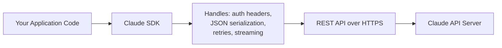
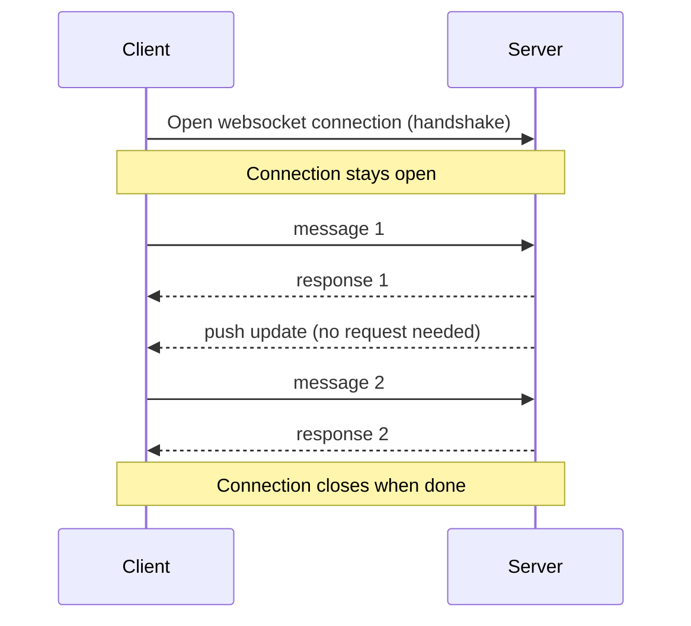
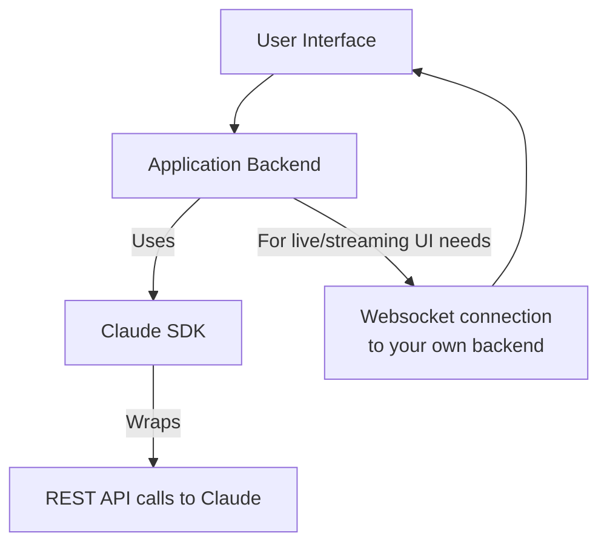

# CCDF Domain 5: Model Selection and Optimization (16.8%)
## Task — Technical Fundamentals (6.1%)

This tutorial covers the basic engineering concepts you need to build AI applications with Claude — specifically, how SDKs wrap REST APIs, and how websockets differ from REST for real-time use cases.

---

## 1. Why "Technical Fundamentals" Matters for This Exam

You don't need to be a full-stack engineer to pass CCDF, but you do need to understand **how your code actually talks to Claude** under the hood. Every Claude integration — whether you call it directly or through a framework — ultimately rests on:

1. **REST APIs** (the standard way to call Claude over HTTP)
2. **SDKs** (official libraries that wrap those REST calls so you don't write raw HTTP code)
3. **Websockets** (an alternative connection type used for real-time, two-way communication)

---

## 2. REST APIs — The Foundation

REST (Representational State Transfer) is a style of building APIs using standard HTTP methods.

| HTTP Method | Purpose | Example |
|---|---|---|
| `POST` | Create / submit something | Send a new message to Claude |
| `GET` | Retrieve something | Fetch a batch job's status |
| `DELETE` | Remove something | Cancel a batch job |

**A raw REST call to Claude looks like this:**

```bash
curl https://api.anthropic.com/v1/messages \
  -H "x-api-key: $ANTHROPIC_API_KEY" \
  -H "anthropic-version: 2023-06-01" \
  -H "content-type: application/json" \
  -d '{
    "model": "claude-sonnet-4-5",
    "max_tokens": 1024,
    "messages": [
      {"role": "user", "content": "Explain REST APIs simply"}
    ]
  }'
```

### Key REST characteristics

- **Stateless:** every request is independent; the server doesn't remember previous requests on its own. This is why you must resend the full conversation history each time (see Domain 2 notes on context management).
- **Request/response:** you send one request, you get one response back, then the connection can close.
- **Works over plain HTTPS:** no special protocol setup needed.

---

## 3. SDKs — Wrapping REST So You Don't Have To

An **SDK (Software Development Kit)** is an official library (Python, TypeScript/Node.js, Java, Go, etc.) that wraps the raw REST API calls into simple function calls in your programming language.



**Same request as above, using the Python SDK:**

```python
import anthropic

client = anthropic.Anthropic()  # reads ANTHROPIC_API_KEY from env automatically

message = client.messages.create(
    model="claude-sonnet-4-5",
    max_tokens=1024,
    messages=[
        {"role": "user", "content": "Explain REST APIs simply"}
    ]
)

print(message.content)
```

### What the SDK handles for you

| Concern | Raw REST (manual) | SDK (automatic) |
|---|---|---|
| Auth headers | You set them by hand every call | Read from environment/config once |
| JSON formatting | You build/parse JSON manually | Native objects — no manual JSON |
| Retries on failure | You write retry logic yourself | Built-in retry with backoff |
| Streaming responses | You parse raw event stream | Simple iterator/callback interface |
| Error handling | You check status codes yourself | Typed exceptions (e.g., `RateLimitError`) |

**Streaming example (SDK):**

```python
with client.messages.stream(
    model="claude-sonnet-4-5",
    max_tokens=1024,
    messages=[{"role": "user", "content": "Write a short poem"}]
) as stream:
    for text in stream.text_stream:
        print(text, end="", flush=True)
```

**Exam-relevant point:** The SDK doesn't add any new capability Claude doesn't already have via REST — it's purely a **developer convenience layer**. Anything you can do with the SDK, you could also do with raw HTTP calls; the SDK just reduces boilerplate and human error.

---

## 4. Websockets — When You Need Real-Time, Two-Way Communication

REST is "ask, then wait for one answer." **Websockets** are different: they open **one persistent, two-way connection** where either side (client or server) can send messages at any time, without repeating a full request each time.



### REST vs Websockets

| Aspect | REST | Websockets |
|---|---|---|
| Connection | New connection per request (or reused via keep-alive) | One long-lived connection |
| Direction | Client asks, server answers | Both sides can send anytime |
| Best for | Standard request/response tasks (most Claude API calls) | Live, continuous, bidirectional data (e.g., voice, live collaboration, real-time notifications) |
| Complexity | Simpler to build and debug | More complex: needs connection management, reconnection logic |

**Simple conceptual websocket client (JavaScript):**

```javascript
const socket = new WebSocket("wss://example.com/live-updates");

socket.onopen = () => {
  socket.send(JSON.stringify({ type: "subscribe", topic: "agent-status" }));
};

socket.onmessage = (event) => {
  console.log("Received:", event.data);
};

socket.onclose = () => {
  console.log("Connection closed");
};
```

**Exam-relevant point:** Most standard Claude API usage (chat completions, tool use, batch processing) is REST-based. Websockets (or similar streaming-connection patterns) become relevant when your application needs **continuous, low-latency, bidirectional** interaction rather than discrete request/response turns — for example, a live voice agent or a dashboard that needs constant server-pushed updates.

---

## 5. How These Pieces Fit Together in a Real Application



A common real-world pattern:

1. Your **backend** talks to Claude using the **SDK** (which uses REST underneath, including SDK-level streaming for token-by-token output).
2. Your **backend** then relays that streamed output to the **frontend/browser** over a **websocket** (or similar technology like Server-Sent Events), so the user sees text appear live.

So REST/SDK and websockets often work **together**, at different layers of the same application — not as competing choices for the same job.

---

## 6. Anti-Patterns to Avoid

| Anti-pattern | Why it's a problem |
|---|---|
| Writing raw HTTP calls to the Claude API instead of using the official SDK, "for full control" | Reinvents retries, auth handling, and error parsing that the SDK already solves reliably |
| Using a websocket connection for a simple one-off Q&A request | Adds unnecessary connection-management complexity where plain REST is simpler and sufficient |
| Assuming REST calls are stateful | REST is stateless — you must resend context/history yourself each call |
| Ignoring reconnection logic when using websockets | Websocket connections can drop; production apps need reconnect/retry handling |

---

## 7. Quick Reference Summary

| Concept | One-line definition |
|---|---|
| REST API | Standard HTTP-based, stateless, request/response style API |
| SDK | Official language-specific library that wraps REST calls into simple function calls |
| Statelessness | Each REST request is independent; no memory of past requests on the server side |
| Websocket | A single persistent, two-way connection for real-time, continuous communication |
| Streaming (SDK) | SDK feature that delivers Claude's response token-by-token instead of all at once |
| SDK vs raw REST | Same underlying capability; SDK just reduces boilerplate and adds convenience (auth, retries, error types) |

---

## 8. Practice Q&A

**Q1: What is the main relationship between an SDK and the REST API?**
> A: The SDK is a convenience wrapper — it makes the same underlying REST API calls, but handles authentication, JSON formatting, retries, and streaming for you so you don't write raw HTTP code.

**Q2: Why must you resend the full conversation history in every REST call to Claude?**
> A: Because REST APIs are stateless — the server does not remember previous requests on its own, so each call must contain all context it needs.

**Q3: When would you choose a websocket connection over a plain REST call?**
> A: When you need continuous, low-latency, two-way communication — like live voice interaction or real-time server-pushed updates — rather than a single discrete request/response.

**Q4: True or False: Using the SDK gives you access to features that are not available via raw REST calls.**
> A: False. The SDK does not add new capabilities — it wraps the same REST API, just with less boilerplate and built-in conveniences like retries and typed errors.

**Q5: In a typical architecture, how do SDK/REST and websockets usually relate to each other?**
> A: They often work together at different layers — the backend uses the SDK (REST-based) to talk to Claude, while a websocket (or similar) may be used to push the streamed response from the backend to the frontend in real time.