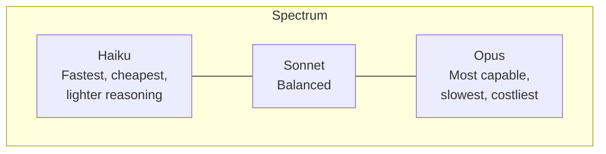
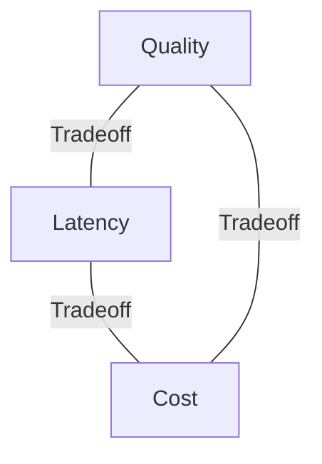
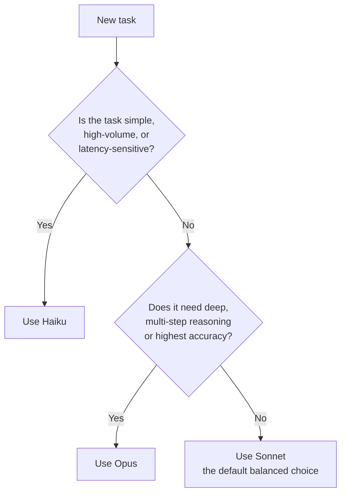
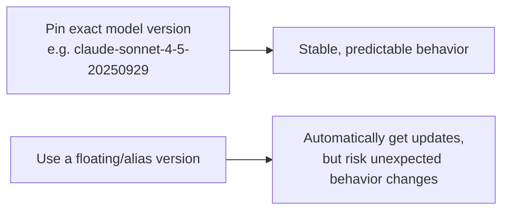

# CCDF Domain 5: Model Selection and Optimization (16.8%)
## Task — Model Selection and Tradeoffs (2.7%)

This tutorial covers how to choose the right Claude model for a task — comparing Opus, Sonnet, and Haiku, understanding quality/latency/cost tradeoffs, and handling breaking behavior changes across model releases.

---

## 1. The Claude Model Family

Claude comes in three model tiers, each built for a different point on the capability-vs-speed-vs-cost spectrum.

| Model | Positioning | Typical use cases |
|---|---|---|
| **Opus** | Most capable, deepest reasoning | Complex multi-step reasoning, hardest coding tasks, high-stakes analysis, research-grade tasks |
| **Sonnet** | Balanced — strong capability at moderate cost/latency | Most production agentic workloads, general coding, everyday business applications |
| **Haiku** | Fastest, lowest cost | High-volume simple tasks, classification, quick lookups, latency-sensitive user-facing features |



**Simple mental model:** Think of it like choosing a vehicle. Haiku is a scooter (quick, cheap, fine for short simple trips). Sonnet is a car (good all-rounder for most journeys). Opus is a heavy-duty truck (built for the hardest jobs, but slower and more expensive to run for a simple errand).

---

## 2. Adaptive Thinking Support

**Adaptive thinking** (covered in the LLM Fundamentals tutorial) lets a model decide, on its own, how much internal reasoning effort a given request needs — instead of always using a fixed amount.

- Not every model tier necessarily supports every thinking mode identically. As a rule for the exam: **more capable tiers (Sonnet, Opus) are the ones built to make good use of extended/adaptive thinking on genuinely hard tasks.**
- Simpler/lighter models like Haiku are optimized for **speed on straightforward tasks** — pairing them with heavy extended reasoning defeats their purpose.

**Exam heuristic:** If a task needs adaptive/extended thinking because of genuine multi-step complexity, that's usually also a signal you should be leaning toward Sonnet or Opus, not Haiku — the reasoning need and the model tier should agree with each other.

---

## 3. The Three Tradeoff Parameters

Every model selection decision balances three competing factors:



| Parameter | What it means | Which model tends to win |
|---|---|---|
| **Quality** | Accuracy, depth of reasoning, handling of nuance/ambiguity | Opus > Sonnet > Haiku |
| **Latency** | Time to first token / time to full response | Haiku > Sonnet > Opus |
| **Cost** | Price per input/output token | Haiku > Sonnet > Opus (cheapest to costliest) |

You almost never get all three at once — a model selection decision is really a decision about **which one or two of these matter most for this specific task.**

### Example scenarios

| Scenario | Priority | Likely model |
|---|---|---|
| Real-time chat widget answering FAQs | Latency + cost | Haiku |
| Drafting a legal contract summary for a client | Quality | Opus |
| General-purpose coding agent for daily engineering tasks | Balanced quality + reasonable cost | Sonnet |
| Classifying thousands of support tickets per hour | Cost + latency (at scale) | Haiku |
| One-off deep root-cause analysis of a production incident | Quality (accuracy matters most, volume is low) | Opus |

**Key exam heuristic (same idea as effort-level selection):** Match the model tier to **task difficulty**, not to how "important" the task feels. A high-volume, simple, repetitive task should usually use a cheaper/faster model even if it's business-critical — reliability comes from good engineering (validation, monitoring), not from over-provisioning model capability.

---

## 4. A Simple Decision Flow



**Code example — selecting model dynamically based on task type:**

```python
def select_model(task_type: str) -> str:
    fast_tasks = {"classification", "simple_lookup", "faq_response"}
    heavy_tasks = {"deep_research", "complex_reasoning", "legal_analysis"}

    if task_type in fast_tasks:
        return "claude-haiku-4-5"
    elif task_type in heavy_tasks:
        return "claude-opus-4-5"
    else:
        return "claude-sonnet-4-5"  # balanced default

model = select_model("faq_response")
print(model)  # claude-haiku-4-5
```

**Anti-pattern:** Hardcoding Opus everywhere "to maximize quality." This inflates cost and latency for tasks that Haiku or Sonnet would have handled just as reliably.

**Anti-pattern (opposite direction):** Defaulting to Haiku everywhere to save cost, then getting poor results on genuinely complex tasks and blaming the prompt instead of the model choice.

---

## 5. Breaking Behavior Changes Across Model Releases

When Anthropic releases a new model version, behavior can shift — even if the new model is "better" overall. This matters a lot for production systems.

### Common types of breaking changes

| Type of change | Example |
|---|---|
| Output format drift | A new model version might format lists, JSON, or code blocks slightly differently by default |
| Tone/verbosity shift | Newer models may be more or less verbose by default |
| Tool-use behavior changes | How/when the model chooses to call a tool may shift |
| Deprecated model versions | Old model version strings eventually get retired and stop being callable |

### Why this matters for exam scenarios



### Best practices (tie back to Domain 2's Configuration Management)

1. **Pin exact model versions** in production (not a floating "latest" alias) so behavior doesn't silently change underneath you.
2. **Test new model versions in staging** before upgrading production, especially for tasks relying on strict output formatting.
3. **Version your prompts alongside your model version** — a prompt tuned for one model version may need adjustment for a newer one.
4. **Monitor for silent regressions** after any model upgrade (e.g., increased parsing failures, changed tool-call patterns) rather than assuming "newer = strictly better for my exact use case."

**Anti-pattern:** Auto-upgrading to the newest model version in production with no testing, assuming "newer is always a safe drop-in replacement."

---

## 6. Quick Reference Summary

| Concept | One-line definition |
|---|---|
| Opus | Most capable tier — best for complex reasoning, highest cost/latency |
| Sonnet | Balanced tier — default choice for most production workloads |
| Haiku | Fastest, cheapest tier — best for simple, high-volume, latency-sensitive tasks |
| Quality/latency/cost tradeoff | You typically optimize for one or two of these, not all three at once |
| Model-task matching heuristic | Match model tier to task difficulty, not task importance |
| Breaking behavior change | Output format, tone, or tool-use behavior shifts between model releases |
| Version pinning | Locking to an exact model version string to avoid unexpected behavior drift |

---

## 7. Practice Q&A

**Q1: A high-volume FAQ chatbot needs fast, cheap responses for simple questions. Which model tier fits best?**
> A: Haiku — it's optimized for speed and low cost on straightforward, high-volume tasks.

**Q2: A one-time, high-stakes legal document analysis needs maximum reasoning accuracy, and volume is low. Which model tier fits best?**
> A: Opus — quality/accuracy is the priority here, and low volume means the higher cost/latency is acceptable.

**Q3: True or False: You should always choose Opus for "important" business tasks, regardless of task complexity.**
> A: False. Model selection should match task difficulty, not task importance — a simple but important task can still be handled well (and more efficiently) by Sonnet or Haiku.

**Q4: Why should production systems pin an exact model version instead of using a floating "latest" alias?**
> A: To avoid unexpected behavior changes (format drift, verbosity changes, tool-use pattern shifts) that can occur silently when a new model version is released.

**Q5: What are the three core tradeoff parameters in model selection?**
> A: Quality, latency, and cost — you generally optimize for one or two of these based on the specific task's needs.

**Q6: Why is it risky to pair a lightweight model like Haiku with heavy extended/adaptive thinking on a highly complex task?**
> A: Haiku is optimized for speed on straightforward tasks; genuinely complex reasoning tasks are better matched with Sonnet or Opus, which are built to make good use of deeper reasoning.