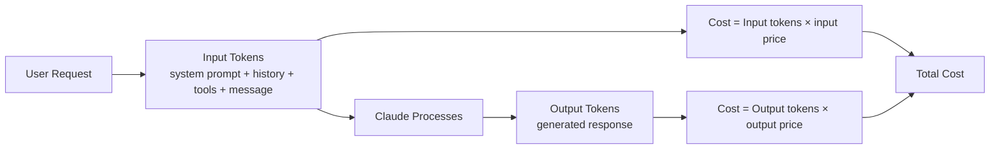
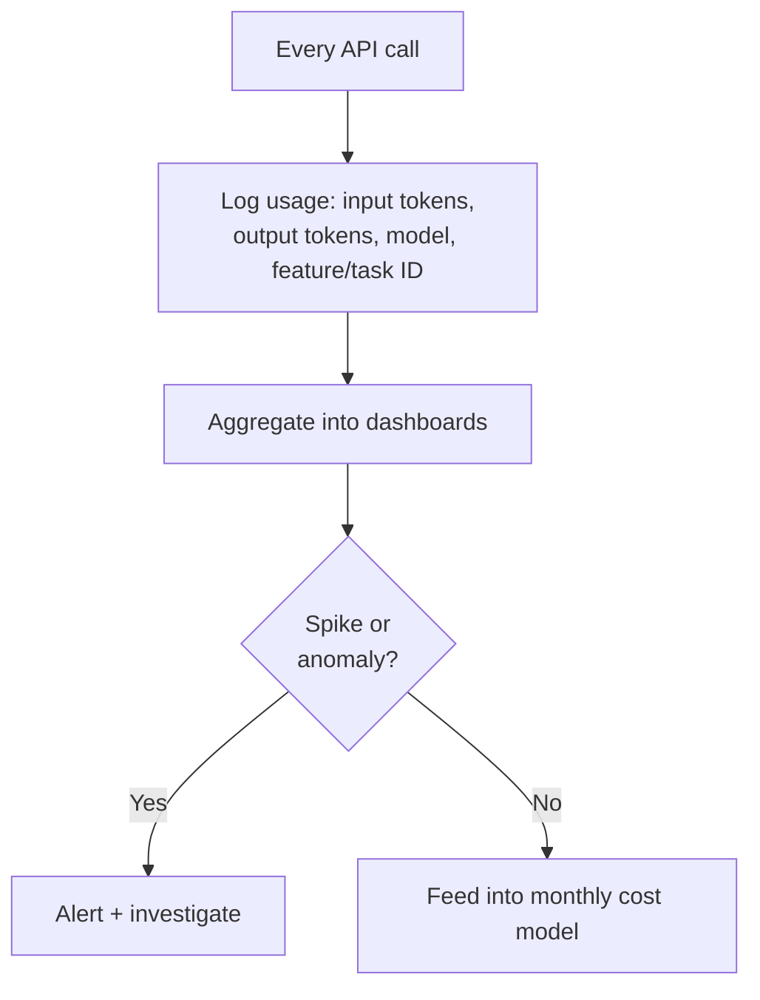
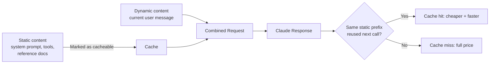
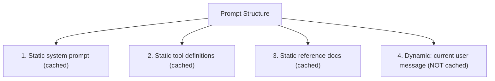
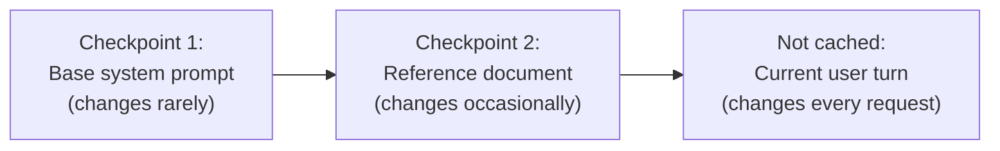
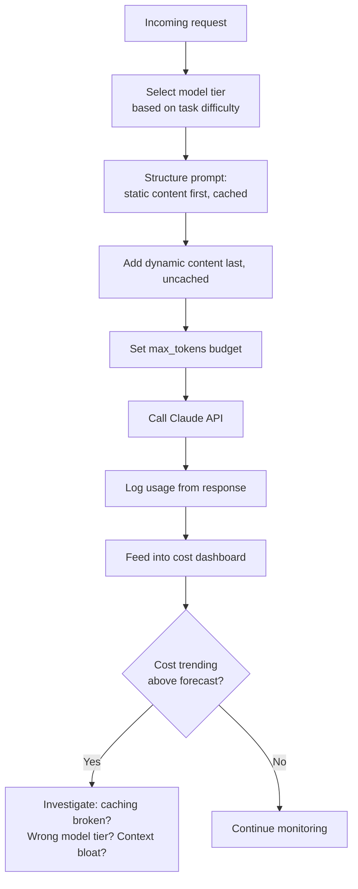

# CCDF Domain 5: Model Selection and Optimization (16.8%)
## Task — Cost and Token Management (2.8%)

This tutorial covers how to track, model, and reduce the cost of running Claude applications — including token budgeting, cost modeling, and caching techniques like prompt caching and cache checkpointing.

---

## 1. Why Cost and Token Management Matters

Every Claude API call costs money based on **tokens used** (input tokens + output tokens). At small scale this is trivial, but for production, high-volume, or agentic applications (which may call Claude many times per task), costs can grow quickly and unpredictably if not managed.



**Key fact:** Input tokens and output tokens are usually priced **differently** — output tokens typically cost more per token than input tokens.

---

## 2. Token Budgeting

**Token budgeting** means deciding, in advance, how many tokens a task/feature is allowed to use — similar to a financial budget.

### Where token budgets apply

| Budget type | What it limits |
|---|---|
| **Per-request budget** | `max_tokens` — caps how many output tokens a single call can generate |
| **Context budget** | How much of the context window you allow for history/tool results before trimming/summarizing |
| **Per-session budget** | Total tokens allowed across an entire multi-turn conversation |
| **Per-user/per-day budget** | Total tokens a user or system is allowed to consume in a time window (cost-control guardrail) |

**Code example — setting an output budget:**

```python
message = client.messages.create(
    model="claude-sonnet-4-5",
    max_tokens=500,  # hard cap on output tokens for this call
    messages=[{"role": "user", "content": "Summarize this article in 3 bullet points"}]
)
```

**Code example — a simple per-session token budget tracker:**

```python
class SessionBudget:
    def __init__(self, max_tokens: int):
        self.max_tokens = max_tokens
        self.used_tokens = 0

    def record_usage(self, input_tokens: int, output_tokens: int):
        self.used_tokens += input_tokens + output_tokens

    def has_budget_remaining(self) -> bool:
        return self.used_tokens < self.max_tokens

budget = SessionBudget(max_tokens=50000)
budget.record_usage(input_tokens=1200, output_tokens=400)

if not budget.has_budget_remaining():
    print("Session token budget exceeded — stop or escalate")
```

**Anti-pattern:** Setting no `max_tokens` limit and no session-level budget at all, then being surprised by a runaway agent loop that generates excessive output.

---

## 3. Token Usage Tracking

Every Claude API response includes a `usage` field showing exactly how many tokens were consumed — this should be **logged for every call** in production.

```python
message = client.messages.create(
    model="claude-sonnet-4-5",
    max_tokens=1024,
    messages=[{"role": "user", "content": "Explain caching in one paragraph"}]
)

print("Input tokens:", message.usage.input_tokens)
print("Output tokens:", message.usage.output_tokens)
```

### Why tracking matters

- **Cost attribution:** know which feature/customer/task is driving spend
- **Anomaly detection:** a sudden spike in token usage can signal a bug (e.g., an agent stuck in a loop) or misuse
- **Optimization targeting:** you can't optimize what you don't measure — usage logs show you *where* to focus caching/trimming efforts



---

## 4. Cost Modeling

**Cost modeling** means estimating and forecasting what a feature or application will cost to run, *before* and *during* production, based on token usage patterns.

### Simple cost model example

```python
# Example illustrative prices (check current official pricing for real values)
INPUT_PRICE_PER_MTOK = 3.00   # $ per million input tokens
OUTPUT_PRICE_PER_MTOK = 15.00 # $ per million output tokens

def estimate_cost(input_tokens: int, output_tokens: int) -> float:
    input_cost = (input_tokens / 1_000_000) * INPUT_PRICE_PER_MTOK
    output_cost = (output_tokens / 1_000_000) * OUTPUT_PRICE_PER_MTOK
    return round(input_cost + output_cost, 6)

cost = estimate_cost(input_tokens=1500, output_tokens=400)
print(f"Estimated cost: ${cost}")
```

### Building a cost model for a feature

| Step | What you do |
|---|---|
| 1 | Estimate average input tokens per request (system prompt + history + tools) |
| 2 | Estimate average output tokens per request |
| 3 | Multiply by expected request volume (daily/monthly) |
| 4 | Add model tier into the calculation (Haiku/Sonnet/Opus have different prices) |
| 5 | Re-forecast whenever prompt length, model tier, or volume changes |

**Exam-relevant link:** Cost modeling directly connects to **Model Selection** (previous topic) — the same feature can have very different cost projections depending on which model tier you choose.

---

## 5. Caching Techniques for Cost Optimization

Caching is one of the most effective ways to cut cost, because you avoid **reprocessing the same input tokens** repeatedly.

### 5.1 Prompt Caching

**Prompt caching** lets you mark a portion of your prompt (usually the **stable, reused part** — system prompt, tool definitions, long reference documents) so Claude doesn't have to fully reprocess it on every call. Repeated calls that reuse the same cached prefix are **cheaper and faster**.



**Code example — marking content as cacheable:**

```python
message = client.messages.create(
    model="claude-sonnet-4-5",
    max_tokens=1024,
    system=[
        {
            "type": "text",
            "text": "You are a helpful support assistant. <long stable instructions here>",
            "cache_control": {"type": "ephemeral"}  # mark this block as cacheable
        }
    ],
    messages=[
        {"role": "user", "content": "How do I reset my password?"}
    ]
)
```

### Key rule: static-content-first, dynamic-content-last ordering

For caching to work well, structure your prompt so that:

1. **Stable/reusable content comes first** (system instructions, tool definitions, reference documents)
2. **Variable/per-request content comes last** (the current user message, live data)



This ordering maximizes how much of the prompt can be reused from cache across repeated calls, because even a small change near the *start* of the prompt breaks the cache for everything after it.

**Anti-pattern:** Putting the dynamic user message *before* the static system instructions in the effective prompt structure — this breaks caching entirely because the "stable prefix" is no longer stable.

### 5.2 Cache Checkpointing

**Cache checkpointing** refers to explicitly marking **multiple distinct points** in a long prompt where caching should apply — useful when different sections of your prompt are stable at different "layers" (e.g., a base system prompt that rarely changes, plus a large reference document that changes occasionally, plus per-session data that changes often).



By placing multiple cache checkpoints, you let each "layer" of your prompt be cached and reused independently — so a change in the reference document doesn't force you to lose the cache benefit on the base system prompt too.

**Practical benefit:** Long-running agent sessions or applications with large static context (e.g., a big knowledge base injected into the system prompt) see the biggest savings, since that large static block is reused across many calls instead of being reprocessed (and repriced) every single time.

---

## 6. Putting It Together — A Cost-Optimized Request Pattern



---

## 7. Anti-Patterns to Avoid

| Anti-pattern | Why it's a problem |
|---|---|
| No `max_tokens` cap on responses | Risk of runaway/expensive output generation |
| Not logging `usage` data per call | No visibility into where cost is coming from |
| Putting dynamic content before static content in the prompt | Breaks prompt caching, forcing full-price reprocessing every call |
| Stuffing large documents into every request instead of retrieval | Wastes input tokens on content not always needed (see Domain 2 context management) |
| Choosing the most expensive model tier by default | Inflates cost without matching quality gain for simpler tasks |
| Never re-estimating cost after prompt/model changes | Cost model goes stale and forecasts become inaccurate |

---

## 8. Quick Reference Summary

| Concept | One-line definition |
|---|---|
| Token budgeting | Setting limits on token usage per request, session, or user/time-window |
| `max_tokens` | Per-call cap on the number of output tokens generated |
| Usage tracking | Logging input/output tokens from every API response for cost visibility |
| Cost modeling | Estimating/forecasting cost based on token usage patterns and volume |
| Prompt caching | Marking stable prompt content so it can be reused cheaply across calls |
| Cache checkpointing | Marking multiple distinct cache points for different "layers" of stable content |
| Static-first ordering | Structuring prompts with stable content first, dynamic content last, to maximize cache hits |

---

## 9. Practice Q&A

**Q1: Why does prompt structure (static-first, dynamic-last) matter for caching?**
> A: Because a change anywhere in the stable prefix breaks the cache for everything after it — putting dynamic content last preserves the reusable cached prefix across calls.

**Q2: What is the difference between prompt caching and cache checkpointing?**
> A: Prompt caching marks a portion of the prompt as reusable/cacheable. Cache checkpointing goes further by marking multiple distinct points in a long prompt, so different stable "layers" (e.g., base system prompt vs. a reference document) can each be cached and reused independently.

**Q3: Why should you log token usage for every API call in production?**
> A: For cost attribution, anomaly detection (e.g., catching runaway agent loops), and to feed accurate data into your cost model.

**Q4: A team stuffs an entire 50-page reference document into every single request, even when only a small part is relevant. What's the cost impact, and what's the better approach?**
> A: This wastes input tokens on unneeded content, driving up cost unnecessarily. A better approach is retrieval (fetching only the relevant section) or prompt caching if the same static document truly needs to be reused across many calls.

**Q5: What does `max_tokens` control, and why is setting it important?**
> A: It caps the number of output tokens Claude can generate in a single response — setting it prevents runaway or unexpectedly expensive generations.

**Q6: Why are output tokens typically more expensive than input tokens?**
> A: Output token pricing is generally higher per token than input token pricing, so response length has an outsized effect on cost compared to prompt length alone.