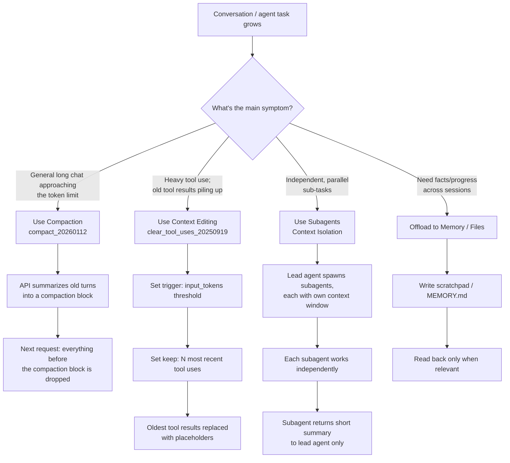

# Claude Certified Developer Foundations (CCDF)
## Domain 6: Prompt and Context Engineering — Context Engineering (3.8%)

This tutorial explains everything in the syllabus line:

> Context and memory management techniques for Claude applications, including context window
> management, prevention of context drift and bloat (tool output pruning, compaction), and
> context isolation through subagents or multi-step agentic workflows.

The language is kept simple. Every idea has a small example. Read it top to bottom, or use the
table of contents to jump to a topic you need to review.

---

## Table of Contents

1. [What Is Context Engineering?](#1-what-is-context-engineering)
2. [Understanding the Context Window](#2-understanding-the-context-window)
3. [Context Rot: Why "Bigger Is Better" Is Wrong](#3-context-rot-why-bigger-is-better-is-wrong)
4. [Context Drift vs. Context Bloat](#4-context-drift-vs-context-bloat)
5. [Context Awareness (Claude's Own Token Budget Tracking)](#5-context-awareness-claudes-own-token-budget-tracking)
6. [Technique 1 — Tool Output Pruning (Context Editing)](#6-technique-1--tool-output-pruning-context-editing)
7. [Technique 2 — Compaction](#7-technique-2--compaction)
8. [Technique 3 — Context Isolation with Subagents](#8-technique-3--context-isolation-with-subagents)
9. [Technique 4 — Offloading to Memory / Files](#9-technique-4--offloading-to-memory--files)
10. [Choosing the Right Technique](#10-choosing-the-right-technique)
11. [Flow Diagram](#11-flow-diagram)
12. [Quick Revision Cheat Sheet](#12-quick-revision-cheat-sheet)
13. [Practice Questions](#13-practice-questions)

---

## 1. What Is Context Engineering?

**Context engineering** is the practice of deciding **what information Claude actually sees** at
each step of a conversation or agentic task — and what it does not see.

A simple way to think about it (a comparison Anthropic itself uses): the model is like a **CPU**,
and its context window is like **RAM**. RAM is fast and powerful, but limited. If you cram
everything into it without curating what belongs there, performance suffers — even though there
was technically "room."

Context engineering is a bigger idea than prompt engineering. Prompt engineering asks "how do I
word this instruction well?" Context engineering asks "at this exact moment in a long-running
task, what is the smallest set of high-signal information that will make Claude perform well?"

---

## 2. Understanding the Context Window

The **context window** is all the text a model can reference while generating a response,
including its own response. It is Claude's "working memory" for the current request — not the
huge dataset it was trained on.

### What counts toward the context window

Everything in a request counts:

- The system prompt
- Every message in `messages` (including tool results, images, and documents)
- Your tool **definitions** (their names, descriptions, and schemas)
- Claude's own output for the turn, **including extended thinking**

Every API response reports exactly what was consumed, in the `usage` field:

```json
{
  "usage": {
    "input_tokens": 1000,
    "output_tokens": 250
  }
}
```

### How a conversation fills up the window

As a conversation goes on, each full turn (user message + assistant response) is normally
**preserved completely** and adds to what the next request must include. So turn 10 of a
conversation sends turns 1–9 back to Claude as input, every single time.

```
Turn 1: [system + msg1] -> response1
Turn 2: [system + msg1 + response1 + msg2] -> response2
Turn 3: [system + msg1 + response1 + msg2 + response2 + msg3] -> response3
...
```

You can see how this grows quickly, especially in agentic workflows with lots of tool calls.

### What happens if you go over the limit

- If your **input alone** already exceeds the context window, the API returns a `400
  invalid_request_error` ("prompt is too long").
- On newer models, if input + `max_tokens` might exceed the window, the API still accepts the
  request — but if generation actually reaches the limit, it stops with
  `stop_reason: "model_context_window_exceeded"` instead of erroring out.

> **Exam tip:** Don't assume a large context window (some models support up to 1M tokens) means
> you can ignore context management. The syllabus explicitly separates "context window
> management" from just "having a big window" — the skill being tested is **curation**, not
> capacity.

---

## 3. Context Rot: Why "Bigger Is Better" Is Wrong

**Context rot** is the well-documented effect where, as the number of tokens in context grows,
the model's ability to accurately recall and use information from that context **decreases** —
even if you are still technically well under the token limit.

This means:

- A bigger context window is not automatically better.
- Irrelevant, stale, or redundant content doesn't just "sit there for free" — it actively degrades
  focus and recall.
- The goal of context engineering is to find the **smallest set of high-signal tokens** that
  reliably produces the behavior you want, not to maximize how much you can stuff in.

> **Exam tip:** If a question describes a Claude application that got "slower to respond correctly"
> or "started forgetting earlier details" purely because a conversation grew very long, the
> underlying concept being tested is **context rot** — the fix is a context management technique,
> not simply a bigger context window.

---

## 4. Context Drift vs. Context Bloat

These two terms describe **two different symptoms** that context engineering aims to prevent.

| Term | What it means | Typical cause | Typical fix |
|---|---|---|---|
| **Context bloat** | The context window fills up with more tokens than are actually useful | Old tool results, verbose logs, repeated large documents, unnecessary system prompt growth | Tool output pruning, compaction |
| **Context drift** | The conversation gradually moves away from the original goal / instructions, or accumulates contradictory guidance | Instructions added incrementally over a long session; system prompt becomes self-contradictory; agent loses track of the original task | Re-stating the goal, structured "todo" notes, compaction with clear summaries, isolating sub-tasks into subagents |

Think of it this way: **bloat** is a size problem (too many tokens); **drift** is a focus problem
(the wrong tokens, or contradictory tokens, dominating attention). Bloat often *causes* drift
because the important instructions get buried under noise — but they are conceptually different
issues, and the exam may test whether you can tell them apart.

---

## 5. Context Awareness (Claude's Own Token Budget Tracking)

Some Claude models — Claude Sonnet 5, Claude Sonnet 4.6, Claude Sonnet 4.5, and Claude Haiku 4.5 —
have **context awareness**: they track their own remaining context window ("token budget")
throughout a conversation, automatically, with nothing for you to enable.

How it works under the hood:

1. In the system prompt of every request, the API tells Claude its total budget:
   ```
   <budget:token_budget>200000</budget:token_budget>
   ```
2. After each tool call, the API updates Claude on what's left:
   ```
   <system_warning>Token usage: 35000/200000; 165000 remaining</system_warning>
   ```

This lets the model manage long tasks against the space that **actually remains**, instead of
guessing. Some other model families (certain Opus models) don't get these automatic tags; for
those, you can supply an explicit budget yourself using **task budgets**.

> **Exam tip:** Context awareness is about **Claude knowing its own remaining space** — it is not
> a context management *technique* you configure per se, but background knowledge for why some
> models behave more sensibly than others as a long conversation nears its limit.

---

## 6. Technique 1 — Tool Output Pruning (Context Editing)

In agentic workflows, tool results (file contents, search results, API responses) can dominate the
context window — sometimes making up 90%+ of tokens in document-heavy agents. But once Claude has
already **processed** an old tool result, keeping the full raw content around usually isn't
helping anymore.

**Context editing** lets you clear specific content from conversation history automatically,
server-side, before the prompt reaches Claude. It is a **beta** feature — enable it with the beta
header `context-management-2025-06-27`.

### Tool result clearing (`clear_tool_uses_20250919`)

This strategy clears the **oldest** tool results first, once the conversation grows past a
threshold you configure. The API replaces each cleared result with a placeholder so Claude still
knows something was removed (and can re-fetch it if truly necessary).

Simplest form — just turn it on with defaults:

```python
response = client.beta.messages.create(
    model="claude-opus-4-7",
    max_tokens=4096,
    messages=[{"role": "user", "content": "Search for recent developments in AI"}],
    tools=[{"type": "web_search_20250305", "name": "web_search"}],
    betas=["context-management-2025-06-27"],
    context_management={"edits": [{"type": "clear_tool_uses_20250919"}]},
)
```

Fully configured example:

```python
response = client.beta.messages.create(
    model="claude-opus-5",
    max_tokens=4096,
    messages=[
        {"role": "user", "content": "Create a simple command line calculator app using Python"}
    ],
    tools=[
        {"type": "text_editor_20250728", "name": "str_replace_based_edit_tool"},
        {"type": "web_search_20250305", "name": "web_search"},
    ],
    betas=["context-management-2025-06-27"],
    context_management={
        "edits": [
            {
                "type": "clear_tool_uses_20250919",
                # Start clearing once input tokens pass this threshold
                "trigger": {"type": "input_tokens", "value": 30000},
                # Always keep this many of the most recent tool uses in full
                "keep": {"type": "tool_uses", "value": 3},
            }
        ]
    },
)
```

Key configuration ideas:

- **`trigger`** — decides *when* clearing kicks in (e.g. once input tokens pass 30,000)
- **`keep`** — decides *how many* of the most recent tool results stay untouched
- By default only the tool **results** are cleared; you can also set `clear_tool_inputs: true` to
  clear the original tool call parameters too

### Thinking block clearing (`clear_thinking_20251015`)

A related strategy for conversations using extended thinking — it manages how many old thinking
blocks are kept versus cleared, so reasoning-heavy agents don't accumulate huge amounts of
internal "scratch work" that no longer matters.

> **Exam tip:** Context editing happens **server-side, before the prompt reaches Claude** — your
> own application still holds the full, unmodified conversation history. This is the key detail
> that distinguishes it from writing your own pruning logic client-side.

---

## 7. Technique 2 — Compaction

**Compaction** is Anthropic's recommended, primary strategy for long-running conversations and
agentic workflows. Instead of selectively clearing individual tool results, compaction
**automatically summarizes older parts of the whole conversation** once it approaches the context
window limit — replacing stale content with a concise summary so the conversation can keep going
well past what would otherwise be the limit.

It is ideal for:

- Long, chat-based multi-turn conversations
- Task-oriented agent loops with lots of follow-up tool use that could exceed the window

Compaction is currently in **beta** — enable it with the beta header `compact-2026-01-12`.

### How it works, step by step

1. The API detects that input tokens have crossed your configured trigger threshold.
2. It generates a summary of the conversation so far.
3. It creates a **compaction block** containing that summary.
4. The response continues, based on the compacted context.
5. On your **next** request, you append the response as usual — the API automatically drops all
   the message blocks *before* the compaction block, and continues the conversation from the
   summary onward.

```python
response = client.beta.messages.create(
    model="claude-opus-4-7",
    max_tokens=4096,
    messages=[{"role": "user", "content": "Help me build a website"}],
    betas=["compact-2026-01-12"],
    context_management={
        "edits": [
            {
                "type": "compact_20260112",
                "trigger": {"type": "input_tokens", "value": 100000},
            }
        ]
    },
)
```

### Server-side compaction vs. client-side (SDK) compaction

| | Where it runs | How it works |
|---|---|---|
| **Server-side compaction** | Anthropic's API | Automatically summarizes and replaces old context server-side. **Recommended for most use cases.** |
| **Context editing (tool clearing)** | Anthropic's API | Fine-grained clearing of specific content (tool results, thinking blocks) — for when you need more control than compaction gives you |
| **Client-side (SDK) compaction** | Your own application, via `tool_runner` in the Python/TypeScript/Ruby SDKs | Generates a summary and replaces the full conversation history yourself. An alternative when you need custom summarization logic |

> **Exam tip:** If the question is about the **general, default, recommended** way to manage a
> long conversation, the answer is usually **compaction**. If the question is about **fine-grained
> control over specific content** (e.g. "clear only old search results, keep the last 3"), the
> answer is **context editing / tool result clearing**.

---

## 8. Technique 3 — Context Isolation with Subagents

Sometimes the best way to manage context isn't to prune or summarize what's *in* one context
window — it's to **not put it there at all**. This is **context isolation**.

### The core idea

A **subagent** is a specialized helper with its **own, separate context window**. It can do a lot
of work — search, read files, reason step by step — accumulating tens of thousands of tokens of
its own, and then return only a **condensed summary** (often just 1,000–2,000 tokens) back to the
main ("lead") agent.

```
Lead Agent (small, focused context)
   │
   ├──> Subagent A: researches Topic X (own 30K-token context, discarded after)
   │        └── returns: 500-word summary
   │
   ├──> Subagent B: researches Topic Y (own context, discarded after)
   │        └── returns: 500-word summary
   │
   └──> Lead Agent combines both summaries into the final answer
```

This is exactly the **orchestrator–worker pattern** Anthropic used for its own multi-agent
research system: a lead agent breaks a query into pieces, spawns subagents to explore each piece
**in parallel**, and each subagent's messy, detailed work stays isolated in its own window —
never polluting the lead agent's context.

### Why this works

- **Separation of concerns:** detailed, noisy work stays inside the subagent; the lead agent only
  ever sees the clean, distilled result.
- **Parallelism:** independent subagents can run at the same time.
- **Fault isolation:** if one subagent's context gets messy or a task fails, it doesn't corrupt
  the lead agent's context or the other subagents' work.

### Trade-offs to know

| Benefit | Cost |
|---|---|
| Keeps the lead agent's context small and focused | Handing off only a summary is **lossy** — the lead agent can't see the subagent's full reasoning, only the result |
| Subagents can run in parallel, scaling past what one context window could handle | Coordinating multiple subagents adds complexity (spawning, combining results) |
| One subagent's context growing huge doesn't affect the others | Uses meaningfully more total tokens than a single-agent approach, since each subagent has its own overhead |

> **Exam tip:** Context isolation trades a small amount of information loss and coordination
> overhead for a much cleaner, more scalable main context. Subagents don't automatically see each
> other's work — passing back a well-written **summary** (not the raw context) is what makes this
> pattern effective.

### Isolation inside a single agent, without subagents

You don't always need multiple agents to isolate context. **Multi-step agentic workflows** can
isolate a step's noisy output by only carrying forward a summarized result to the next step,
similar in spirit to the subagent pattern but within one linear pipeline:

```
Step 1: Read and analyze 50 files  --> produces a short "findings.md" summary
Step 2: Only "findings.md" (not the 50 raw files) is passed into the next step
Step 3: Final report is written using just the accumulated summaries
```

---

## 9. Technique 4 — Offloading to Memory / Files

A complementary strategy is to **write information outside the context window** and pull it back
in only when needed, instead of keeping everything active at once. This is sometimes called
"offloading" or "write" in context-engineering vocabulary.

Examples:

- Writing a running **to-do list** or **scratchpad notes** to a file, so an agent can check
  progress without re-deriving it from scratch each turn
- A structured **memory** file (like `CLAUDE.md` in Claude Code) that persists key facts across
  sessions, instead of repeating the same instructions in every conversation
- The **memory tool** pattern for agents that span multiple sessions, so a new session can quickly
  recover state instead of needing the entire prior history back in context

This works well alongside compaction and subagents: compaction/pruning **reduces** what's in
context, subagents **isolate** what's in context, and offloading **externalizes** what doesn't
need to be in context at all right now.

---

## 10. Choosing the Right Technique

| Situation | Best technique |
|---|---|
| A long, general chat conversation is nearing the token limit | **Compaction** (server-side, automatic, minimal integration work) |
| An agent makes many tool calls and old tool results (file reads, search results) are piling up | **Tool result clearing** (context editing) |
| Extended thinking is generating a lot of old thinking blocks you no longer need | **Thinking block clearing** (context editing) |
| A task naturally splits into independent, parallelizable sub-tasks (e.g. researching 3 unrelated topics) | **Subagents / context isolation** |
| An agent needs to remember facts or progress across many sessions, not just within one context window | **Offloading to memory/files** |
| You need very fine-grained control over exactly what's kept vs. cleared | **Context editing** (configure `trigger` and `keep` yourself) |

> **Exam tip:** A recurring exam pattern is: "describe a scenario, pick the best technique." Match
> the *symptom* (long chat vs. tool-heavy agent vs. parallel sub-tasks vs. cross-session memory) to
> the technique built for that symptom — don't reach for subagents to fix simple bloat, and don't
> reach for compaction to parallelize independent research tasks.

---

## 11. Flow Diagram



---

## 12. Quick Revision Cheat Sheet

| Term | One-line definition |
|---|---|
| **Context window** | All the text (input + output) a model can reference for one request; its "working memory" |
| **Context rot** | Recall/accuracy degrades as token count grows, even below the hard limit |
| **Context bloat** | Too many tokens in context, many of them not actually useful |
| **Context drift** | Conversation/instructions gradually lose focus or become contradictory |
| **Context awareness** | Some models automatically track their own remaining token budget |
| **Context editing** | Beta API feature to selectively clear tool results / thinking blocks, server-side |
| **Tool result clearing** | `clear_tool_uses_20250919` — clears oldest tool results past a threshold, keeps N most recent |
| **Thinking block clearing** | `clear_thinking_20251015` — manages how many old extended-thinking blocks are kept |
| **Compaction** | `compact_20260112` — automatically summarizes older conversation into a "compaction block" |
| **Context isolation** | Giving a subagent (or a workflow step) its own separate context, returning only a summary |
| **Offloading** | Writing notes/state outside the context window, retrieved only when needed |
| **`model_context_window_exceeded`** | `stop_reason` when a response fills the entire context window during generation |

---

## 13. Practice Questions

**Q1.** What is the key difference between context bloat and context drift?
<details><summary>Answer</summary>
Bloat is a size problem — too many tokens, many of them not useful. Drift is a focus problem — the
conversation or instructions gradually move away from the original goal or become contradictory.
Bloat can cause drift, but they are distinct issues.
</details>

**Q2.** Which beta header enables tool result clearing, and which strategy name do you use?
<details><summary>Answer</summary>
Beta header: <code>context-management-2025-06-27</code>. Strategy: <code>clear_tool_uses_20250919</code>.
</details>

**Q3.** A conversation is approaching its context limit and you want the simplest, most automatic
fix with minimal integration work. Which technique should you reach for first?
<details><summary>Answer</summary>
Server-side compaction (<code>compact_20260112</code>) — it's Anthropic's recommended primary
strategy and requires the least custom integration work.
</details>

**Q4.** True or False: Context editing modifies the conversation history your own application
holds.
<details><summary>Answer</summary>
False. Context editing happens server-side, before the prompt reaches Claude. Your client
application still keeps the full, unmodified conversation history.
</details>

**Q5.** You need to research three completely unrelated topics as part of one user request. What's
the best context engineering technique, and why?
<details><summary>Answer</summary>
Context isolation using subagents. Each topic can be researched independently and in parallel, in
its own context window, with only a condensed summary returned to the lead agent — keeping the
lead agent's context small and avoiding pollution between unrelated topics.
</details>

**Q6.** What does "context rot" mean, and why does it matter even if you're nowhere near the hard
token limit?
<details><summary>Answer</summary>
Context rot is the tendency for a model's recall and accuracy to degrade as the number of tokens
in context increases — even well under the maximum limit. It matters because it means "there's
still room" is not a good enough reason to leave irrelevant content in context; curation matters
regardless of how much headroom is left.
</details>

**Q7.** In the tool result clearing configuration, what do the `trigger` and `keep` parameters
control?
<details><summary>Answer</summary>
<code>trigger</code> controls when clearing starts (e.g. once input tokens exceed a threshold).
<code>keep</code> controls how many of the most recent tool uses are preserved in full when
clearing happens.
</details>

---

### Final Tips for the Exam

- Know the **four techniques** by name and by the symptom each one solves: compaction (general
  long conversations), tool result clearing (agentic tool-heavy workloads), subagents (parallel,
  independent sub-tasks), and offloading (cross-session memory).
- Remember that **context editing runs server-side** — a common exam distractor is suggesting you
  need to manually rewrite your own `messages` array to prune content, when the API can do it for
  you.
- Remember **context rot**: bigger context windows do not remove the need for good context
  engineering.
- Be able to distinguish **bloat** (too much) from **drift** (unfocused/contradictory) as two
  separate failure symptoms.
- For subagents, remember the trade-off: cleaner isolated context vs. lossy summarized handoff and
  more total token usage.

Good luck with your CCDF exam!