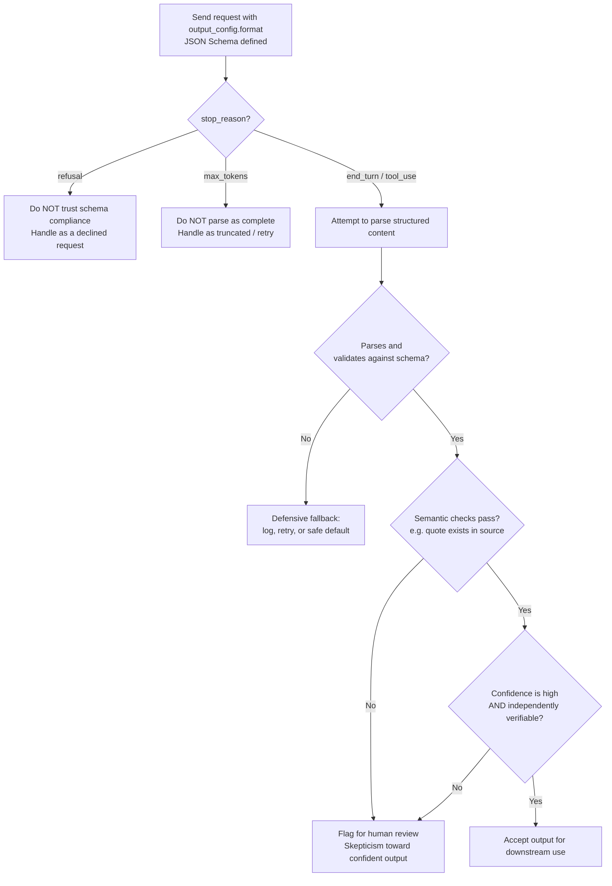

# Claude Certified Developer Foundations (CCDF)
## Domain: Output Handling (2.6%)

This tutorial explains everything in the syllabus line:

> Established patterns and techniques for producing, validating, and consuming Claude output,
> including structured output patterns, response validation, defensive parsing, and skepticism
> toward confident output.

The language is kept simple. Every idea has a small example. Read it top to bottom, or use the
table of contents to jump to a topic you need to review.

---

## Table of Contents

1. [Why Output Handling Is Its Own Skill](#1-why-output-handling-is-its-own-skill)
2. [Structured Output Patterns](#2-structured-output-patterns)
3. [Response Validation](#3-response-validation)
4. [Defensive Parsing](#4-defensive-parsing)
5. [Skepticism Toward Confident Output (Hallucination Awareness)](#5-skepticism-toward-confident-output-hallucination-awareness)
6. [Putting It All Together: A Robust Consumption Pipeline](#6-putting-it-all-together-a-robust-consumption-pipeline)
7. [Flow Diagram](#7-flow-diagram)
8. [Quick Revision Cheat Sheet](#8-quick-revision-cheat-sheet)
9. [Practice Questions](#9-practice-questions)

---

## 1. Why Output Handling Is Its Own Skill

Getting a response back from Claude is only half the job. A production Claude application also
needs to:

1. **Produce** output in a shape your code can actually use.
2. **Validate** that the output is complete, well-formed, and matches what you expected.
3. **Parse** it defensively, so a malformed or partial response doesn't crash your application.
4. **Stay skeptical** of confident-sounding output, since a fluent, well-formatted answer can
   still be factually wrong.

Each of these is a distinct skill, and each has established, documented patterns you can rely on
instead of inventing your own ad hoc solution.

---

## 2. Structured Output Patterns

### The problem structured outputs solve

Without any constraints, Claude can generate malformed JSON, miss required fields, or produce
inconsistent data types — even with careful prompting. This causes real problems downstream:

- Parsing errors from invalid JSON syntax
- Missing required fields
- Inconsistent data types
- Schema violations that require error handling and retries

### The solution: `output_config.format`

Anthropic's **structured outputs** feature constrains Claude's response to a JSON Schema you
provide, using constrained decoding at the model level. This guarantees:

- **Always valid** — no more `JSON.parse()` errors
- **Type safe** — guaranteed field types and required fields
- **Reliable** — no retries needed just for schema violations

```python
response = client.messages.create(
    model="claude-opus-5-5",
    max_tokens=1024,
    messages=[
        {
            "role": "user",
            "content": "Extract the key info: John Smith (john@example.com) wants a demo of the Enterprise plan next Tuesday.",
        }
    ],
    output_config={
        "format": {
            "type": "json_schema",
            "schema": {
                "type": "object",
                "properties": {
                    "name": {"type": "string"},
                    "email": {"type": "string"},
                    "plan_interest": {"type": "string"},
                    "demo_requested": {"type": "boolean"},
                },
                "required": ["name", "email", "plan_interest", "demo_requested"],
                "additionalProperties": False,
            },
        }
    },
)
```

Response (always valid JSON matching the schema):

```json
{
  "name": "John Smith",
  "email": "john@example.com",
  "plan_interest": "Enterprise",
  "demo_requested": true
}
```

### Using native schema tools instead of raw JSON Schema

Most SDKs let you define the schema using a language-native tool, which is usually easier to
maintain:

```python
from pydantic import BaseModel

class ContactInfo(BaseModel):
    name: str
    email: str
    plan_interest: str
    demo_requested: bool

response = client.messages.parse(
    model="claude-opus-5-5",
    max_tokens=1024,
    messages=[{"role": "user", "content": "..."}],
    output_format=ContactInfo,
)

contact = response.parsed_output   # already validated and typed
print(contact.name, contact.email)
```

```typescript
import { z } from "zod";
import { zodOutputFormat } from "@anthropic-ai/sdk/helpers/zod";

const ContactInfo = z.object({
  name: z.string(),
  email: z.string(),
  planInterest: z.string(),
  demoRequested: z.boolean(),
});

const response = await client.messages.parse({
  model: "claude-opus-5-5",
  max_tokens: 1024,
  messages: [{ role: "user", content: "..." }],
  output_config: { format: zodOutputFormat(ContactInfo) },
});

console.log(response.parsed_output!.email);
```

### Two complementary features

| Feature | What it constrains | Use it when |
|---|---|---|
| **JSON outputs** (`output_config.format`) | Claude's **text response** | You need the final answer itself to be structured (extraction, classification, API responses) |
| **Strict tool use** (`strict: true` on a tool) | The **arguments Claude passes to a tool** | You need guaranteed-valid tool call parameters in an agentic workflow |

They can be combined in the same request: Claude can call a tool with guaranteed-valid parameters
**and** return a structured final answer.

### Important limitations to know

- **Not every schema feature is supported.** Numerical constraints (`minimum`, `maximum`), string
  length constraints (`minLength`, `maxLength`), and recursive schemas are **not** supported. SDKs
  often auto-transform these into a plain type plus a description, and separately validate the
  constraint in your own code.
- **`additionalProperties` must be `false`** for objects.
- **Property order in the output**: required properties always appear first (in schema order),
  then optional properties (in schema order) — not necessarily the order you wrote them.
- **Enum casing isn't 100% guaranteed.** Claude may return an enum value that differs only in
  capitalization from what you defined. Compare enum values case-insensitively.
- **Refusals and truncation still bypass the schema.** If `stop_reason` is `"refusal"` or
  `"max_tokens"`, the output may **not** match your schema — the safety refusal or the token cutoff
  takes precedence over schema compliance.
- **Structured outputs are incompatible with citations and message prefilling.**

> **Exam tip:** "Structured output patterns" on the exam usually tests two things: (1) that you
> know `output_config.format` is the mechanism (not just "ask nicely for JSON in the prompt"), and
> (2) that you know its limits — specifically that a `refusal` or `max_tokens` response can still
> violate the schema, so your code must handle that case rather than assume the schema guarantee
> is absolute.

---

## 3. Response Validation

**Response validation** means checking that what came back from Claude is actually usable, before
your application acts on it. Even with structured outputs, validation still matters in two
distinct places:

### Layer 1: Was the API call itself successful?

Before looking at content at all, check:

- Did the request return a normal response, or an error/exception?
- What is `stop_reason`? (`end_turn`, `max_tokens`, `tool_use`, `refusal`, `pause_turn`,
  `model_context_window_exceeded`)

```python
if response.stop_reason == "refusal":
    # The content may not match your schema or expectations at all
    handle_refusal(response)
elif response.stop_reason == "max_tokens":
    # The content may be truncated mid-structure
    handle_truncation(response)
```

### Layer 2: Does the content actually satisfy your schema/expectations?

Even with structured outputs turned on, it's good practice to still run your own validation step
as a safety net — this catches the rare edge cases above (refusal, truncation) where the schema
guarantee doesn't hold, and it validates any numeric/length constraints the API itself doesn't
enforce.

```python
from pydantic import BaseModel, ValidationError

class ContactInfo(BaseModel):
    name: str
    email: str
    plan_interest: str
    demo_requested: bool

try:
    contact = ContactInfo.model_validate_json(raw_text)
except ValidationError as e:
    # Handle the case where output didn't validate, even though we asked it to
    log_validation_failure(e, raw_text)
```

### Semantic validation: is the content actually correct?

Schema validation only checks *shape* ("is this a string?"), not *truth* ("is this string
correct?"). For higher-stakes content, add a semantic validation step:

- **Citation/quote verification**: ask Claude to cite the exact quote supporting each claim, then
  check that the quote actually appears in the source document.
- **Self-verification**: ask Claude to check its own answer against stated criteria before
  finishing (*"Before you finish, verify your answer against [test criteria]."*)
- **Best-of-N comparison**: run the same prompt multiple times and compare outputs — if answers
  disagree, that's a signal something in the response might be unreliable.

> **Exam tip:** Response validation happens at **two separate layers**: (1) whether the call
> succeeded and how it stopped (`stop_reason`), and (2) whether the actual content is well-formed
> **and** correct. A question that only checks HTTP status is missing half of response validation.

---

## 4. Defensive Parsing

**Defensive parsing** means writing your parsing code so that a malformed, unexpected, or partial
response degrades gracefully instead of crashing your application or silently producing garbage.

### Core defensive parsing habits

**1. Never assume a content block is what you expect — check its `type` first.**

A Messages API response's `content` is a **list** of blocks, and different blocks have different
`type` values (`text`, `tool_use`, `thinking`, etc.). Defensive code always checks:

```python
for block in response.content:
    if block.type == "text":
        handle_text(block.text)
    elif block.type == "tool_use":
        handle_tool_call(block.name, block.input)
    else:
        log_unexpected_block_type(block.type)
```

**2. Wrap parsing in try/except, and never let a parse failure take down the whole request.**

```python
import json

def safe_parse_json(raw_text: str):
    try:
        return json.loads(raw_text), None
    except json.JSONDecodeError as e:
        return None, f"Failed to parse JSON: {e}"

data, error = safe_parse_json(raw_text)
if error:
    # fall back gracefully — retry, log, or return a safe default
    return fallback_response()
```

**3. Check for truncation before parsing.**

If `stop_reason == "max_tokens"`, don't even attempt to parse structured content as complete —
it's very likely to be a syntactically broken partial JSON object. Handle this **before** the
parse step, not as a side effect of a caught exception.

```python
if response.stop_reason == "max_tokens":
    # Don't bother trying to parse: request a continuation, or raise max_tokens and retry
    return handle_truncated_response(response)
```

**4. Validate types and ranges even after JSON parsing succeeds.**

Successfully parsed JSON can still contain the wrong types or out-of-range values (especially for
constraints the structured-output schema itself couldn't enforce, like `minimum`/`maximum`).

```python
data, error = safe_parse_json(raw_text)
if data and not (0 <= data.get("confidence", -1) <= 1):
    # Valid JSON, but semantically invalid — treat as a parse failure too
    return fallback_response()
```

**5. Have an explicit fallback path, not just an exception log.**

Defensive parsing isn't complete until there's a defined **fallback behavior**: a default value, a
retry with adjusted parameters, a hand-off to a human, or a clear error surfaced to the user —
never a silent `None` propagating deeper into your system.

**6. Treat tool inputs the same way — even with `strict: true`.**

Strict tool use guarantees schema-valid tool call arguments, but your tool-**execution** code
should still validate business logic that a JSON Schema can't express (e.g. "does this file path
actually exist," "is this date in the future").

> **Exam tip:** Defensive parsing is about assuming the **unexpected will happen** —
> partial/truncated JSON, an unexpected content block type, a value that's technically the right
> type but semantically wrong — and having a **deliberate fallback**, rather than only wrapping
> code in a try/except and hoping for the best.

---

## 5. Skepticism Toward Confident Output (Hallucination Awareness)

Claude, like all language models, can sometimes generate text that is **factually incorrect or
inconsistent with the given context** — a phenomenon called **hallucination**. The critical thing
to internalize: hallucinated content is often written in the **same confident, fluent tone** as
correct content. Fluency is not evidence of correctness.

Anthropic's documented mitigation strategies fall into "basic" and "advanced" tiers.

### Basic hallucination-reduction strategies

**1. Allow Claude to say "I don't know."** Explicitly giving Claude permission to admit
uncertainty is one of the simplest, most effective techniques.

```
As our M&A advisor, analyze this report on the potential acquisition of AcmeCo by ExampleCorp.
<report>{{REPORT}}</report>
Focus on financial projections, integration risks, and regulatory hurdles. If you're unsure about
any aspect or if the report lacks necessary information, say "I don't have enough information to
confidently assess this."
```

**2. Use direct quotes for factual grounding.** For long documents (20k+ tokens), ask Claude to
extract exact, word-for-word quotes **before** performing the actual task. This grounds the
response in the real text instead of a paraphrase that can drift from the source.

```
1. Extract exact quotes from the policy that are most relevant to GDPR and CCPA compliance.
   If you can't find relevant quotes, state "No relevant quotes found."
2. Use the quotes to analyze compliance, referencing the quotes by number. Only base your
   analysis on the extracted quotes.
```

**3. Verify with citations.** Ask Claude to cite the specific quote/source behind each claim, so
the response is auditable. You can also have Claude do a second pass: verify each claim by finding
a supporting quote, and **retract the claim** if no supporting quote can be found.

### Advanced hallucination-reduction techniques

| Technique | How it works |
|---|---|
| **Chain-of-thought verification** | Ask Claude to explain its reasoning step-by-step before the final answer — this exposes faulty logic or unstated assumptions |
| **Best-of-N verification** | Run the same prompt multiple times and compare outputs; inconsistency across runs is a signal of possible hallucination |
| **Iterative refinement** | Feed Claude's own output back as input to a follow-up prompt, asking it to verify or expand — this can catch and correct earlier inconsistencies |
| **External knowledge restriction** | Explicitly instruct Claude to use **only** the provided documents, not its general/background knowledge |

### The critical caveat

> These techniques significantly **reduce** hallucinations — they do not **eliminate** them.
> Always independently verify critical information, especially for high-stakes decisions.

This is the essence of "skepticism toward confident output": no amount of prompting or validation
fully removes the need for a human or an independent system to sanity-check high-stakes claims.
Treat a fluent, well-cited, confidently worded answer as a **strong candidate**, not as ground
truth, when the cost of being wrong is high.

> **Exam tip:** The exam is likely to test that you understand these techniques **reduce risk, not
> eliminate it**. A question describing someone who "added a citation requirement and now trusts
> the output completely" is describing a mistake — citations make output auditable, they don't
> make it infallible.

---

## 6. Putting It All Together: A Robust Consumption Pipeline

```python
from pydantic import BaseModel, ValidationError

class RiskAssessment(BaseModel):
    summary: str
    confidence: str        # "low" | "medium" | "high"
    supporting_quote: str
    needs_human_review: bool

def get_validated_assessment(document_text: str):
    response = client.messages.create(
        model="claude-opus-5-5",
        max_tokens=1024,
        messages=[{
            "role": "user",
            "content": f"""
Analyze the compliance risk in this document.
<document>{document_text}</document>

First extract the exact quote most relevant to compliance risk. If none exists,
say "No relevant quote found." Then give your assessment. If you are not confident,
set needs_human_review to true and explain why in the summary.
""",
        }],
        output_config={
            "format": {
                "type": "json_schema",
                "schema": {
                    "type": "object",
                    "properties": {
                        "summary": {"type": "string"},
                        "confidence": {"type": "string", "enum": ["low", "medium", "high"]},
                        "supporting_quote": {"type": "string"},
                        "needs_human_review": {"type": "boolean"},
                    },
                    "required": ["summary", "confidence", "supporting_quote", "needs_human_review"],
                    "additionalProperties": False,
                },
            }
        },
    )

    # --- Response validation: layer 1 (did the call succeed and how did it stop?) ---
    if response.stop_reason == "refusal":
        return {"error": "Claude declined to assess this document.", "review_needed": True}
    if response.stop_reason == "max_tokens":
        return {"error": "Response was truncated.", "review_needed": True}

    raw_text = next(b.text for b in response.content if b.type == "text")

    # --- Defensive parsing: layer 2 (does it parse and validate?) ---
    try:
        result = RiskAssessment.model_validate_json(raw_text)
    except ValidationError as e:
        log_validation_failure(e, raw_text)
        return {"error": "Malformed response.", "review_needed": True}

    # --- Defensive parsing: layer 3 (does the quote actually exist in the source?) ---
    quote_found = result.supporting_quote in document_text
    if not quote_found and result.supporting_quote != "No relevant quote found.":
        # Skepticism toward confident output: the quote is suspicious/possibly hallucinated
        result.needs_human_review = True
        result.summary += " (Warning: cited quote could not be verified against the source.)"

    # --- Skepticism toward confident output: never blindly trust "high confidence" ---
    if result.confidence == "high" and not quote_found:
        result.needs_human_review = True

    return result
```

This single function demonstrates every syllabus item: a **structured output pattern**
(`output_config.format`), **response validation** (checking `stop_reason` first, then schema
validation), **defensive parsing** (try/except with a clear fallback), and **skepticism toward
confident output** (independently checking the cited quote instead of trusting a "high confidence"
label at face value).

---

## 7. Flow Diagram



---

## 8. Quick Revision Cheat Sheet

| Concept | One-line definition |
|---|---|
| **Structured outputs** | `output_config.format` constrains Claude's text response to a JSON Schema via constrained decoding |
| **Strict tool use** | `strict: true` on a tool guarantees schema-valid tool call arguments |
| **Schema guarantee exceptions** | `refusal` and `max_tokens` responses may NOT match your schema |
| **Enum casing caveat** | Enum/const string values may differ only in capitalization from your schema |
| **Response validation (layer 1)** | Check `stop_reason` before trusting any content |
| **Response validation (layer 2)** | Validate the actual content shape (schema) and correctness (semantics) |
| **Defensive parsing** | Assume malformed/partial/unexpected output will happen; always have a fallback |
| **Content block type check** | Always check `block.type` before assuming what kind of content you received |
| **Hallucination** | Factually incorrect or context-inconsistent text, often delivered in a confident tone |
| **"Allow I don't know"** | Explicitly permitting uncertainty reduces false confident answers |
| **Direct-quote grounding** | Extract exact quotes from long documents before analyzing them |
| **Citation verification** | Require sourced claims; retract claims with no supporting quote |
| **Best-of-N verification** | Run the same prompt multiple times; disagreement signals possible hallucination |
| **Key caveat** | These techniques reduce hallucination risk — they never eliminate it |

---

## 9. Practice Questions

**Q1.** True or False: If you use `output_config.format`, the response is guaranteed to always
match your schema, no matter what.
<details><summary>Answer</summary>
False. If `stop_reason` is `"refusal"` (Claude declined for safety reasons) or `"max_tokens"`
(response was cut off), the output may not match your schema. Your code must check
`stop_reason` before trusting schema compliance.
</details>

**Q2.** What are the two "layers" of response validation described in this tutorial?
<details><summary>Answer</summary>
Layer 1: whether the API call succeeded and how it stopped (checking `stop_reason`). Layer 2:
whether the actual content is well-formed (schema validation) and correct (semantic validation,
e.g. citation checking).
</details>

**Q3.** Your code receives a response and immediately calls `response.content[0].text` without
checking anything. What defensive parsing habit is missing?
<details><summary>Answer</summary>
Checking the content block's `type` first. Content blocks can be `text`, `tool_use`, `thinking`,
etc. — assuming the first block is always text (and always present) is not defensive parsing.
</details>

**Q4.** Name two basic techniques for reducing hallucinations, from Anthropic's documented
guidance.
<details><summary>Answer</summary>
Any two of: allowing Claude to say "I don't know" (explicit permission to admit uncertainty),
grounding long-document tasks in direct word-for-word quotes extracted first, or verifying claims
with citations (and retracting claims with no supporting quote).
</details>

**Q5.** A team adds citation requirements to their prompts and then stops manually reviewing any
output that includes a citation, assuming citations guarantee correctness. What's wrong with this
approach?
<details><summary>Answer</summary>
This violates "skepticism toward confident output." Citations make a response more auditable, but
Anthropic's own guidance is explicit that these techniques reduce hallucination risk — they do not
eliminate it. High-stakes claims should still be independently verified, especially since a cited
quote can itself be fabricated or the model's citation behavior can be imperfect.
</details>

**Q6.** What should your code do differently when `stop_reason == "max_tokens"` versus a normal
parse failure?
<details><summary>Answer</summary>
Treat truncation as its own category, detected before attempting to parse — since a
`max_tokens`-truncated structured response is very likely to be incomplete/invalid JSON by
construction. The fix (retry with higher `max_tokens`, or request a continuation) is different from
a generic parse-failure fallback for a complete-but-malformed response.
</details>

**Q7.** In the JSON Schema used for structured outputs, what happens to property ordering in the
returned JSON if some properties are `required` and some are optional?
<details><summary>Answer</summary>
Required properties are output first, in their schema order, followed by optional properties, also
in their schema order — regardless of the order the properties were originally listed in the
schema's `properties` object.
</details>

---

### Final Tips for the Exam

- Know the **schema guarantee's exceptions**: `refusal` and `max_tokens` responses can still
  violate your JSON Schema — this is a favorite exam trap.
- Separate **schema validation** (is it shaped right?) from **semantic validation** (is it actually
  true?) — structured outputs only solve the first one.
- Defensive parsing means **assuming failure will happen** and having a real fallback path, not
  just a try/except that logs and moves on.
- Remember the core hallucination-mitigation techniques (allow "I don't know," quote grounding,
  citation verification, best-of-N, iterative refinement, external knowledge restriction) — and
  the caveat that **none of them eliminate hallucination risk entirely**.
- "Skepticism toward confident output" is a mindset as much as a technique: fluent and confident
  is not the same as correct.

Good luck with your CCDF exam!