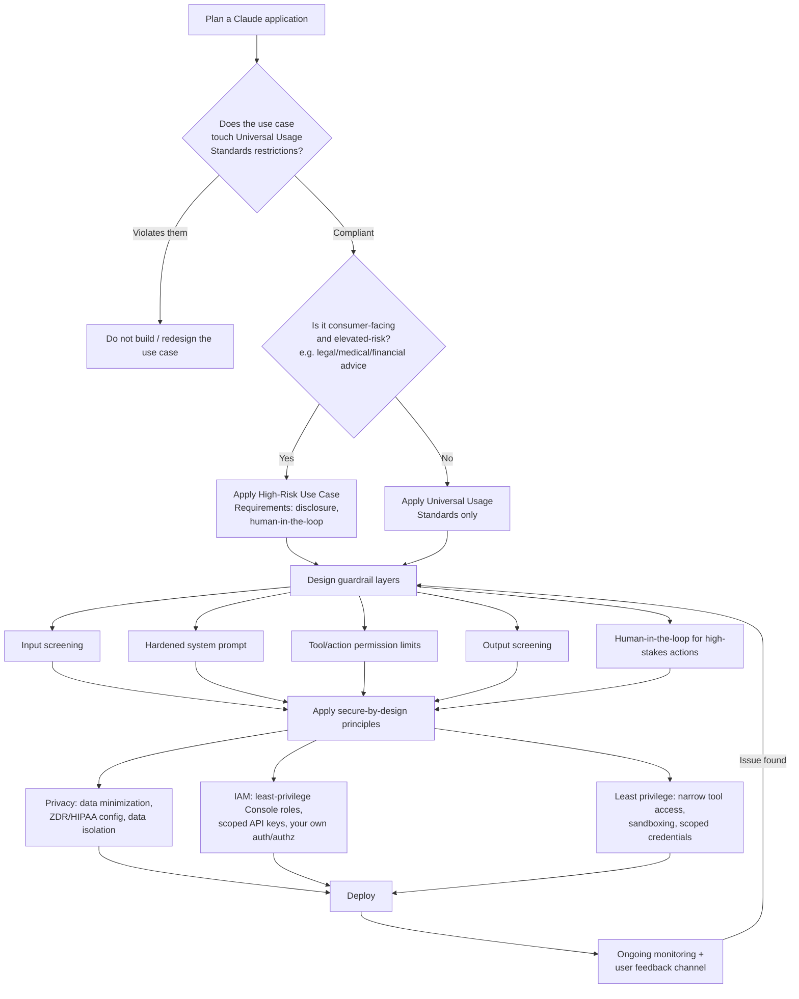

# Claude Certified Developer Foundations (CCDF)
## Domain: Guardrails and Safe Deployment (2.3%)

This tutorial explains everything in the syllabus line:

> Safe and responsible deployment practices (content policy, guardrail layering) and
> secure-by-design principles (privacy, identity and access management, least privilege).

The language is kept simple. Every idea has a small example. Read it top to bottom, or use the
table of contents to jump to a topic you need to review.

---

## Table of Contents

1. [What "Safe Deployment" Means for a Claude Application](#1-what-safe-deployment-means-for-a-claude-application)
2. [Content Policy — Anthropic's Usage Policy](#2-content-policy--anthropics-usage-policy)
3. [High-Risk and Additional Use Case Requirements](#3-high-risk-and-additional-use-case-requirements)
4. [Guardrail Layering](#4-guardrail-layering)
5. [Secure-by-Design Principle 1: Privacy](#5-secure-by-design-principle-1-privacy)
6. [Secure-by-Design Principle 2: Identity and Access Management (IAM)](#6-secure-by-design-principle-2-identity-and-access-management-iam)
7. [Secure-by-Design Principle 3: Least Privilege](#7-secure-by-design-principle-3-least-privilege)
8. [Putting It All Together: A Safe Deployment Checklist](#8-putting-it-all-together-a-safe-deployment-checklist)
9. [Flow Diagram](#9-flow-diagram)
10. [Quick Revision Cheat Sheet](#10-quick-revision-cheat-sheet)
11. [Practice Questions](#11-practice-questions)

---

## 1. What "Safe Deployment" Means for a Claude Application

Building a working Claude application is only step one. **Safely deploying** it means making sure
that, once real users are using it in the real world, it:

- Follows the rules Anthropic sets for what Claude can be used for (**content policy**)
- Has more than one line of defense against things going wrong (**guardrail layering**)
- Was **designed from the start** — not bolted on afterward — to protect data, identities, and
  permissions (**secure-by-design**: privacy, IAM, least privilege)

Think of it this way: content policy tells you **what's allowed**. Guardrail layering is **how you
enforce** that reliably. Secure-by-design principles are about **how your whole system is built**
so that even things you didn't anticipate are less likely to cause serious harm.

---

## 2. Content Policy — Anthropic's Usage Policy

Anthropic's **Usage Policy** (also called the Acceptable Use Policy, or AUP) sets binding rules for
everyone who submits inputs to Anthropic's products and services — including through third-party
apps built on Claude, authorized resellers, and passthrough access. It exists to keep users safe
and to promote responsible use of Claude.

### The three tiers of the Usage Policy

| Tier | Who it applies to |
|---|---|
| **Universal Usage Standards** | **All users and all use cases**, no exceptions |
| **High-Risk Use Case Requirements** | Specific **consumer-facing** use cases that pose an elevated risk of harm (e.g. legal, financial, medical, employment-related advice) |
| **Additional Use Case Guidelines** | Certain other use cases: consumer-facing chatbots, products serving minors, agentic use, and Model Context Protocol (MCP) servers |

### What Universal Usage Standards prohibit

These apply to **every** user, with no exceptions, and include things like:

- Compromising children's safety (creating, distributing, or promoting CSAM)
- Critical infrastructure attacks
- Developing weapons (including cyberweapons and CBRN weapons)
- Unauthorized access to computer systems
- Creating malware

### Enforcement

Anthropic's **Safeguards Team** actively monitors and enforces the Usage Policy. If a violation is
found:

- Access can be **throttled, suspended, or terminated**
- Model outputs may be **blocked or modified**, without prior notice
- CSAM violations specifically are **reported to law enforcement**

If you believe a model output is inaccurate, biased, or harmful, you (or your users) can report it
to `usersafety@anthropic.com`, or via the in-product "thumbs down" / report-issue feature.

> **Exam tip:** Memorize the **three tiers by name** (Universal Usage Standards, High-Risk Use
> Case Requirements, Additional Use Case Guidelines) and remember that Universal Usage Standards
> apply to **everyone**, with no exceptions — this is the baseline "content policy" the rest of
> your application's guardrails should never contradict.

---

## 3. High-Risk and Additional Use Case Requirements

### High-Risk Use Case Requirements

These apply specifically to **consumer-facing** deployments with elevated potential for harm —
for example, apps giving legal, financial, or medical advice to end users. Typical requirements
include:

- **Human oversight / human-in-the-loop** review for high-stakes outputs
- **AI disclosure** — telling users they're interacting with an AI, and that it isn't a substitute
  for a licensed professional
- Additional safeguards appropriate to the specific domain (e.g. crisis-intervention resources for
  mental-health-adjacent use cases)

An important nuance: these requirements are generally clarified to apply when the model's outputs
are **consumer-facing** — not for pure business-to-business (B2B) interactions where the output
never reaches an end consumer directly.

### Additional Use Case Guidelines

These cover a handful of specific scenarios that come with their own tailored rules:

| Use case | What's typically required |
|---|---|
| **Consumer-facing chatbots** | Clear disclosure that the user is talking to an AI |
| **Products serving minors** | Enhanced safety requirements; a minor is defined as anyone under 18, regardless of jurisdiction |
| **Agentic use** | Human-in-the-loop controls and a "minimal footprint" principle — give the agent no more reach than its task needs |
| **MCP servers** | Specific requirements addressing the downstream risk that a third-party MCP integration introduces |

> **Exam tip:** A recurring exam distinction: **Universal Usage Standards = no exceptions, applies
> to all.** **High-Risk Use Case Requirements = applies to specific elevated-risk, consumer-facing
> scenarios.** A question describing "an internal, employee-only tool" is a hint that High-Risk
> consumer-facing requirements may **not** apply the same way — but Universal Usage Standards
> always still apply.

---

## 4. Guardrail Layering

**Guardrail layering** means combining **multiple, independent** safety mechanisms so that if one
layer fails or is bypassed, another layer still catches the problem. This is the core practical
technique behind "safe deployment."

### Why one guardrail is never enough

A single defense — say, just a well-written system prompt — can be bypassed by a sufficiently
creative jailbreak attempt. Layering means an attacker (or an honest mistake) has to get through
**several independent checks**, not just one, before something goes wrong.

### Typical layers in a well-guarded Claude application

| Layer | What it does | Example |
|---|---|---|
| **Input screening** | Classifies user input before it reaches the main conversation | A harmlessness screen using a small, fast model |
| **System prompt guardrails** | Sets explicit ethical/legal boundaries and refusal behavior | "Refuse any request that violates our values..." |
| **Tool/action permissions** | Restricts what the model can actually *do*, even if it "wants to" | Least-privilege tool scoping (see Section 7) |
| **Output screening** | Checks the model's response before it reaches the user | A second classifier checking for policy violations in the final answer |
| **Human-in-the-loop review** | A human approves high-stakes actions before they take effect | Required for high-risk consumer-facing use cases |
| **Monitoring and feedback loops** | Ongoing review of real outputs to catch what earlier layers missed | Continuous monitoring, user feedback ("thumbs down") routed back to your team |

### A layered example

```
User input
   │
   ▼
[Layer 1] Harmlessness screen (small model classifies input)
   │  pass
   ▼
[Layer 2] Main Claude call, guided by a hardened system prompt
   │
   ▼
[Layer 3] Tool calls scoped to least-privilege permissions
   │
   ▼
[Layer 4] Output screen (checks final response against policy)
   │  pass
   ▼
[Layer 5] Delivered to user, logged for ongoing monitoring
```

If Layer 1 misses something (e.g. a cleverly obfuscated jailbreak), Layer 2's hardened system
prompt might still cause a refusal. If that also fails, Layer 3's restricted tool permissions
limit the actual damage a bad output could cause. If a bad response still slips through, Layer 4
can catch it before the user ever sees it. This is the essence of "layering": **no single point
of failure**.

> **Exam tip:** If an exam scenario describes a system that relies on **only one** safety
> mechanism (e.g. "we just have a good system prompt"), the correct improvement is almost always
> to **add another independent layer** — not to make the existing single layer more elaborate.

---

## 5. Secure-by-Design Principle 1: Privacy

"Secure-by-design" means privacy and security decisions are made **as part of the architecture**,
from the very first design decisions — not added on afterward as a patch.

### What privacy-by-design looks like in practice

- **Data minimization**: only collect/send the data actually needed for the task (don't include
  full customer records when only a name and order ID are needed).
- **Purpose limitation**: use data only for the purpose the user/customer agreed to — don't
  repurpose support-chat transcripts for unrelated analytics without proper basis/consent.
- **Appropriate data-handling configuration**: choose the right Anthropic data-retention setting
  for your data's sensitivity — e.g. **zero data retention (ZDR)**, where customer data isn't
  stored at rest after the API response is returned (except where required to comply with law or
  combat misuse), or **HIPAA-ready access** with a signed Business Associate Agreement (BAA) for
  protected health information.
- **Data isolation**: one user's data/context must never leak into another user's session.
- **Transparency**: disclosing to users when they're interacting with an AI system, and how their
  data will be used — this overlaps directly with the "Additional Use Case Guidelines" for
  consumer-facing chatbots covered in Section 3.

> **Exam tip:** "Privacy" as a secure-by-design principle is about **building the data-handling
> decisions into the architecture up front** (what data flows where, what's retained, what's
> isolated) — not just writing a privacy policy document after the system is already built.

---

## 6. Secure-by-Design Principle 2: Identity and Access Management (IAM)

**Identity and Access Management (IAM)** is about controlling **who** (which person, service, or
API key) can do **what**, within your Claude application and within the Claude Platform/Console
itself.

### IAM at the Claude Platform/Console level

The Claude Console organizes access through **organizations**, **workspaces**, and **roles**:

| Concept | What it does |
|---|---|
| **Organization** | The top-level account; organization **admins** automatically get admin access to every workspace |
| **Workspace** | A way to separate API usage by project, environment, or team, with its own members, API keys, and resource limits |
| **API keys scoped to a workspace** | A key can typically only access resources within its own workspace — preventing a key meant for one project from touching another |

### Workspace roles (fine-grained access control)

| Role | Permissions |
|---|---|
| **Workspace User** | Use the Workbench only |
| **Workspace Limited Developer** | Create/manage API keys, use the API — but cannot access session tracing views or download files |
| **Workspace Developer** | Create/manage API keys, use the API |
| **Workspace Admin** | Full control over workspace settings and members |
| **Workspace Billing** | View billing information only (inherited from the organization billing role) |

Key IAM facts worth remembering:

- **Organization admins** automatically receive Workspace Admin access to **every** workspace.
- **Organization billing members** automatically receive Workspace Billing access to every
  workspace.
- Regular organization users/developers must be **explicitly added** to each workspace — access
  is not automatic just because someone is in the organization.
- Only organization members with the **admin** role can provision **Admin API keys**.

### IAM at your own application level

IAM isn't only about the Claude Console — your own application needs its own identity and access
controls **around** Claude:

- Authenticate your own end users (verify who they are) independently of any Anthropic API key.
- Authorize specific actions per user (verify what they're allowed to do) in your own
  tool-execution code — never assume that Claude choosing to call a tool is itself an
  authorization decision.
- Use **service accounts** or scoped credentials for machine-to-machine access (e.g. a backend
  service calling the API), rather than sharing one broad, all-access key everywhere.

> **Exam tip:** The exam is likely to test the **role table** above (which role can do what) and
> the **inheritance rules** (organization admins get Workspace Admin everywhere automatically;
> regular members must be explicitly added per workspace). It's also likely to test that IAM at
> the platform level (Console roles, API keys) is a **different layer** from IAM/authorization in
> your own application code — both matter, and one doesn't substitute for the other.

---

## 7. Secure-by-Design Principle 3: Least Privilege

**Least privilege** means giving every person, credential, tool, and AI agent **only** the
permissions it actually needs to do its job — nothing more.

### Why least privilege matters especially for agentic Claude apps

An agent that can call tools is, functionally, a piece of software making decisions on your data
and systems. If that agent (or a successful prompt injection targeting that agent) only has access
to a narrow, well-scoped set of permissions, the **maximum possible damage** from any single
mistake or attack is limited.

### Applying least privilege in practice

| Area | Least-privilege practice |
|---|---|
| **API keys** | Scope keys to a single workspace/project rather than granting organization-wide access; rotate keys regularly |
| **Tool access** | Only give an agent the specific tools it needs for its task — don't attach a "delete records" tool to an agent that only needs to read data |
| **IAM policies (e.g. cloud IAM for Claude Platform on AWS)** | Attach a scoped policy granting only the specific actions the application uses, restricted to the specific resource (e.g. a specific workspace ARN), rather than a broad managed policy |
| **Data access** | An agent handling one customer's support ticket should only be able to reach that customer's data, not the entire customer database |
| **Sandboxing** | Run tools that execute code or touch the filesystem inside sandboxed/isolated environments, limiting the blast radius of a compromised tool call |
| **Human roles (Console)** | Assign the **lowest role** that lets someone do their job — e.g. Workspace Developer instead of Workspace Admin, if admin-level settings changes aren't part of their role |

### A concrete least-privilege example

```
# Overly broad (avoid):
An agent's API key has organization-wide access, and its "database" tool
can run arbitrary SQL against the production database.

# Least privilege (prefer):
The agent's API key is scoped to a single workspace.
Its "database" tool only exposes a narrow, parameterized read-only
function like get_order_status(order_id), not raw SQL execution.
```

```python
# Least-privilege tool definition: narrow, single-purpose, no raw access
def get_order_status(order_id: str, requesting_user_id: str):
    if not user_owns_order(requesting_user_id, order_id):
        return {"error": "Not authorized"}
    return {"status": fetch_status(order_id)}
# Notice: no raw database connection, no arbitrary query capability,
# and an explicit authorization check baked into the tool itself.
```

> **Exam tip:** Least privilege shows up at **every** level the exam might ask about: human roles
> in the Console, API key scoping, tool/action permissions for an agent, and even IAM policies on
> cloud platforms hosting Claude. The unifying principle is always the same: **grant the minimum
> access required for the task, and nothing else.**

---

## 8. Putting It All Together: A Safe Deployment Checklist

Before deploying a Claude-powered application to real users, a secure-by-design, policy-compliant
launch checklist looks like this:

- [ ] **Content policy compliance**: confirmed the use case doesn't violate Universal Usage
      Standards, and identified whether High-Risk Use Case Requirements or Additional Use Case
      Guidelines apply (e.g. consumer-facing chatbot disclosure, minors, agentic use, MCP servers)
- [ ] **AI disclosure**: users are told they're interacting with an AI, where required
- [ ] **Guardrail layering**: input screening, hardened system prompt, output screening, and
      (for high-risk use cases) human-in-the-loop review are all present — not just one of them
- [ ] **Privacy**: data minimization applied; correct data-retention configuration (ZDR/HIPAA)
      chosen for the data's sensitivity; per-user data isolation confirmed
- [ ] **IAM**: Console roles assigned at the minimum level needed; API keys scoped to the
      appropriate workspace; your own application authenticates and authorizes its own end users
      independently of the Anthropic API key
- [ ] **Least privilege**: agent tool access is narrow and purpose-built; sandboxing is used for
      any code/file-system-touching tools; no credential grants more access than its task needs
- [ ] **Monitoring**: a feedback/reporting path exists (e.g. `usersafety@anthropic.com`, in-product
      feedback) and outputs are reviewed on an ongoing basis, not just at launch

---

## 9. Flow Diagram



---

## 10. Quick Revision Cheat Sheet

| Term | One-line definition |
|---|---|
| **Usage Policy / AUP** | Anthropic's binding rules for anyone submitting inputs to its products/services |
| **Universal Usage Standards** | Apply to **all** users, no exceptions (e.g. no CSAM, no weapons development, no unauthorized system access) |
| **High-Risk Use Case Requirements** | Apply to specific elevated-risk, **consumer-facing** use cases (legal/medical/financial advice); require human oversight and AI disclosure |
| **Additional Use Case Guidelines** | Cover chatbots, products serving minors, agentic use, and MCP servers |
| **Safeguards Team** | Anthropic's team that monitors/enforces the Usage Policy; can throttle, suspend, or terminate access |
| **Guardrail layering** | Combining multiple independent safety mechanisms so no single failure compromises the system |
| **Privacy by design** | Data minimization, purpose limitation, correct retention config (ZDR/HIPAA), data isolation, built in from the start |
| **IAM (Console level)** | Organizations → Workspaces → Roles (User, Limited Developer, Developer, Admin, Billing); admins inherit access everywhere, others must be added explicitly |
| **IAM (application level)** | Your own authentication/authorization of end users, independent of the Anthropic API key |
| **Least privilege** | Grant only the minimum access/permissions needed — for people, API keys, and agent tools alike |
| **ZDR (zero data retention)** | Customer data not stored at rest after the API response, except as legally required |
| **Minimal footprint (agentic use)** | Give an agent no more reach/permissions than its specific task requires |

---

## 11. Practice Questions

**Q1.** What are the three tiers of Anthropic's Usage Policy, and which one applies to absolutely
everyone with no exceptions?
<details><summary>Answer</summary>
Universal Usage Standards, High-Risk Use Case Requirements, and Additional Use Case Guidelines.
Universal Usage Standards apply to all users and use cases with no exceptions.
</details>

**Q2.** A consumer-facing app gives automated financial advice directly to end users. Which tier
of the Usage Policy applies on top of the Universal Usage Standards, and what does it typically
require?
<details><summary>Answer</summary>
High-Risk Use Case Requirements. It typically requires safeguards like human-in-the-loop oversight
and clear AI disclosure to the end user.
</details>

**Q3.** A team relies solely on a well-written system prompt to prevent harmful outputs. What
concept from this tutorial identifies the weakness here, and what's the fix?
<details><summary>Answer</summary>
This violates guardrail layering — a single defense is a single point of failure. The fix is to
add independent additional layers (e.g. an input screen before the system prompt, an output screen
after the response, and scoped tool permissions), not to just make the one system prompt more
elaborate.
</details>

**Q4.** True or False: In the Claude Console, a regular organization member automatically gets
access to every workspace in the organization.
<details><summary>Answer</summary>
False. Only organization admins (and organization billing members, for the Billing role)
automatically inherit access to every workspace. Regular organization users/developers must be
explicitly added to each workspace.
</details>

**Q5.** An agent only needs to look up a customer's order status. Which least-privilege design is
better: giving it a raw SQL-execution tool against the production database, or a narrow
`get_order_status(order_id)` function? Why?
<details><summary>Answer</summary>
The narrow `get_order_status(order_id)` function. It exposes only the specific capability the
task needs, limiting the maximum possible damage from a mistake or a successful prompt injection —
this is the core idea of least privilege.
</details>

**Q6.** Name two elements of "privacy by design" as covered in this tutorial.
<details><summary>Answer</summary>
Any two of: data minimization (only sending/collecting what's needed), purpose limitation (using
data only for its intended purpose), choosing the appropriate data-retention configuration (ZDR or
HIPAA-ready access), per-user data isolation, and transparency/AI disclosure to users.
</details>

**Q7.** What happens if Anthropic determines a user has violated the Usage Policy?
<details><summary>Answer</summary>
Access may be throttled, suspended, or terminated, and model outputs may be blocked or modified
without prior notice. CSAM-related violations are additionally reported to law enforcement.
</details>

---

### Final Tips for the Exam

- Memorize the **three-tier structure** of the Usage Policy and know that Universal Usage
  Standards apply universally, with no exceptions.
- Remember that **guardrail layering** is about independent, redundant safety mechanisms — the
  fix for "only one defense" is always "add another layer," not "reinforce the one layer."
- Know the **Console IAM role table** (User, Limited Developer, Developer, Admin, Billing) and the
  **inheritance rules** (org admins get Workspace Admin everywhere; others must be added
  explicitly).
- Least privilege applies at **every level**: human roles, API key scoping, agent tool
  permissions, and cloud IAM policies — the exam may test any of these angles.
- Remember that secure-by-design means these decisions are made **during architecture and design**,
  not retrofitted after a problem occurs.

Good luck with your CCDF exam!