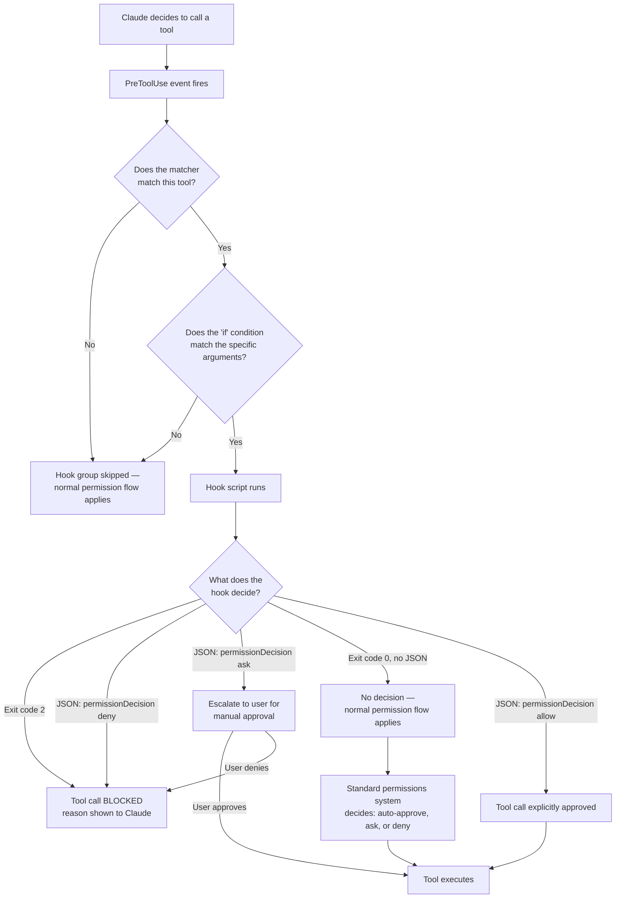

# Claude Certified Developer Foundations (CCDF)
## Domain: Claude Hooks (1.0%)

This tutorial explains everything in the syllabus line:

> Leveraging hooks for guardrails and safety controls to prevent destructive actions within
> Claude applications.

The language is kept simple. Every idea has a small example. Read it top to bottom, or use the
table of contents to jump to a topic you need to review.

---

## Table of Contents

1. [What Are Hooks?](#1-what-are-hooks)
2. [Why Hooks Are a Guardrail Mechanism](#2-why-hooks-are-a-guardrail-mechanism)
3. [The Key Safety Event: `PreToolUse`](#3-the-key-safety-event-pretooluse)
4. [How a Hook Is Configured](#4-how-a-hook-is-configured)
5. [Matchers — Deciding When a Hook Fires](#5-matchers--deciding-when-a-hook-fires)
6. [Narrowing Further with the `if` Field](#6-narrowing-further-with-the-if-field)
7. [How a Hook Communicates Its Decision](#7-how-a-hook-communicates-its-decision)
8. [A Complete Worked Example: Blocking Destructive Commands](#8-a-complete-worked-example-blocking-destructive-commands)
9. [Other Safety-Relevant Hook Events](#9-other-safety-relevant-hook-events)
10. [Where Hooks Are Defined (Scope)](#10-where-hooks-are-defined-scope)
11. [Best Practices for Guardrail Hooks](#11-best-practices-for-guardrail-hooks)
12. [Flow Diagram](#12-flow-diagram)
13. [Quick Revision Cheat Sheet](#13-quick-revision-cheat-sheet)
14. [Practice Questions](#14-practice-questions)

---

## 1. What Are Hooks?

**Hooks** are user-defined shell commands, HTTP endpoints, MCP tool calls, LLM prompts, or
subagents that run **automatically at specific points** in Claude Code's lifecycle — for example,
right before a tool is about to execute, or right after a session ends.

Think of a hook as a **checkpoint** your own code gets to run at a specific moment, with the power
to inspect what's about to happen and — for some events — **stop it** before it happens.

Hooks are not just for the terminal: the same hook events fire consistently across every surface
Claude Code runs on (terminal sessions, IDE extensions, the desktop app, and cloud sessions).

---

## 2. Why Hooks Are a Guardrail Mechanism

The syllabus focuses on hooks specifically as a way to **prevent destructive actions**. This
matters because a system prompt or instruction ("please don't delete files") is only guidance —
Claude might still make a mistake, misunderstand a request, or be manipulated into taking a
harmful action.

A hook is different: it's **deterministic code that runs outside the model**, inspecting the
**actual** tool call Claude is about to make, and can **enforce** a decision — not just suggest
one. This makes hooks a genuine **guardrail layer** (see the Guardrails and Safe Deployment domain
for how this fits into layered defense) that sits between "Claude decided to do X" and "X actually
happens."

```
Claude decides to run: rm -rf /important-data
        │
        ▼
  [PreToolUse hook fires]
        │
        ├─ Hook inspects the command
        │
        ├─ Hook says "deny" ──────► Tool call is BLOCKED. Destructive action prevented.
        │
        └─ Hook says nothing / "allow" ──► Tool call proceeds through normal permission flow
```

> **Exam tip:** The core exam idea is: **hooks let you enforce safety rules in code, independent
> of what the model decides** — this is what makes them a reliable guardrail rather than just
> another prompt instruction.

---

## 3. The Key Safety Event: `PreToolUse`

For "preventing destructive actions," the single most important hook event is **`PreToolUse`**.

- **When it fires**: before a tool call executes.
- **Can it block the action?** Yes — this is one of the few events that can actually **prevent**
  something from happening, because the action hasn't happened yet.
- **What it receives**: the tool name and its exact input (e.g. the Bash command about to run, or
  the file path about to be edited).

```json
{
  "session_id": "abc123",
  "cwd": "/home/user/my-project",
  "hook_event_name": "PreToolUse",
  "tool_name": "Bash",
  "tool_input": {
    "command": "rm -rf /tmp/build"
  },
  "tool_use_id": "toolu_01ABC123..."
}
```

Because this fires **before** execution, a `PreToolUse` hook is your last line of defense against
a destructive command, a dangerous file edit, or an unwanted tool call actually taking effect.

> **Exam tip:** If a question asks "which hook event would you use to prevent a destructive Bash
> command from ever running," the answer is `PreToolUse` — it is one of very few events that can
> genuinely stop an action before it happens, since the tool hasn't executed yet.

---

## 4. How a Hook Is Configured

Hooks are defined in JSON settings files (like `.claude/settings.json`). Configuration has three
levels of nesting:

1. Choose a **hook event** to respond to (e.g. `PreToolUse`)
2. Add a **matcher** to filter when it fires (e.g. "only for the Bash tool")
3. Define one or more **hook handlers** to actually run when matched

```json
{
  "hooks": {
    "PreToolUse": [
      {
        "matcher": "Bash",
        "hooks": [
          {
            "type": "command",
            "command": "${CLAUDE_PROJECT_DIR}/.claude/hooks/block-rm.sh"
          }
        ]
      }
    ]
  }
}
```

Reading this configuration: whenever the **`PreToolUse`** event fires, **and** the tool being
called matches **`Bash`**, run the shell script `block-rm.sh`.

### Types of hook handlers

| Type | What it does |
|---|---|
| `command` | Runs a shell command; your script receives JSON on stdin |
| `http` | Sends the event's JSON as an HTTP POST request to a URL you control |
| `mcp_tool` | Calls a tool on an already-connected MCP server |
| `prompt` | Sends a prompt to a Claude model for a quick single-turn evaluation |
| `agent` | Spawns a subagent that can use tools (Read, Grep, Glob) to verify conditions before deciding |

For guardrail/safety use cases, `command` hooks are the most common — a small, fast script that
makes a deterministic yes/no decision.

---

## 5. Matchers — Deciding When a Hook Fires

The `matcher` field filters **when** a hook group activates. For tool events like `PreToolUse`,
the matcher is compared against the **tool name**.

| Matcher value | Behavior | Example |
|---|---|---|
| `"*"`, `""`, or omitted | Matches every occurrence of the event | Fires on every tool call |
| Plain letters/digits/`\|`/`,` | Exact string match (or list of exact matches) | `Bash` matches only the Bash tool; `Edit\|Write` matches either |
| Anything with other characters | Treated as a JavaScript regular expression | `mcp__.*` matches every tool from any MCP server |

```json
{
  "hooks": {
    "PreToolUse": [
      {
        "matcher": "Bash|PowerShell",
        "hooks": [{ "type": "command", "command": "./scripts/check-command.sh" }]
      }
    ]
  }
}
```

This matcher activates the hook group for **either** the Bash tool or the PowerShell tool.

### Matching MCP tools

MCP server tools appear as regular tool names following the pattern `mcp__<server>__<tool>`. To
match every tool from one server, append `.*`:

```json
{ "matcher": "mcp__memory__.*" }
```

matches every tool provided by the `memory` MCP server.

> **Exam tip:** Remember that an omitted or `"*"` matcher fires on **every** occurrence of the
> event — a common exam scenario is recognizing that a hook with no matcher will run for *every*
> tool call, not just the one intended, which could unexpectedly slow things down or misfire.

---

## 6. Narrowing Further with the `if` Field

A matcher filters by **tool name**. The `if` field on an individual hook handler filters more
narrowly, by **tool name and arguments together**, using the same syntax as permission rules.

```json
{
  "hooks": {
    "PreToolUse": [
      {
        "matcher": "Bash",
        "hooks": [
          {
            "type": "command",
            "if": "Bash(rm *)",
            "command": "${CLAUDE_PROJECT_DIR}/.claude/hooks/block-rm.sh"
          }
        ]
      }
    ]
  }
}
```

Here, the **matcher** narrows to Bash tool calls generally, and the **`if`** condition narrows
further to only Bash calls whose subcommand matches `rm *`. So the script only runs (and only
spawns a process) when there's actually a chance the command is destructive — not on every single
Bash call.

```json
{ "if": "Edit(*.ts)" }   // only runs for edits to TypeScript files
```

> **Exam tip:** The distinction to remember: **matcher = which tool**; **`if` = which tool AND
> which specific arguments**. Using `if` well means your guardrail hook only spawns a process
> when there's a real chance the action is worth checking — an important detail for both
> performance and clarity.

---

## 7. How a Hook Communicates Its Decision

A hook communicates its result back to Claude Code through **exit codes** and/or **JSON printed to
stdout**.

### Exit codes (the simple approach)

| Exit code | Meaning |
|---|---|
| `0` | Success / no decision — the normal permission flow applies |
| `2` | **Blocking error** — for `PreToolUse`, this blocks the tool call |
| Any other code | Generally treated as a non-blocking error; the action proceeds |

```bash
#!/bin/bash
# Reads JSON input from stdin, checks the command
input=$(cat)
command=$(jq -r '.tool_input.command' <<<"$input")

if [[ "$command" == rm* ]]; then
  echo "Blocked: rm commands are not allowed" >&2
  exit 2  # Blocking error: tool call is prevented
fi

exit 0  # No decision: the normal permission flow applies
```

### JSON output (the fine-grained approach)

For finer control — including explicitly **allowing**, **denying**, or asking the user — exit
with code `0` and print a JSON object to stdout instead:

```json
{
  "hookSpecificOutput": {
    "hookEventName": "PreToolUse",
    "permissionDecision": "deny",
    "permissionDecisionReason": "Destructive command blocked by hook"
  }
}
```

The `permissionDecision` field can be:

| Value | Effect |
|---|---|
| `"allow"` | The tool call is explicitly approved |
| `"deny"` | The tool call is blocked, with the given reason shown to Claude |
| `"ask"` | Escalates to the user for a manual decision |

```bash
#!/bin/bash
COMMAND=$(jq -r '.tool_input.command')

if echo "$COMMAND" | grep -q 'rm -rf'; then
  jq -n '{
    hookSpecificOutput: {
      hookEventName: "PreToolUse",
      permissionDecision: "deny",
      permissionDecisionReason: "Destructive command blocked by hook"
    }
  }'
else
  exit 0  # no decision; normal permission flow applies
fi
```

> **Exam tip:** Know both mechanisms. **Exit code 2 always blocks** on events that support
> blocking — even if you also print JSON that says "allow," exit code 2 wins. **JSON output**
> gives you the richer three-way decision (`allow` / `deny` / `ask`), which exit codes alone
> cannot express.

---

## 8. A Complete Worked Example: Blocking Destructive Commands

This example ties Sections 4–7 together into a single, practical guardrail: blocking `rm -rf`
commands before they run.

**Step 1 — Configure the hook** (`.claude/settings.json`):

```json
{
  "hooks": {
    "PreToolUse": [
      {
        "matcher": "Bash",
        "hooks": [
          {
            "type": "command",
            "if": "Bash(rm *)",
            "command": "${CLAUDE_PROJECT_DIR}/.claude/hooks/block-rm.sh"
          }
        ]
      }
    ]
  }
}
```

**Step 2 — Write the hook script** (`.claude/hooks/block-rm.sh`):

```bash
#!/bin/bash
# .claude/hooks/block-rm.sh
COMMAND=$(jq -r '.tool_input.command')

if echo "$COMMAND" | grep -q 'rm -rf'; then
  jq -n '{
    hookSpecificOutput: {
      hookEventName: "PreToolUse",
      permissionDecision: "deny",
      permissionDecisionReason: "Destructive command blocked by hook"
    }
  }'
else
  exit 0  # no decision; normal permission flow applies
fi
```

**Step 3 — Make it executable:**

```bash
chmod +x .claude/hooks/block-rm.sh
```

### What happens, step by step, when Claude tries to run `rm -rf /tmp/build`

1. **Event fires**: `PreToolUse` fires; Claude Code sends the tool input as JSON on stdin.
2. **Matcher checks**: the matcher `"Bash"` matches the tool name — the hook group activates.
3. **`if` condition checks**: `"Bash(rm *)"` matches because `rm -rf /tmp/build` is a subcommand
   matching `rm *` — so the script actually spawns. (If the command had been `npm test`, the `if`
   check would fail and the script would never even run.)
4. **Hook handler runs**: the script inspects the full command, finds `rm -rf`, and prints a
   `deny` decision to stdout.
5. **Claude Code acts on the result**: it reads the JSON decision, **blocks the tool call**, and
   shows Claude the reason — the destructive action never happens.

If the command had instead been a safer variant like `rm file.txt`, the script would hit
`exit 0` — no decision — and the call would continue through the normal permission flow (which
might still ask the user, depending on settings).

---

## 9. Other Safety-Relevant Hook Events

While `PreToolUse` is the star of "preventing destructive actions," a few other events are worth
knowing for a fuller guardrail picture:

| Event | When it fires | Relevance to safety |
|---|---|---|
| `PostToolUse` | After a tool call **succeeds** | Cannot prevent the action (it already happened), but can flag the result, log it, or feed a warning back to Claude for the next step |
| `UserPromptSubmit` | Before Claude processes a submitted prompt | Can **block** prompt processing entirely — useful for screening user input before it ever reaches the model (see the harmlessness-screen pattern from the Security domain) |
| `Stop` | When Claude finishes responding | Can prevent Claude from stopping (force it to continue) — useful for enforcing "you must complete verification before finishing" |
| `PreCompact` | Before context compaction | Can block compaction from happening |

> **Exam tip:** The key distinction the exam is likely to test: only **some** events can actually
> block an action (because the action hasn't happened yet). `PreToolUse` blocks a tool call before
> it runs; `PostToolUse` **cannot** undo a tool call that already succeeded — it can only react to
> it. Choose your hook event based on **timing**: to *prevent* something, you need a hook that
> fires *before* it happens.

---

## 10. Where Hooks Are Defined (Scope)

Where you define a hook determines how widely it applies — this matters for guardrails meant to
protect an entire team versus just your own machine.

| Location | Scope | Shareable with team? |
|---|---|---|
| `~/.claude/settings.json` | All your projects | No — local to your machine only |
| `.claude/settings.json` | A single project | Yes — can be committed to the repo |
| `.claude/settings.local.json` | A single project | No — kept out of git |
| Managed policy settings | Organization-wide | Yes — admin-controlled |
| A plugin's `hooks/hooks.json` | Active while the plugin is enabled | Yes — bundled with the plugin |

> **Exam tip:** A team-wide guardrail (e.g. "nobody on this project can run `rm -rf`") belongs in
> **`.claude/settings.json`** (committed to the repo) or, for an organization-wide rule that
> individuals cannot override, in **managed policy settings**. A personal preference belongs in
> `~/.claude/settings.json` or `.claude/settings.local.json`.

---

## 11. Best Practices for Guardrail Hooks

1. **Fire before, not after, for anything truly destructive.** Use `PreToolUse` (or another
   before-the-fact event) for actions you must actually prevent — not `PostToolUse`, which is too
   late.
2. **Narrow with `matcher` and `if` before doing real work.** Don't run an expensive or slow check
   on every single tool call — scope your hook to the specific tool and pattern that actually
   matters.
3. **Prefer explicit JSON decisions over relying only on exit codes** when you need the
   `allow`/`deny`/`ask` distinction — exit codes alone only give you a blunt block/no-block signal.
4. **Give a clear `permissionDecisionReason`.** Claude (and the user) sees this reason — a vague
   message like "blocked" is far less useful than "Destructive command blocked: contains rm -rf".
5. **Fail safely.** If your hook script errors out unexpectedly, understand what that means for
   your specific event (many events treat an unclear result as "no decision — proceed normally"),
   and design your script so a bug in the *hook* doesn't silently disable your intended guardrail.
6. **Commit shared guardrails to the project.** A safety rule meant for the whole team should live
   in `.claude/settings.json` (or managed policy settings for an org-wide rule), not just on one
   person's machine.
7. **Layer hooks with other guardrails.** As covered in the Guardrails and Safe Deployment domain,
   a hook is one layer — combine it with a hardened system prompt, least-privilege tool access,
   and monitoring for defense in depth, rather than relying on a single hook alone.

---

## 12. Flow Diagram



---

## 13. Quick Revision Cheat Sheet

| Term | One-line definition |
|---|---|
| **Hook** | User-defined command/HTTP/MCP/prompt/agent handler that runs at a specific lifecycle point |
| **`PreToolUse`** | Fires **before** a tool call executes; the key event for **preventing** destructive actions |
| **`PostToolUse`** | Fires **after** a tool call succeeds; can react/log but cannot undo the action |
| **Matcher** | Filters which tool name a hook group applies to (`Bash`, `Edit\|Write`, `mcp__.*`, etc.) |
| **`if` field** | Filters by tool name AND arguments together, using permission-rule syntax (e.g. `"Bash(rm *)"`) |
| **Exit code 0** | Success / no decision — normal permission flow applies |
| **Exit code 2** | Blocking error — prevents the action on events that support blocking |
| **`permissionDecision`** | JSON field with value `"allow"`, `"deny"`, or `"ask"` — richer than exit codes alone |
| **`permissionDecisionReason`** | Human-readable explanation shown to Claude/the user for a decision |
| **`.claude/settings.json`** | Project-level, shareable hook configuration (commit to the repo) |
| **Managed policy settings** | Organization-wide hook configuration individuals cannot override |
| **Defense in depth** | A hook is one guardrail layer; combine it with prompts, permissions, and monitoring |

---

## 14. Practice Questions

**Q1.** Which hook event should you use to prevent a destructive Bash command from ever executing,
and why?
<details><summary>Answer</summary>
`PreToolUse`, because it fires before the tool call executes — this is the point at which the
action can still genuinely be blocked. `PostToolUse` fires only after the tool has already run, so
it's too late to prevent the action.
</details>

**Q2.** A hook is configured with `"matcher": "Bash"` and `"if": "Bash(rm *)"`. Will this hook run
for the command `npm test && git push`?
<details><summary>Answer</summary>
No. The matcher matches the Bash tool generally, but the `if` condition requires a subcommand
matching `rm *`, which is not present in `npm test && git push`. The hook script never spawns for
this command.
</details>

**Q3.** What's the difference between blocking via exit code 2 and blocking via JSON
`permissionDecision: "deny"`?
<details><summary>Answer</summary>
Exit code 2 is a simple, blunt block-or-not signal. JSON `permissionDecision` gives a three-way
decision (`allow`, `deny`, `ask`) plus a human-readable reason field — richer control than exit
codes alone can express. Exit code 2 still blocks even if JSON output is also present and says
something different.
</details>

**Q4.** Where should a guardrail hook be defined if it must apply to every developer on a shared
project, and be committed to version control?
<details><summary>Answer</summary>
`.claude/settings.json` (the project-level settings file), since it's shareable and can be
committed to the repo — unlike `.claude/settings.local.json`, which is kept out of git, or
`~/.claude/settings.json`, which is local to one person's machine only.
</details>

**Q5.** True or False: A `PostToolUse` hook can undo a destructive file deletion after it has
already happened.
<details><summary>Answer</summary>
False. `PostToolUse` fires after the tool call has already succeeded — it can react to what
happened (log it, warn Claude, flag it) but cannot prevent or undo an action that has already
executed.
</details>

**Q6.** What field would a hook use to filter on both the tool name and the specific file
extension being edited, such as only running for `.ts` files?
<details><summary>Answer</summary>
The `if` field, using permission-rule syntax like `"Edit(*.ts)"` on the individual hook handler —
the `matcher` field alone only filters by tool name, not by the specific arguments.
</details>

**Q7.** Why is a `PreToolUse` hook considered a stronger guardrail than a system-prompt
instruction telling Claude not to perform a destructive action?
<details><summary>Answer</summary>
A system-prompt instruction is guidance the model might still misinterpret, forget, or be talked
out of. A `PreToolUse` hook is deterministic code running outside the model that inspects the
actual tool call and can enforce a block — it doesn't depend on the model choosing to comply.
</details>

---

### Final Tips for the Exam

- Know that **`PreToolUse`** is the event that actually prevents destructive actions — timing
  (before vs. after the action) is the core concept the exam will test.
- Understand the **matcher vs. `if`** distinction: matcher filters by tool name; `if` filters by
  tool name **and** arguments together.
- Know both decision mechanisms: **exit codes** (0 = no decision, 2 = block) and **JSON output**
  (`permissionDecision`: `allow`/`deny`/`ask`, plus a `permissionDecisionReason`).
- Remember hooks are **one layer** of a broader guardrail strategy — pair them with hardened
  prompts, least-privilege permissions, and monitoring, as covered in the Guardrails and Safe
  Deployment domain.
- A hook defined for **team-wide** enforcement belongs in `.claude/settings.json` or managed
  policy settings — not a personal, uncommitted settings file.

Good luck with your CCDF exam!