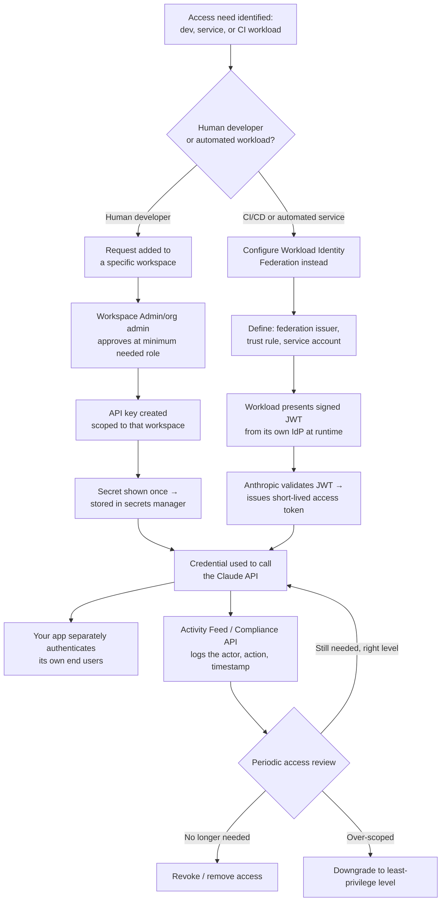

# Claude Certified Developer Foundations (CCDF)
## Domain: Identity, Secrets, and Key Management (1.6%)

This tutorial explains everything in the syllabus line:

> Managing secrets, credentials, and API keys across Claude development and production
> environments, including identity validation and authentication, access approval and level
> verification, and authorized access monitoring.

The language is kept simple. Every idea has a small example. Read it top to bottom, or use the
table of contents to jump to a topic you need to review.

---

## Table of Contents

1. [Why This Domain Matters](#1-why-this-domain-matters)
2. [The Building Blocks: Organizations, Workspaces, and Roles](#2-the-building-blocks-organizations-workspaces-and-roles)
3. [API Keys — Types, Scoping, and Handling](#3-api-keys--types-scoping-and-handling)
4. [Admin API Keys](#4-admin-api-keys)
5. [Identity Validation and Authentication](#5-identity-validation-and-authentication)
6. [Workload Identity Federation — Secrets Without Secrets](#6-workload-identity-federation--secrets-without-secrets)
7. [Access Approval and Level Verification](#7-access-approval-and-level-verification)
8. [Managing Secrets Across Dev and Production Environments](#8-managing-secrets-across-dev-and-production-environments)
9. [Authorized Access Monitoring](#9-authorized-access-monitoring)
10. [Putting It All Together: A Secure Credential Lifecycle](#10-putting-it-all-together-a-secure-credential-lifecycle)
11. [Flow Diagram](#11-flow-diagram)
12. [Quick Revision Cheat Sheet](#12-quick-revision-cheat-sheet)
13. [Practice Questions](#13-practice-questions)

---

## 1. Why This Domain Matters

Every request to Claude — from a developer testing in a notebook to a production service handling
millions of calls — has to prove **who it is** before it's allowed to do anything. Getting this
wrong is one of the most common and most damaging mistakes in real deployments: a leaked API key,
an over-scoped credential, or a stale key nobody remembered to revoke can expose an entire
organization's Claude usage to someone who was never supposed to have it.

This domain is about doing identity and secrets management **correctly**: knowing which credential
type to use for which situation, how access is scoped and approved, and how to detect misuse after
the fact.

---

## 2. The Building Blocks: Organizations, Workspaces, and Roles

Before talking about keys, you need the container structure they live inside.

| Concept | What it is |
|---|---|
| **Organization** | The top-level account for a company/team using the Claude Platform |
| **Workspace** | A way to separate API usage by project, environment, or team within an organization; each has its own members, API keys, and resource limits |
| **Role** | What a person is allowed to do, assigned per-workspace (and at the organization level) |

### Workspace roles

| Role | Permissions |
|---|---|
| **Workspace User** | Use the Workbench only |
| **Workspace Limited Developer** | Create/manage API keys, use the API — but cannot access session tracing views or download files |
| **Workspace Developer** | Create/manage API keys, use the API |
| **Workspace Admin** | Full control over workspace settings and members |
| **Workspace Billing** | View billing information only (inherited from the organization billing role, cannot be assigned manually) |

### Role inheritance rules

- **Organization admins** automatically receive **Workspace Admin** access to every workspace.
- **Organization billing members** automatically receive **Workspace Billing** access to every
  workspace.
- Regular organization users/developers must be **explicitly added** to each workspace — access
  is never automatic just because someone belongs to the organization.

> **Exam tip:** Memorize the role table and the inheritance rule. A very common exam trap is
> assuming any organization member can see every workspace by default — only admins (and billing
> members, for billing data) get that automatically.

---

## 3. API Keys — Types, Scoping, and Handling

An **API key** is the credential that authenticates a request to the Anthropic API. Every call to
a Claude model needs a valid key.

### Key scoping

- API keys are typically **scoped to a single workspace** and can only access resources within
  that workspace.
- Some API keys can be **bound to a principal** — either a **User** or a **Service Account** —
  rather than tied only to a workspace.
- A key's `scope` field tells you where it belongs: `{"type": "workspace", "workspace_id": "wrkspc_..."}`
  for a workspace-scoped key, or `{"type": "organization"}` for a principal-bound key with no
  workspace.

### Handling keys safely

- **Copy the secret once and store it in a secrets manager.** The full secret value is shown only
  once at creation time — if you lose it, you must create a new key, not retrieve the old one.
- **Never hardcode a key in source code** committed to version control. Load it from an
  environment variable or a secrets manager at runtime.
- **Name keys descriptively** (e.g. `prod-billing-service`, `dev-jane-local`) so you can identify
  what each one is for during a review.
- **Rotate keys periodically**, and immediately if you suspect a leak.
- **Revoke unused keys.** A key that's no longer needed is pure risk with no benefit — treat
  "delete unused credentials" as a routine housekeeping task, not an emergency-only action.

```python
import os
from anthropic import Anthropic

# Good: load from environment / secrets manager, never hardcode
client = Anthropic(api_key=os.environ["ANTHROPIC_API_KEY"])
```

```python
# Bad: never do this
client = Anthropic(api_key="sk-ant-api03-abc123...")  # hardcoded secret, will leak via git history
```

> **Exam tip:** The exam may test the specific fact that **a full API key secret is displayed only
> once at creation** — this is why storing it immediately in a secrets manager (not a chat
> message, not a notes app) is a core operational practice, not just good hygiene.

---

## 4. Admin API Keys

An **Admin API key** is a separate, more powerful credential type used to manage your organization
programmatically, rather than to make ordinary Claude model calls.

### What an Admin API key can do

A single Admin API key authenticates every API in the "Admin" category:

- Admin API (manage members, workspaces, API keys)
- Analytics APIs
- Compliance API (Activity Feed, for Console organizations)
- Spend Limits API
- Usage and Cost API
- Rate Limits API
- Claude Code Analytics API

You do **not** need a separate key for each of these — one Admin API key covers all of them.

### Who can create one, and where

| Your organization type | Create the key in | Key prefix | Who can create it |
|---|---|---|---|
| **Claude Console (Claude Platform)** | Claude Console → Settings → Admin keys | `sk-ant-admin01-...` | Organization members with the **admin** role |
| **Claude Enterprise (claude.ai)** | claude.ai → Organization settings → API | `sk-ant-api01-...` | The organization's primary owner (can also scope a key to Compliance API only) |

Important scoping facts:

- A key created in **one** organization cannot manage a **different** organization — if your
  company uses both Claude Console and Claude Enterprise, you need one key in each.
- Certain sensitive Admin API operations — specifically **service-account**, **federation-issuer**,
  and **federation-rule** endpoints — accept **only** an OAuth bearer token with the `org:admin`
  scope, not an ordinary Admin API key.
- A call that exceeds a key's granted scopes returns **403 Forbidden**, listing both the scopes
  the key has and the scopes the endpoint actually needs — useful for debugging access-denied
  errors.

> **Exam tip:** Remember that Admin API keys are fundamentally different in **purpose** from
> regular API keys: regular keys make model calls; Admin keys manage the organization itself
> (members, workspaces, billing, compliance data). Only users with the **admin role** can create
> them — this is a deliberate security control, not an oversight.

---

## 5. Identity Validation and Authentication

**Authentication** answers "who (or what) is making this request?" In a Claude application, this
happens at **two separate layers**, and both matter:

### Layer 1: Authenticating to the Anthropic API itself

Every request to `api.anthropic.com` must present a valid credential — an API key (via the
`x-api-key` header) or a short-lived token from Workload Identity Federation (see Section 6).
Anthropic's systems validate this credential before processing the request at all.

### Layer 2: Authenticating your own application's end users

The Anthropic API key authenticates **your application** to Anthropic — it does **not**
authenticate the **human using your application**. Your own system must independently verify who
that person is (login, session tokens, SSO, etc.) before deciding what Claude should do on their
behalf.

```python
def handle_chat_request(request):
    # Layer 2: authenticate YOUR end user first — independent of the Anthropic API key
    user = authenticate_session(request.session_token)
    if not user:
        return {"error": "Not authenticated"}, 401

    # Only now, with a known identity, proceed to call Claude (Layer 1 handled by the SDK/API key)
    response = client.messages.create(
        model="claude-sonnet-5",
        max_tokens=1024,
        messages=[{"role": "user", "content": request.message}],
    )
    return response
```

> **Exam tip:** A classic exam trap is treating "the API call succeeded" as proof the **end user**
> was properly authenticated. These are two separate checks: the API key authenticates your
> **application**; your own code must authenticate the **person**.

---

## 6. Workload Identity Federation — Secrets Without Secrets

**Workload Identity Federation (WIF)** lets a workload authenticate to the Claude API using
**short-lived OpenID Connect (OIDC) tokens** from an identity provider you already operate (AWS
IAM, Google Cloud, GitHub Actions, Kubernetes, Microsoft Entra ID, Okta, or any standards-compliant
OIDC issuer) — **instead of** a long-lived, static `sk-ant-...` API key.

### How it works

1. Your workload presents a signed JWT from your identity provider.
2. Anthropic validates the JWT against **trust rules** you configure in the Claude Console.
3. Anthropic returns a **short-lived Anthropic access token** bound to a **service account** in
   your organization.

There are **no static secrets** to generate, store in CI, rotate, or worry about leaking — the
token that comes back typically expires in minutes.

### The three resources you configure

| Resource | What it defines |
|---|---|
| **Service account** (`svac_...`) | A named, non-human identity inside your organization — the principal a federated token acts as. Has no email, password, or Console login |
| **Federation issuer** | The identity provider allowed to sign tokens for you (e.g. your GitHub Actions OIDC issuer) |
| **Federation rule** | The trust conditions: which token claims are accepted, and which service account (and workspace scope) the resulting token may act as |

A service account becomes **active in a workspace** only when added as a member of that workspace
— and at token-exchange time, Anthropic checks that the federation rule's workspace matches one
of the service account's actual workspace memberships. The resulting token then follows that
workspace's rate limits and usage attribution, exactly like a normal API key would.

### Why this matters for security

> Workload Identity Federation strengthens your security posture by replacing static API keys
> with tokens that expire in minutes rather than never. It is not a complete security story on
> its own — federated authentication is only as strong as the upstream identity provider that
> signs the JWT. Pair it with the controls your IdP already supports (workload identity binding,
> conditional access, audit logging) for defense in depth.

> **Exam tip:** The core exam fact here is the **trade-off WIF solves**: static, long-lived API
> keys are a standing liability (they can leak, get committed to a repo, or sit around unused
> for years), while WIF tokens are short-lived and tied to an identity provider you already trust
> and audit. But WIF is only as strong as that upstream identity provider — it doesn't replace
> good IdP hygiene, it depends on it.

---

## 7. Access Approval and Level Verification

This is about making sure that **granting** access follows a controlled process, and that the
**level** of access granted actually matches what's needed (tying directly back to least
privilege).

### Access approval principles

- **Only specific roles can grant sensitive access.** For example, only organization members with
  the **admin** role can create Admin API keys — this is a deliberate gate, not an accidental
  limitation.
- **Explicit addition, not automatic inheritance, for regular access.** As covered in Section 2,
  regular members must be explicitly added to a workspace — someone doesn't get access "by
  default" just because they're in the organization.
- **Approval should be traceable.** Who added this member to this workspace, and when? Who created
  this API key? This information should be discoverable after the fact (see Section 9).

### Level verification principles

- **Match the granted role to the actual job.** Someone who only needs to run API calls for a
  single project should get **Workspace Developer** in that one workspace — not **Workspace
  Admin**, and not access to workspaces unrelated to their project.
- **Verify scopes on Admin API keys match their intended use.** Since a single Admin API key can
  reach several different Admin-category APIs, confirm the key's actual granted scopes line up
  with what the consuming system is supposed to do — nothing broader.
- **Recheck access periodically, not just at grant time.** A person's job responsibilities change;
  access levels should be reviewed and adjusted, not left as a "set once" decision.

```json
// Example: a 403 response reveals a scope mismatch — useful for level verification
{
  "error": {
    "type": "permission_error",
    "message": "This key has scopes [read:compliance_activities] but this endpoint requires [read:compliance_user_data]"
  }
}
```

> **Exam tip:** "Access approval and level verification" is really asking: (1) is there a
> controlled, role-gated process for **granting** access, and (2) does the **level** of access
> actually granted match the specific need — checked both at grant time and periodically
> afterward?

---

## 8. Managing Secrets Across Dev and Production Environments

Development and production environments have **different** risk profiles, and credentials should
reflect that difference — not share the same keys.

| Practice | Why it matters |
|---|---|
| **Separate workspaces per environment** | A `dev` workspace and a `production` workspace keep API keys, usage, and resource limits cleanly isolated — a mistake in dev can't accidentally touch prod data or budget |
| **Separate keys per environment** | Never reuse a production API key in a local dev setup, a test suite, or a shared notebook |
| **Tighter approval for production credentials** | Production Admin API keys and production-scoped service accounts should require stricter approval than a developer's personal dev-workspace key |
| **Environment variables / secrets managers, not source control** | `.env` files should be gitignored; production secrets belong in a dedicated secrets manager (e.g. a cloud provider's secret store), not in deployment scripts or config files checked into git |
| **Short-lived credentials in CI/CD where possible** | Workload Identity Federation is specifically well-suited to CI/CD pipelines (e.g. GitHub Actions) — replacing a static key stored as a CI secret with a per-run federated token |
| **Different rotation cadence** | A rarely-used personal dev key might be rotated quarterly; a production service credential handling significant traffic might warrant more frequent rotation and closer monitoring |

```yaml
# Example: GitHub Actions using Workload Identity Federation instead of a stored static secret
# (conceptual — exact configuration depends on your federation rule setup)
permissions:
  id-token: write   # allows the workflow to request an OIDC token
jobs:
  deploy:
    steps:
      - name: Authenticate to Claude API via WIF
        run: |
          # workload presents its GitHub Actions OIDC token;
          # Anthropic exchanges it for a short-lived access token
          # bound to a pre-configured service account — no ANTHROPIC_API_KEY secret needed
```

> **Exam tip:** The exam likely tests that you know **why** dev and prod need separate
> credentials/workspaces — not just as a stylistic preference, but because it limits the blast
> radius of a mistake or leak in one environment from ever touching the other.

---

## 9. Authorized Access Monitoring

Granting the right access isn't the end of the story — you also need to be able to **see what
happened** after the fact: who did what, when, and with which credential.

### The Compliance API and Activity Feed

The **Compliance API** gives organizations programmatic access to an **Activity Feed** — a
record of security-relevant events across the organization, retained for **6 years** and queryable
within about **1 minute** of the event occurring.

Two categories of activity are tracked:

| Category | Examples |
|---|---|
| **Admin and system activities** | Adding a member to a workspace, creating an API key, updating account settings, modifying entity access |
| **Resource activities** | Creating a file, downloading a file, deleting a skill — user-driven actions that touch data or resources (not direct model inference) |

Each activity record includes details like the **actor** (who did it — a user or a service
account), their **IP address**, **user agent**, a timestamp, and the specific **action type**.

```bash
curl --fail-with-body -sS \
  "https://api.anthropic.com/v1/compliance/activities?limit=1" \
  --header "x-api-key: $ANTHROPIC_COMPLIANCE_ACCESS_KEY" \
  --header "anthropic-version: 2023-06-01"
```

```json
{
  "data": [
    {
      "id": "activity_01XyDMpzjS89pFZXqSFUBDr6",
      "created_at": "2026-04-10T08:09:10Z",
      "actor": {
        "type": "user_actor",
        "email_address": "user@example.com",
        "user_id": "user_01TuVwXyZaBcDeFgH2JkLmN4",
        "ip_address": "192.0.2.34",
        "user_agent": "Mozilla/5.0..."
      },
      "type": "claude_chat_created"
    }
  ]
}
```

### Who can access it

- An **Admin API key** (`sk-ant-admin01-...`) can access the Activity Feed portion of the
  Compliance API.
- A dedicated **Compliance Access Key** (created in claude.ai, for Claude Enterprise
  organizations) can access the **full** Compliance API, including chats, files, projects, and
  organization-wide user/role/group directories — a broader scope than the Admin API key's
  Activity-Feed-only access.
- Access requires the specific scope `read:compliance_activities` (or broader scopes like
  `read:compliance_user_data` for content endpoints).

### Why monitoring completes the identity/secrets story

Access control (Sections 2–7) answers "who is **allowed** to do what." Monitoring answers "what
did people **actually** do with that access." Both are necessary:

- A correctly-scoped credential that's misused (e.g. a legitimate service account making
  unexpected calls) is only detectable through monitoring.
- A key that was granted appropriately six months ago, but hasn't been used since, is a candidate
  for revocation — but only if someone is actually reviewing usage.
- Security incident response depends on being able to reconstruct **who did what, when** — exactly
  what the Activity Feed is designed to provide.

> **Exam tip:** Know the distinction between **Admin API key access** (Activity Feed only, for
> Console organizations) and a full-scope **Compliance Access Key** (all Compliance API
> endpoints, for Claude Enterprise). Also remember the two activity categories (admin/system vs.
> resource activities) and that direct model inference interactions are **not** logged as part of
> this feed.

---

## 10. Putting It All Together: A Secure Credential Lifecycle

A well-managed credential goes through a clear lifecycle, matching every section above:

```
1. REQUEST
   A developer/service needs access to a specific workspace for a specific purpose.

2. APPROVE
   Someone with the appropriate role (e.g. Workspace Admin, or org admin for Admin API keys)
   grants access — at the narrowest level that satisfies the need (least privilege).

3. ISSUE
   - Human/dev use case: a scoped API key is created; the secret is shown once and
     immediately stored in a secrets manager.
   - Automated/CI use case: Workload Identity Federation is configured instead, avoiding
     a static secret entirely.

4. USE
   The credential authenticates requests. Your application still separately authenticates
   its own end users — the API key is not a substitute for that.

5. MONITOR
   Activity Feed / Compliance API records who used which credential, when, and what they did.

6. REVIEW
   Access levels are periodically re-verified against actual need (level verification).

7. ROTATE / REVOKE
   Keys are rotated on a schedule, revoked immediately on suspected leak, and removed
   entirely once no longer needed.
```

---

## 11. Flow Diagram



---

## 12. Quick Revision Cheat Sheet

| Term | One-line definition |
|---|---|
| **Organization** | Top-level account container |
| **Workspace** | Scopes API keys, members, and resource limits per project/environment/team |
| **Workspace roles** | User, Limited Developer, Developer, Admin, Billing — org admins/billing inherit access everywhere automatically |
| **API key** | `sk-ant-api03-...` credential authenticating ordinary model-call requests; shown once, then must be stored securely |
| **Admin API key** | `sk-ant-admin01-...` credential for managing the org itself (members, workspaces, billing, compliance data); only admins can create |
| **`org:admin` OAuth scope** | Required specifically for service-account and federation endpoints — an Admin API key alone isn't enough |
| **Authentication (two layers)** | (1) the API key authenticates your app to Anthropic; (2) your own code must separately authenticate your end users |
| **Workload Identity Federation (WIF)** | Exchanges a short-lived OIDC token from your own IdP for a short-lived Anthropic access token — no static secret needed |
| **Service account** | A named, non-human identity (`svac_...`) that a WIF token acts as; no email/password/login |
| **Federation issuer / rule** | Configuration defining which IdP is trusted and which service account/workspace a token may act as |
| **Least privilege (in this domain)** | Grant the minimum role/scope for the actual need; verify at grant time and periodically after |
| **Compliance API / Activity Feed** | Organization-wide audit log of admin/system and resource activities; 6-year retention; queryable within ~1 minute |
| **Admin API key vs. Compliance Access Key** | Admin API key reaches Activity Feed only; a dedicated Compliance Access Key (Claude Enterprise) reaches the full Compliance API |

---

## 13. Practice Questions

**Q1.** True or False: An Anthropic API key authenticates the human end user chatting with your
application.
<details><summary>Answer</summary>
False. The API key authenticates your **application** to Anthropic. Your own system must
separately authenticate the human end user — this is a distinct, second layer.
</details>

**Q2.** What's the key security advantage of Workload Identity Federation over a static API key
for a CI/CD pipeline?
<details><summary>Answer</summary>
WIF replaces a long-lived static secret (which can leak or sit unused/unrotated) with a
short-lived token (often expiring in minutes) obtained by exchanging a signed JWT from an identity
provider you already trust and audit. There's no static secret to store, rotate, or leak in CI.
</details>

**Q3.** Who can create an Admin API key for a Claude Console organization?
<details><summary>Answer</summary>
Only organization members with the admin role.
</details>

**Q4.** A request to a Compliance API endpoint fails with 403 Forbidden. What does the response
tell you, and how does this relate to "level verification"?
<details><summary>Answer</summary>
The response lists the scopes the key currently has and the scopes the endpoint requires — this
is a direct, actionable signal for verifying whether a credential's granted access level actually
matches what it's being used for (and should be corrected if there's a mismatch).
</details>

**Q5.** What are the two categories of activity tracked in the Compliance API's Activity Feed, and
what's explicitly excluded?
<details><summary>Answer</summary>
Admin and system activities (e.g. adding a workspace member, creating an API key) and resource
activities (e.g. creating/downloading a file, deleting a skill). Direct model inference
interactions (actual chat/completion content) are not logged as part of this feed.
</details>

**Q6.** Why should development and production environments use separate workspaces and separate
API keys, rather than sharing one set of credentials?
<details><summary>Answer</summary>
Separate workspaces/keys isolate usage, resource limits, and blast radius — a mistake, bug, or
leaked credential in the dev environment can't accidentally reach or affect production data,
budget, or access.
</details>

**Q7.** What happens to regular organization users/developers regarding workspace access — do they
get access to every workspace automatically, like organization admins do?
<details><summary>Answer</summary>
No. Regular organization users/developers must be explicitly added to each workspace. Only
organization admins (for Workspace Admin access) and organization billing members (for Workspace
Billing access) inherit access to every workspace automatically.
</details>

---

### Final Tips for the Exam

- Remember the **two authentication layers**: the API key authenticates your app; your own code
  authenticates your end users. Don't conflate the two.
- Know **Workload Identity Federation's** core value proposition: short-lived tokens from a
  trusted IdP, replacing static long-lived API keys — especially for CI/CD and automated
  workloads.
- Memorize the **Admin API key vs. Compliance Access Key** distinction: Admin API keys reach the
  Activity Feed only; a full-scope Compliance Access Key (Claude Enterprise) reaches everything.
- Access approval and level verification are about **matching granted access to actual need**,
  checked both at grant time and on an ongoing basis — not a one-time setup task.
- Monitoring (the Activity Feed) is what makes the whole system **accountable after the fact** —
  access control alone isn't enough without the ability to review what was actually done with it.

Good luck with your CCDF exam!