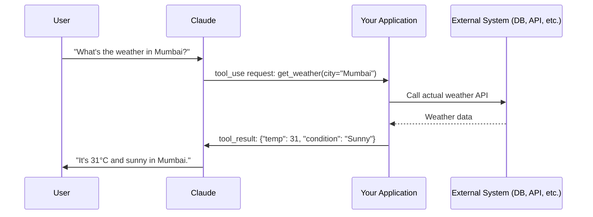
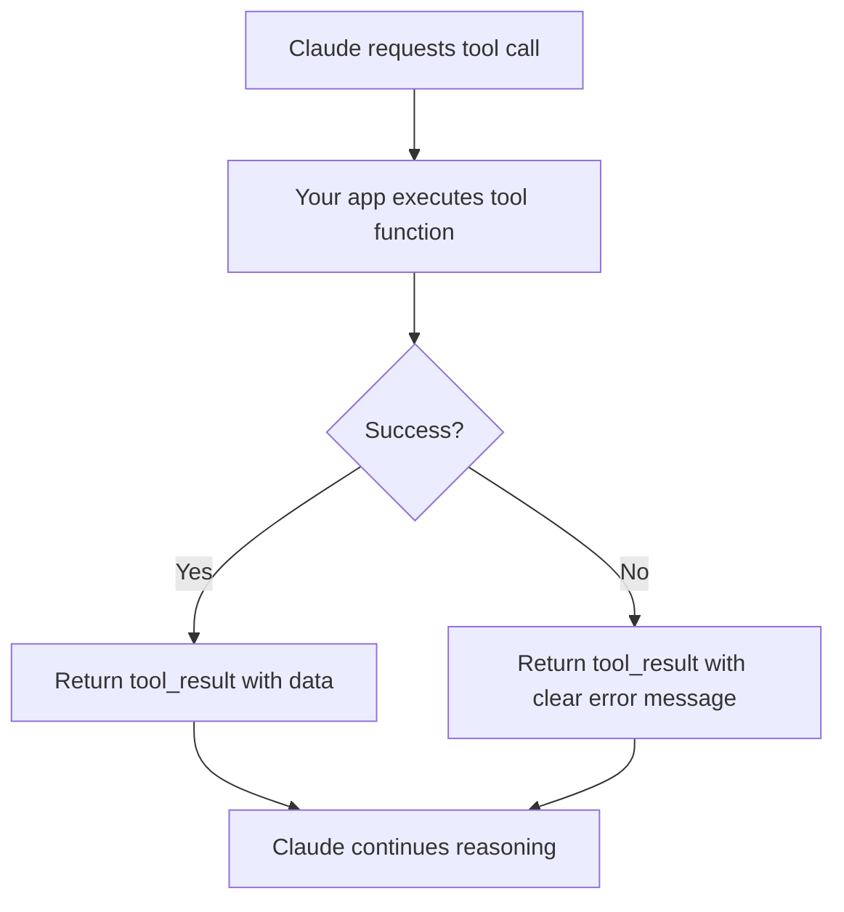
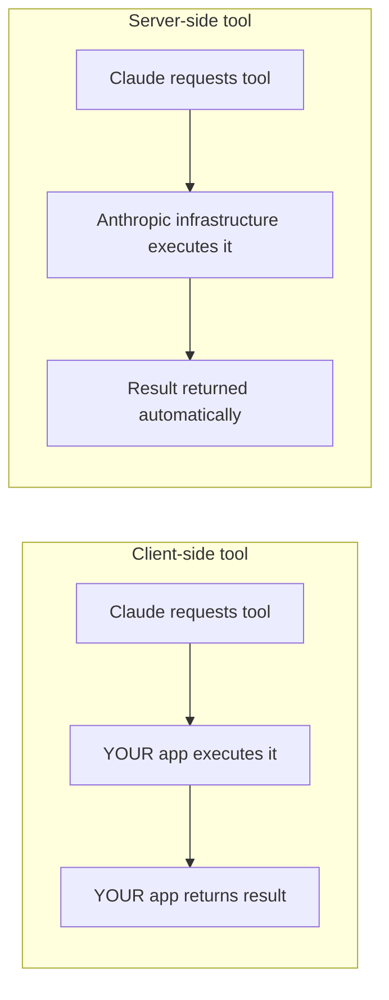
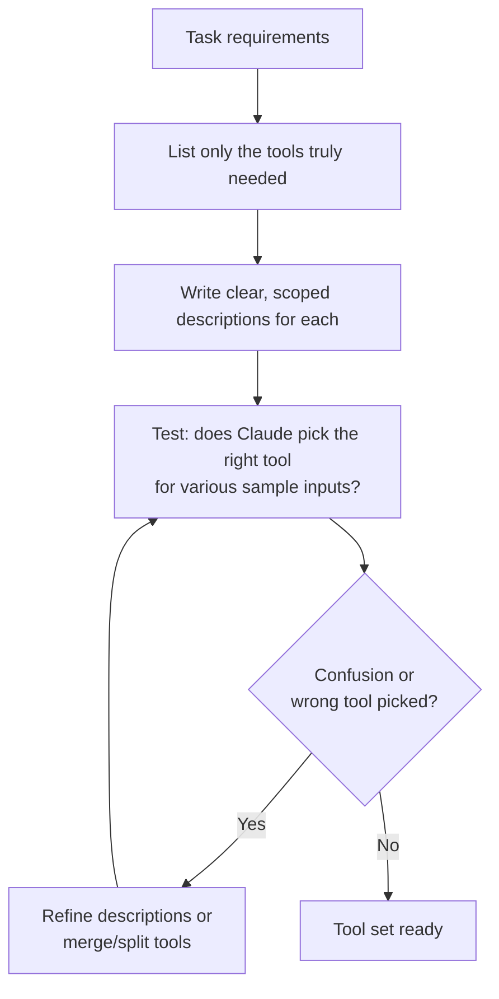

# CCDF Domain 8: Tools and MCPs (10.6%)
## Task — Tool Implementation (4.4%)

This tutorial covers how to implement tools for Claude applications — tool use / function calling basics, configuring external system interaction, writing good tool descriptions, error handling, tool usage patterns, and best practices for building a tool set.

---

## 1. What is "Tool Use" / "Function Calling"?

**Tool use** (also called function calling) lets Claude go beyond just generating text — it can request that your application **run a specific function** (like "search the database" or "send an email"), then use the result to continue answering.

Claude itself never directly executes code. It only **requests** a tool call; **your application** is responsible for actually running it and sending the result back.



---

## 2. Defining a Tool

A tool definition tells Claude: **what the tool is called, what it does, and what inputs it needs.**

```python
tools = [
    {
        "name": "get_weather",
        "description": "Get the current weather for a given city. Use this whenever the user asks about current weather conditions.",
        "input_schema": {
            "type": "object",
            "properties": {
                "city": {
                    "type": "string",
                    "description": "The city name, e.g. 'Mumbai' or 'London'"
                }
            },
            "required": ["city"]
        }
    }
]

message = client.messages.create(
    model="claude-sonnet-4-5",
    max_tokens=1024,
    tools=tools,
    messages=[{"role": "user", "content": "What's the weather in Mumbai?"}]
)
```

When Claude decides to use the tool, the response contains a `tool_use` content block instead of (or alongside) plain text:

```json
{
  "type": "tool_use",
  "id": "toolu_01A...",
  "name": "get_weather",
  "input": { "city": "Mumbai" }
}
```

Your application then executes the real function and sends the result back as a `tool_result`:

```python
tool_result_message = {
    "role": "user",
    "content": [
        {
            "type": "tool_result",
            "tool_use_id": "toolu_01A...",
            "content": "31°C, Sunny"
        }
    ]
}
```

---

## 3. Configuring External System Interaction

Tools are the bridge between Claude and the outside world — databases, internal APIs, third-party services, file systems, etc. Configuring this properly means:

| Concern | What to configure |
|---|---|
| **Authentication** | API keys, OAuth tokens, service credentials the tool function uses internally |
| **Permissions/scope** | The tool should only be able to do what the task truly needs (least privilege — ties to Domain 3's "capability bloat" anti-pattern) |
| **Timeouts** | External calls should have a timeout so a slow/broken system doesn't hang the whole agent loop |
| **Rate limiting** | Protect external systems (and your cost) from excessive tool calls |

```python
import requests

def get_weather(city: str) -> str:
    try:
        response = requests.get(
            f"https://api.weatherservice.com/v1/current",
            params={"city": city},
            timeout=5  # never let an external call hang forever
        )
        response.raise_for_status()
        data = response.json()
        return f"{data['temp']}°C, {data['condition']}"
    except requests.exceptions.RequestException as e:
        return f"Error: could not retrieve weather data ({str(e)})"
```

---

## 4. Writing Good Tool Descriptions

Claude decides **when** and **how** to call a tool based almost entirely on the `description` field. A vague description leads to wrong or missed tool calls.

### Comparison: weak vs. strong descriptions

| Weak description | Strong description |
|---|---|
| `"Gets data"` | `"Get the current weather for a given city. Use this whenever the user asks about current or today's weather conditions. Do not use for weather forecasts more than 1 day ahead."` |
| `"Searches"` | `"Search the internal product catalog by keyword. Returns up to 10 matching products with name, price, and stock status. Use only for product-related queries, not general web search."` |

### Good tool description checklist

- Say **what the tool does**, in plain language
- Say **when to use it** (and when *not* to)
- Describe **each parameter** clearly, including format/units if relevant
- Mention **what the tool returns**

**Anti-pattern:** Writing a one-word or overly generic tool description (e.g., `"Query the database"`) — this causes Claude to either avoid the tool or misuse it, because it doesn't know the intended scope.

---

## 5. Error Handling in Tools

Tools **will** fail sometimes — external systems go down, inputs are invalid, permissions are missing. Good tool implementation handles this gracefully instead of crashing the whole agent loop.



**Key principle:** Even on failure, send a `tool_result` back to Claude — don't just silently drop it. Claude can often recover gracefully (e.g., try a different approach, ask the user for clarification) if it knows the tool failed and *why*.

```python
def safe_tool_result(tool_use_id: str, success: bool, data=None, error=None):
    content = data if success else f"Error: {error}"
    return {
        "type": "tool_result",
        "tool_use_id": tool_use_id,
        "content": content,
        "is_error": not success
    }
```

**Anti-pattern:** Letting an unhandled exception in your tool function crash the request instead of returning a structured error `tool_result`.

---

## 6. Tool Usage Patterns

### 6.1 Agentic Harness Dispatch

In an agentic loop, your application code (the "harness") is responsible for **dispatching** each tool call Claude requests to the correct real function, then feeding results back in — repeating until Claude produces a final answer with no more tool calls.

```python
def run_agent_loop(user_message: str, tools: list, tool_functions: dict):
    messages = [{"role": "user", "content": user_message}]

    while True:
        response = client.messages.create(
            model="claude-sonnet-4-5",
            max_tokens=1024,
            tools=tools,
            messages=messages
        )

        tool_calls = [b for b in response.content if b.type == "tool_use"]
        if not tool_calls:
            return response  # Claude is done, final answer ready

        messages.append({"role": "assistant", "content": response.content})

        tool_results = []
        for call in tool_calls:
            func = tool_functions[call.name]  # dispatch by tool name
            result = func(**call.input)
            tool_results.append({
                "type": "tool_result",
                "tool_use_id": call.id,
                "content": result
            })
        messages.append({"role": "user", "content": tool_results})
```

### 6.2 Client-Side vs. Server-Side Tools

| Type | Who executes it | Example |
|---|---|---|
| **Client-side tools** | Your own application code, running wherever your app runs (your server, a user's device) | Calling your internal database, a custom business API |
| **Server-side tools** | Executed by Anthropic's infrastructure itself, without you writing the execution code | Anthropic-provided tools like web search or code execution, where Anthropic runs the tool and returns results directly |



**Exam-relevant distinction:** With client-side tools, *you* own the execution, security, and error handling. With server-side tools, Anthropic manages execution — but you still choose whether to enable the tool and how to use its output.

### 6.3 Approval Patterns

For sensitive or risky actions (e.g., deleting data, sending money, sending emails on someone's behalf), it's a best practice to insert a **human approval step** before actually executing the tool.

```mermaid
flowchart TD
    A[Claude requests sensitive tool call] --> B{Requires approval?}
    B -- Yes --> C[Pause and show user/admin the proposed action]
    C --> D{Approved?}
    D -- Yes --> E[Execute tool]
    D -- No --> F[Return tool_result: "Action denied by user"]
    B -- No --> E
    E --> G[Continue agent loop]
```

```python
SENSITIVE_TOOLS = {"delete_record", "send_payment", "send_email"}

def dispatch_tool_call(call, tool_functions, get_user_approval):
    if call.name in SENSITIVE_TOOLS:
        approved = get_user_approval(call.name, call.input)
        if not approved:
            return safe_tool_result(call.id, success=False, error="Denied by user")
    result = tool_functions[call.name](**call.input)
    return safe_tool_result(call.id, success=True, data=result)
```

**Anti-pattern:** Auto-executing every tool call Claude requests with no approval gate, even for destructive or irreversible actions.

---

## 7. Tool Set Construction Best Practices

When designing the full set of tools you give Claude, keep these principles in mind:

| Best practice | Why |
|---|---|
| **Give only the tools the task needs** (least privilege) | Reduces risk and avoids "capability bloat" — an agent with unused powerful tools is a bigger attack surface |
| **Keep tool names and purposes distinct** | Overlapping tools (two tools that do almost the same thing) confuse Claude's tool selection |
| **Prefer a few well-designed tools over many narrow ones**, when reasonable | Fewer, well-scoped tools are easier for Claude to choose correctly and easier to maintain |
| **Return structured, consistent output formats** | Makes it easier for Claude to parse and use results reliably across calls |
| **Document edge cases in the description** | E.g., "Returns an empty list if no results found" avoids Claude misinterpreting an empty result as an error |



---

## 8. Anti-Patterns to Avoid

| Anti-pattern | Why it's a problem |
|---|---|
| Vague or missing tool descriptions | Claude can't reliably decide when/how to use the tool |
| No timeout on external calls inside a tool | A hung external system can freeze the whole agent loop |
| Swallowing errors instead of returning them as `tool_result` | Claude has no way to recover or explain the failure to the user |
| Giving every tool to every agent "just in case" | Increases risk and cost with no benefit (capability bloat) |
| No approval step for destructive/sensitive actions | Risk of irreversible actions being auto-executed without human oversight |
| Two tools with overlapping purposes | Confuses tool selection and increases wrong-tool-call rate |

---

## 9. Quick Reference Summary

| Concept | One-line definition |
|---|---|
| Tool use / function calling | Claude requests a specific function be run; your app executes it and returns the result |
| Tool definition | JSON schema describing a tool's name, description, and input parameters |
| `tool_use` block | Claude's request to call a specific tool with specific inputs |
| `tool_result` block | Your application's response containing the tool's output (or error) |
| Agentic harness dispatch | Application logic that routes each tool call to the correct real function and loops until done |
| Client-side tool | Executed by your own application code |
| Server-side tool | Executed directly by Anthropic's infrastructure |
| Approval pattern | Human confirmation step before executing sensitive/risky tool calls |
| Least privilege (tool set) | Giving an agent only the tools its specific task actually requires |

---

## 10. Practice Q&A

**Q1: Who actually executes a tool when Claude sends a `tool_use` request?**
> A: Your own application code (for client-side tools) — Claude only requests the call; it does not execute code itself. Server-side tools are the exception, executed by Anthropic's infrastructure.

**Q2: Why is a vague tool description like "Gets data" problematic?**
> A: Claude relies on the description to decide when and how to use a tool — a vague description leads to missed or incorrect tool calls.

**Q3: A tool call fails due to an external API timeout. What should your application do?**
> A: Catch the error and return a structured `tool_result` with `is_error: true` and a clear error message, rather than letting the exception crash the request — this lets Claude recover gracefully.

**Q4: What is the difference between a client-side and a server-side tool?**
> A: A client-side tool is executed by your own application code; a server-side tool is executed directly by Anthropic's infrastructure without you writing execution code.

**Q5: Why should destructive actions (like deleting a record) go through an approval pattern?**
> A: To insert human oversight before an irreversible or high-risk action is actually executed, reducing the risk of unintended consequences from autonomous agent behavior.

**Q6: What tool set design principle helps reduce "capability bloat" risk?**
> A: Least privilege — giving an agent only the tools its specific task actually requires, not every available tool "just in case."