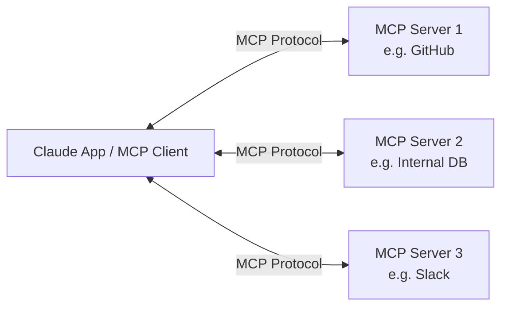
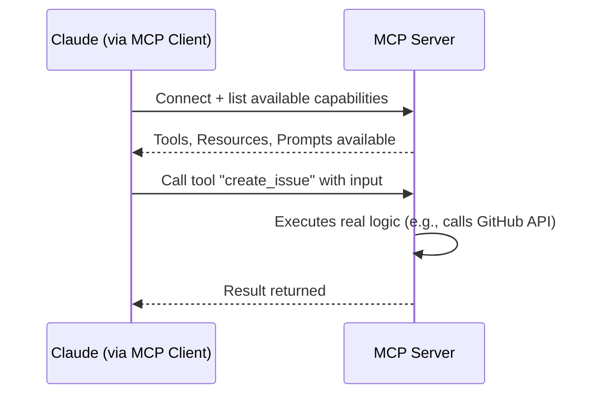
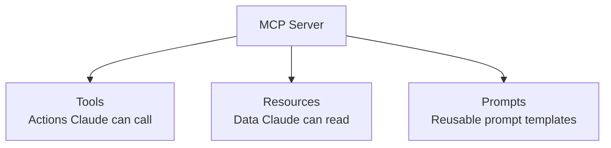
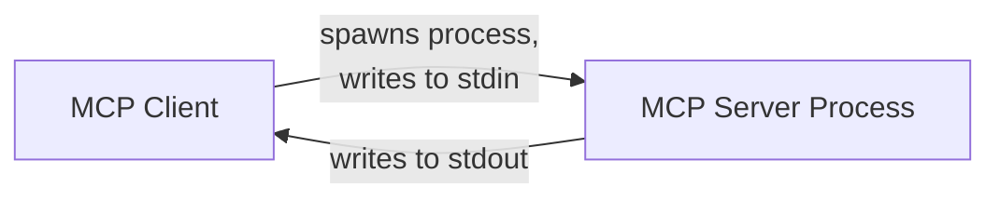
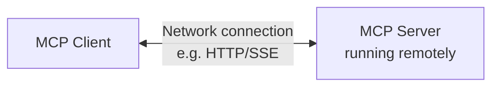
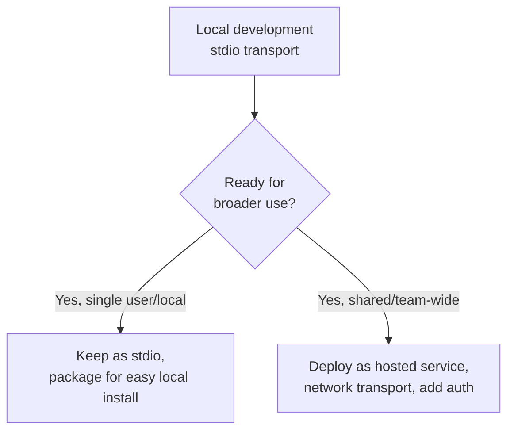
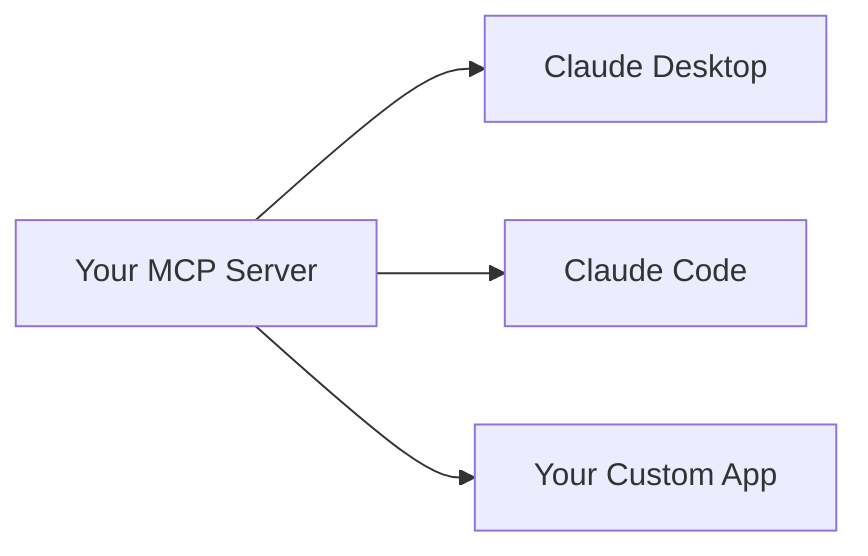

# CCDF Domain 8: Tools and MCPs (10.6%)
## Task — MCP Server Development (2.1%)

This tutorial covers how to build an MCP (Model Context Protocol) server — what it is, how it exposes resources/tools/prompts to Claude, how it's deployed, and the communication patterns it uses (stdio, sockets, client vs. server).

---

## 1. What is MCP?

**MCP (Model Context Protocol)** is an open standard that lets AI applications like Claude connect to external systems — databases, APIs, file systems, internal tools — in a **consistent, reusable way**.

Think of MCP like a **USB port for AI applications**: instead of writing a custom, one-off integration every time you want Claude to talk to a new system, you build (or use) an **MCP server** that exposes that system's capabilities in a standard format any MCP-compatible client can use.



**Key benefit:** you write the integration logic **once**, in the MCP server, and any MCP client (Claude Code, Claude Desktop, your own app) can use it — instead of rebuilding the same integration for every application.

---

## 2. Client vs. Server Roles

| Role | Who it is | Responsibility |
|---|---|---|
| **MCP Client** | The AI application (e.g., Claude Desktop, Claude Code, your custom app) | Connects to one or more MCP servers, discovers what they offer, and requests actions on Claude's behalf |
| **MCP Server** | A program you (or someone else) build | Exposes a specific system's capabilities — tools, resources, prompts — in the standard MCP format |



**Exam-relevant point:** You, as a developer, typically build the **server** side — exposing your system's capability to Claude. The **client** side (how Claude connects and uses it) is usually handled by the host application (Claude Desktop, Claude Code, etc.).

---

## 3. The Three MCP Primitives: Tools, Resources, Prompts

An MCP server can expose three types of capabilities:

| Primitive | What it is | Example |
|---|---|---|
| **Tools** | Actions the AI can invoke (like function calling) | `create_ticket(title, description)` |
| **Resources** | Data/content the AI can read (like files or documents) | `file://project/README.md`, a database record |
| **Prompts** | Pre-written prompt templates the server offers for common tasks | A "summarize incident report" prompt template with placeholders |



### 3.1 Tools (action-oriented)

```python
# Simplified conceptual example using the MCP Python SDK
from mcp.server import Server
from mcp.types import Tool, TextContent

server = Server("ticketing-server")

@server.list_tools()
async def list_tools():
    return [
        Tool(
            name="create_ticket",
            description="Create a new support ticket. Use when a user reports a bug or issue.",
            inputSchema={
                "type": "object",
                "properties": {
                    "title": {"type": "string"},
                    "description": {"type": "string"}
                },
                "required": ["title", "description"]
            }
        )
    ]

@server.call_tool()
async def call_tool(name: str, arguments: dict):
    if name == "create_ticket":
        ticket_id = save_ticket(arguments["title"], arguments["description"])
        return [TextContent(type="text", text=f"Created ticket #{ticket_id}")]
```

### 3.2 Resources (data-oriented)

```python
@server.list_resources()
async def list_resources():
    return [
        {"uri": "ticketing://tickets/open", "name": "Open Tickets", "mimeType": "application/json"}
    ]

@server.read_resource()
async def read_resource(uri: str):
    if uri == "ticketing://tickets/open":
        return json.dumps(get_open_tickets())
```

### 3.3 Prompts (template-oriented)

```python
@server.list_prompts()
async def list_prompts():
    return [
        {"name": "summarize_ticket", "description": "Summarize a support ticket in plain language"}
    ]

@server.get_prompt()
async def get_prompt(name: str, arguments: dict):
    if name == "summarize_ticket":
        return f"Summarize this support ticket for a non-technical manager:\n{arguments['ticket_text']}"
```

**Simple rule to remember the difference:**
- **Tools = do something**
- **Resources = read something**
- **Prompts = reusable instructions for something**

---

## 4. Communication Patterns

MCP servers can communicate with clients over different **transports** — the underlying channel used to exchange messages.

### 4.1 stdio (Standard Input/Output)

The client launches the MCP server as a **local subprocess** and communicates by writing to/reading from its standard input and output streams.



- **Best for:** local tools running on the same machine as the client (e.g., a local file-access server, a local dev tool)
- **Simple, low-overhead** — no networking setup needed
- Server lifecycle is tied to the client (it starts/stops the subprocess)

```bash
# Example: how a client config might launch a stdio MCP server
{
  "command": "python",
  "args": ["my_mcp_server.py"]
}
```

### 4.2 Sockets / HTTP-based transport

The server runs as an independent, long-running process (potentially on a different machine), and the client connects to it over a network socket or HTTP-based connection (e.g., using Server-Sent Events for streaming).



- **Best for:** shared/remote servers that multiple clients or users need to connect to, or servers that need to run independently of any one client's lifecycle
- Requires networking, authentication, and deployment considerations (hosting, scaling, security)

### Comparison Table

| Aspect | stdio | Sockets / Network-based |
|---|---|---|
| Location | Local subprocess on same machine | Can be remote, independently hosted |
| Setup complexity | Simple | Higher (networking, auth, hosting) |
| Lifecycle | Tied to client (starts/stops with it) | Independent — long-running service |
| Best for | Local dev tools, personal integrations | Shared/team/organization-wide integrations |

**Exam heuristic:** Choose **stdio** for simple, local, single-user tools. Choose **sockets/HTTP-based transport** when the server needs to be shared across multiple users/clients or deployed as a standalone service.

---

## 5. Deployment Considerations

When moving an MCP server from local development to real use, consider:

| Concern | What to think about |
|---|---|
| **Hosting** | Where does the server run — locally (stdio), or as a deployed service (containers, cloud hosting)? |
| **Authentication** | How does the server verify which client/user is connecting, and what they're allowed to do? |
| **Least privilege** | The server should only expose tools/resources actually needed — same principle as Domain 8's Tool Implementation topic |
| **Versioning** | As your server's tools/resources evolve, avoid breaking existing clients unexpectedly |
| **Logging/observability** | Track tool calls and errors for debugging and auditing (ties to Domain 3's observability topic) |



---

## 6. Integration with Claude Applications

Once built, an MCP server can be connected to different Claude host applications:

| Host application | How it connects |
|---|---|
| **Claude Desktop** | Configured via a local config file listing MCP servers to launch (often stdio-based) |
| **Claude Code** | Can connect to MCP servers configured for a project or globally |
| **Custom applications (via API/SDK)** | Your own app acts as the MCP client, connecting to one or more MCP servers programmatically |



The same server implementation can serve **all** of these host applications — this reusability is the core value proposition of MCP.

---

## 7. Anti-Patterns to Avoid

| Anti-pattern | Why it's a problem |
|---|---|
| Exposing every possible tool/resource "just in case" | Violates least privilege; bigger attack surface, more room for misuse (ties to capability bloat) |
| Using stdio for a server that needs to be shared across many users | stdio ties the server's lifecycle to a single local client process — not suitable for shared/remote use |
| No authentication on a network-based MCP server | Anyone who can reach it could call your tools |
| Vague tool/resource descriptions in the server | Same problem as in general tool implementation — Claude can't reliably decide when to use them |
| No error handling inside server-side tool logic | A crash in the server can break the whole client interaction instead of returning a clean error |

---

## 8. Quick Reference Summary

| Concept | One-line definition |
|---|---|
| MCP | Open standard protocol letting AI applications connect to external systems in a reusable way |
| MCP Client | The AI application side that connects to and uses MCP servers (e.g., Claude Desktop, Claude Code) |
| MCP Server | The program you build that exposes a system's capabilities to MCP clients |
| Tools (MCP) | Actions the AI can invoke through the server |
| Resources (MCP) | Data/content the AI can read through the server |
| Prompts (MCP) | Reusable prompt templates the server offers |
| stdio transport | Client launches server as a local subprocess, communicates via stdin/stdout |
| Socket/network transport | Server runs independently (possibly remote), client connects over network |

---

## 9. Practice Q&A

**Q1: What is the main benefit of building an MCP server instead of a custom one-off integration?**
> A: You write the integration once, and any MCP-compatible client (Claude Desktop, Claude Code, custom apps) can reuse it — instead of rebuilding the same integration for every application.

**Q2: What is the difference between an MCP "tool" and an MCP "resource"?**
> A: A tool is an action the AI can invoke (does something); a resource is data/content the AI can read (provides something).

**Q3: When should you choose stdio transport over a network-based transport for an MCP server?**
> A: When the server is a simple, local, single-user tool whose lifecycle can be tied to the client process. Network-based transport is better when the server needs to be shared across multiple users/clients or deployed as an independent service.

**Q4: Why is authentication important for a network-based MCP server but less critical for a local stdio-based one?**
> A: A network-based server can potentially be reached by other systems/users over the network, so it needs to verify who's connecting; a local stdio server is only reachable by the process that spawned it.

**Q5: What are the three primitives an MCP server can expose, and what does each represent?**
> A: Tools (actions to invoke), Resources (data to read), and Prompts (reusable prompt templates).

**Q6: Why should an MCP server avoid exposing every possible tool and resource it technically could?**
> A: To follow least privilege — reducing the attack surface and risk of misuse, similar to avoiding capability bloat in general tool implementation.