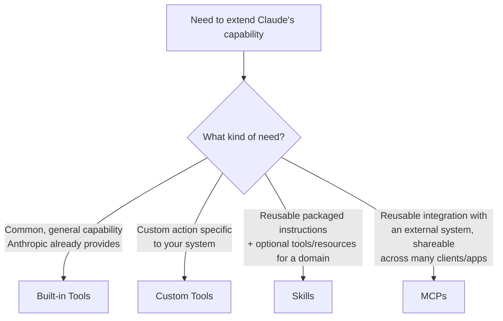
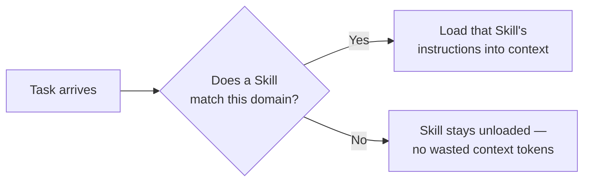
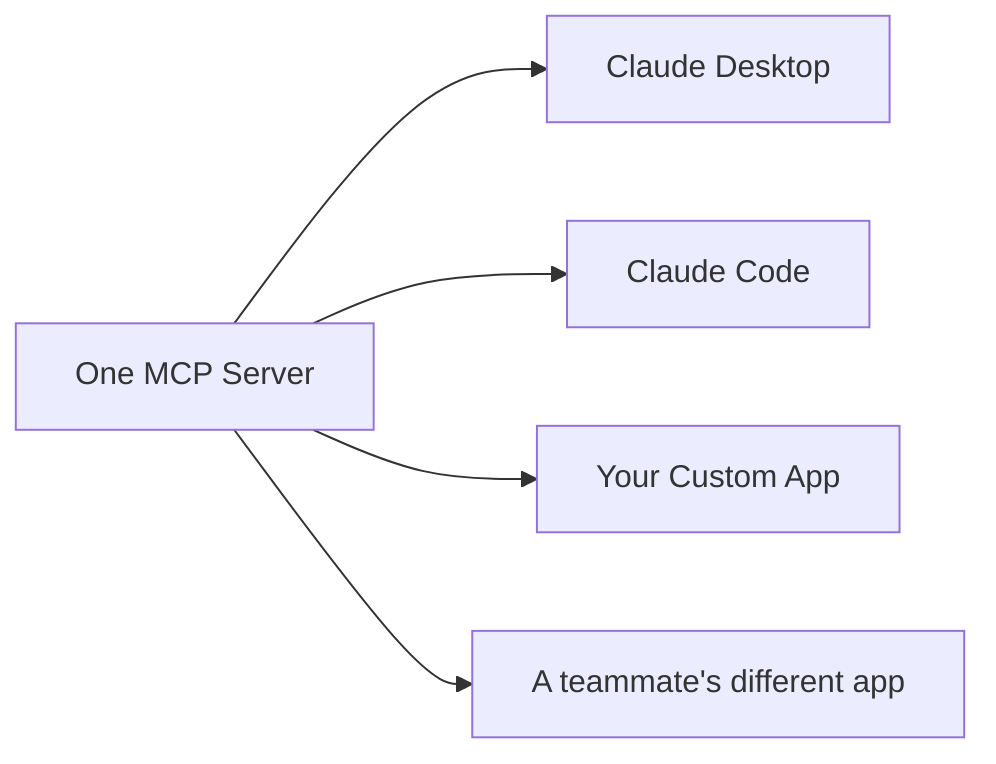
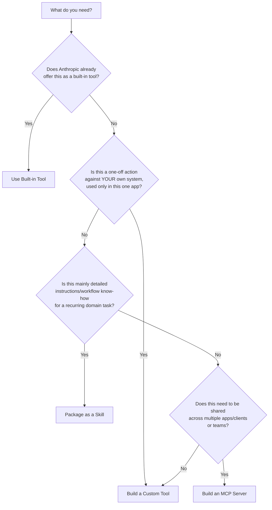

# CCDF Domain 8: Tools and MCPs (10.6%)
## Task — Agentic Customization (4.1%)

This tutorial covers how to choose among the four main ways to extend and customize Claude's capabilities: **built-in tools, custom tools, Skills, and MCPs** — and the tradeoffs between them.

---

## 1. The Four Customization Approaches

When you need Claude to do something beyond plain text generation, you have four broad options. Understanding when to reach for each one is the core exam skill here.



| Approach | What it is | Who builds it |
|---|---|---|
| **Built-in Tools** | Ready-made tools Anthropic provides (e.g., web search, code execution) | Anthropic |
| **Custom Tools** | Tools you define yourself via function calling, for your specific system | You (application developer) |
| **Skills** | Packaged, reusable instructions (and optionally tools/resources) for handling a specific domain or task type, loaded only when relevant | You or a team (packaged/shareable) |
| **MCPs** | A standardized server exposing tools/resources/prompts, usable by any MCP-compatible client | You or a third party (broadly reusable) |

---

## 2. Built-in Tools

**Built-in tools** are capabilities Anthropic already implements and exposes — you just enable them, without writing execution logic yourself.

```python
message = client.messages.create(
    model="claude-sonnet-4-5",
    max_tokens=1024,
    tools=[{"type": "web_search_20250305", "name": "web_search"}],
    messages=[{"role": "user", "content": "What's the latest news on renewable energy policy?"}]
)
```

### When to use built-in tools

- The capability is **general-purpose** and common across many applications (web search, code execution)
- You don't want to build and maintain the execution logic yourself
- Anthropic already handles the "server-side" execution (see Domain 8's Tool Implementation topic — these are typically server-side tools)

**Tradeoff:** Fast to adopt, low maintenance — but you're limited to what Anthropic offers, with less control over exact behavior.

---

## 3. Custom Tools

**Custom tools** are tools you define yourself using function calling — connecting Claude to your own systems, databases, or business logic (covered in detail in the Tool Implementation tutorial).

```python
tools = [
    {
        "name": "check_order_status",
        "description": "Check the current status of a customer's order by order ID.",
        "input_schema": {
            "type": "object",
            "properties": {"order_id": {"type": "string"}},
            "required": ["order_id"]
        }
    }
]
```

### When to use custom tools

- You need to connect to **your own internal systems** (databases, internal APIs, proprietary business logic)
- The capability is **specific to your application** and won't be reused elsewhere
- You want full control over execution, validation, and error handling

**Tradeoff:** Maximum flexibility and control — but you own all the implementation, security, and maintenance work.

---

## 4. Skills

**Skills** are packaged sets of instructions (and optionally supporting tools/resources) for handling a specific domain or recurring task type. Skills use **progressive disclosure** — they're only loaded into context when relevant to the current task, instead of bloating every request with instructions that aren't needed.



**Conceptual example — a Skill's structure:**

```
skills/
  pdf-generation/
    SKILL.md          # instructions: when/how to use this skill
    templates/         # supporting reference files
    helper_script.py   # optional supporting tool logic
```

```markdown
<!-- SKILL.md (simplified) -->
# PDF Generation Skill

Use this skill whenever the user asks to create, fill, or edit a PDF file.

## Steps
1. Determine if this is a new PDF or editing an existing one.
2. Use the provided helper_script.py for form-filling tasks.
3. Follow the formatting conventions in templates/.
```

### When to use Skills

- You have a **recurring domain-specific workflow** (e.g., "how our team writes reports," "how to generate compliant PDFs") that needs detailed instructions, not just a single function call
- You want to **avoid bloating every prompt** with instructions that are only relevant sometimes (progressive disclosure)
- The task needs **a combination of instructions + possibly tools/reference material**, not just one action

**Tradeoff:** Great for packaging complex, reusable know-how efficiently — but Skills are generally scoped to a single application/environment rather than being a universal cross-application standard like MCP.

---

## 5. MCPs (Model Context Protocol servers)

**MCPs** (covered in depth in the MCP Server Development tutorial) are standardized servers exposing tools, resources, and prompts — usable by **any MCP-compatible client**, not just one application.



### When to use MCPs

- The integration needs to be **shared across multiple applications, teams, or clients** — not just one app
- You're connecting to an **external system** that many different AI tools might want to use (e.g., GitHub, Slack, an internal data platform)
- You want a **standardized, portable** way to expose capabilities, rather than re-implementing custom tool logic in every app that needs it

**Tradeoff:** Highest reusability and standardization — but higher setup/deployment overhead (server hosting, transport choice, auth) compared to a simple custom tool used in just one app.

---

## 6. Side-by-Side Comparison

| Factor | Built-in Tools | Custom Tools | Skills | MCPs |
|---|---|---|---|---|
| Who implements execution logic | Anthropic | You | You (may include tools) | You (server-side) |
| Reusable across multiple apps? | Yes (Anthropic-wide) | No (app-specific) | Usually app-specific | Yes (any MCP client) |
| Best for | Common general capabilities | App-specific actions on your own systems | Packaged domain instructions + workflow know-how | Cross-application, standardized integrations |
| Setup effort | Lowest | Medium | Medium | Highest |
| Context efficiency | N/A (managed by Anthropic) | You control what's sent | High — progressive disclosure loads only when relevant | Depends on how server is queried |

---

## 7. A Decision Framework



### Worked examples

| Scenario | Best approach | Why |
|---|---|---|
| Need Claude to search the web for current news | Built-in tool | Anthropic already provides web search |
| Need Claude to check order status in your company's internal order database | Custom tool | Specific to your system, used only in your app |
| Your team has a detailed standard way of writing incident postmortems that Claude should follow every time | Skill | It's mostly instructions/workflow, loaded only when relevant |
| Multiple teams across your company want their AI apps to connect to the same internal ticketing system | MCP | Needs to be reusable across many different applications/clients |

**Anti-pattern:** Building a custom tool from scratch for a capability Anthropic already offers as a built-in tool — this duplicates effort and maintenance for no benefit.

**Anti-pattern:** Building a full MCP server for a one-off action used by a single internal app with no plan for reuse — this adds unnecessary deployment/hosting overhead when a simple custom tool would do.

**Anti-pattern:** Cramming detailed domain workflow instructions directly into the main system prompt instead of packaging them as a Skill — this bloats context on every single request, even when that workflow isn't relevant to the current task.

---

## 8. Quick Reference Summary

| Concept | One-line definition |
|---|---|
| Built-in tool | Ready-made capability provided by Anthropic (e.g., web search) |
| Custom tool | Tool you define yourself for your own system, via function calling |
| Skill | Packaged, reusable instructions (+ optional tools/resources) for a domain, loaded only when relevant |
| MCP | Standardized server exposing tools/resources/prompts, reusable across any MCP-compatible client |
| Progressive disclosure | Loading detailed instructions/context only when relevant to the current task |
| Reusability tradeoff | Built-in tools and MCPs are broadly reusable; custom tools and (typically) Skills are more app-specific |

---

## 9. Practice Q&A

**Q1: Anthropic already offers a code execution tool. Should you build a custom tool to run code instead?**
> A: No — use the built-in tool. Building a custom equivalent duplicates effort Anthropic already provides and maintains.

**Q2: Your company wants several different internal AI applications (built by different teams) to all be able to query the same internal ticketing system. What's the best approach?**
> A: Build an MCP server — it standardizes the integration so any MCP-compatible client/app across teams can reuse it, instead of each team building its own custom tool.

**Q3: What is "progressive disclosure" in the context of Skills, and why does it matter?**
> A: It means a Skill's detailed instructions are only loaded into context when relevant to the current task — this avoids bloating every request's context with instructions that aren't needed most of the time.

**Q4: A single internal app needs a one-off action against your company's own proprietary database, with no plans for reuse elsewhere. What's the most appropriate approach?**
> A: A custom tool — it's app-specific, doesn't need the broader reusability (and setup overhead) of an MCP server.

**Q5: What's the main tradeoff of choosing an MCP server over a simple custom tool?**
> A: MCPs offer much higher reusability across multiple clients/applications, but come with higher setup and deployment overhead (hosting, transport, authentication) compared to a simple custom tool built into one app.

**Q6: Your team has a detailed, recurring workflow (e.g., how to format quarterly reports) that Claude should follow whenever that specific task comes up, but not otherwise. What's the best fit — custom tool or Skill?**
> A: A Skill — it's primarily instructions/workflow know-how for a recurring domain task, and progressive disclosure means it only loads into context when that specific task is relevant.